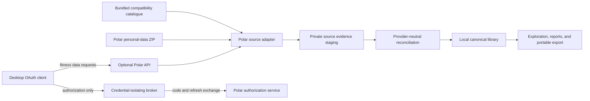

# Connected Provider Synchronization Architecture

## Status

Confirmed provider-neutral product and reconciliation direction for post-MVP connected sources. Provider assistance
is not a dependency: published contracts, independently reproducible interoperability evidence, project-side rights
review, and explicit product risk acceptance must establish eligibility. The Polar adapter is not eligible for
release until those evidence gates close. [FR-024](../requirements.md#fr-024--incremental-connected-provider-synchronization)
keeps every connection optional; the historical archive and bundled compatibility knowledge remain the offline
baseline.

The descriptive Polar API evidence is maintained in the
[Polar AccessLink Dynamic API v4 reference](../data-formats/providers/polar-accesslink-v4.md). The proposed OAuth
deployment boundary is recorded separately in
[ADR 0038](decisions/0038-isolate-confidential-provider-oauth.md).
The reproducible public-source investigation and catalogue acquisition procedure are maintained in
[Polar interoperability evidence](../research/polar-interoperability-evidence.md).

## Goals

- Extend an established local history with new or amended provider records without requiring another complete ZIP.
- Reconcile archive and API evidence by provider identity and revision rather than delivery order.
- Keep fitness data on the person's device and preserve useful offline behavior.
- Keep provider credentials, catalogues, schemas, and policy outside the provider-neutral core.
- Make connection, requested scopes, synchronization coverage, conflicts, disconnection, and retention consequences
  explicit and reversible.

## Source topology



The OAuth broker is not a data-sync service. It receives no archive, training session, route, sample, report, or
library query. Once authorization completes, provider data travels from Polar directly to the desktop application.
The broker alternative remains proposed until its product, security, operational, and provider-authority gates close.

## Bundled compatibility catalogue

### Required product artifact

Each supported archive adapter ships a minimal, immutable, versioned compatibility snapshot sufficient to interpret
the provider identifiers covered by that archive contract. For Polar, the snapshot contains only the evidence needed
by the existing provider-sport catalogue contract: exact source identifier, stable provider name key, `en-US` and
`es-ES` human names, optional parent evidence, and an optional
provider-neutral family suggestion. It excludes user profiles, sport-profile settings, training records, devices,
tokens, and unrelated catalogue configuration.

The source snapshot and generated application asset have separate digests. The generation manifest records the
upstream authority, retrieval date, catalogue revision, mapping version, transformation version, and review result.
A clean build verifies the generated bytes against that manifest.
Updates are ordinary reviewed FitFreed releases; runtime network access is not required to understand an imported ZIP.

### Acquisition order

1. Pin Polar Flow's public numeric sport mapping, the public localization revision, the official API contract, the
   official example client, and representative independent public implementations. Record source, retrieval method,
   date, revision, and the exact interoperability fact each source establishes.
2. Fetch the unauthenticated public mapping and the two supported public localization namespaces. Never use account
   history, profiles, devices, authorization, or one participant's response as the asset.
3. Run the deterministic maintainer generator. It emits exact source identifiers, stable name keys, the two supported
   localized names, conservative provider-neutral family suggestions, source and output digests, and a provenance
   manifest. It fails on missing translations, duplicate identifiers, changed source shape, digest drift, or
   unreviewed additions. Parent evidence remains absent because the public mapping does not publish it.
4. Treat distinct identifiers with the same stable provider name key as one provider-normalization identity. Preserve
   every exact identifier in evidence and retain the user correction path.
5. Keep the public upstream responses in ignored local storage. Version only the minimal generated compatibility
   snapshot, manifest, generator, and synthetic contract fixtures.

The private authenticated diagnostic performed on 2026-08-30 independently establishes the semantic join but
supplies no catalogue content and is not an input to the bundled artifact.

## Optional account connection

### Eligibility gates

Before enabling the Polar connector, FitFreed requires independently reviewable implementation evidence for:

- project-client registration and the redirect mechanism used by the native desktop product;
- authorization-code exchange through either a documented public-client PKCE flow or the minimal registered-client
  broker;
- requested scopes, refresh, revocation, expiry, rate limits, and failure recovery;
- local token protection and complete disconnect behavior; and
- deletion, amendment, availability-window, and pagination semantics needed for deterministic synchronization.

Until these gates close, the connector remains unavailable product scope rather than an implementation that asks
users to accept unverified risk.

### Independent implementation questions

Research and project-side review must answer the following before implementation or release:

1. Whether Polar supports a documented public-client PKCE flow and, otherwise, the exact minimal confidential-broker
   exchange required by the registered-client flow.
2. Which redirect URI and native handoff mechanism are reliable on macOS and portable to the later platforms.
3. Which locally retained records remain after individual disconnect and which tokens and cached transport state are
   removed immediately.
4. How deletion and amendments are detected, including cases outside recent polling overlap.
5. How pagination, availability windows, and rate limits affect initial synchronization and daily refresh.
6. Which source attribution and brand rules apply to labels and exported reports.

Each answer cites dated public evidence and distinguishes observation, interpretation, unresolved behavior, and
explicit product decisions. Lack of a provider response does not block investigation.

### Authorization and token custody

The connector requests the least privilege needed for each enabled family. Its initial training capability requires
`sports:read` and `training_sessions:read`; `training_targets:read` and later families require a separate visible
scope expansion. It does not request `profile:read` merely to correlate an account because that scope exposes broader
account information, including email.

The system browser owns sign-in and consent. The desktop generates a cryptographically random state value and an
ephemeral handoff key. If Polar supports a documented public-client PKCE flow, the desktop exchanges the code directly
and no broker exists. Under the currently documented confidential-client flow, the proposed broker protects the Polar
client secret, validates state and exact redirect, performs only authorization-code and refresh-token exchanges, and
returns an encrypted one-use token envelope to the requesting desktop. It stores no long-lived token and logs no code,
token, account value, request body, or network address beyond the minimum security telemetry accepted by the privacy
review.

The desktop stores access and refresh tokens in the operating-system credential store: macOS Keychain first, with
platform-equivalent adapters for Linux and Windows. Tokens never enter SQLite, logs, diagnostics, crash reports,
backups, portable exports, or frontend state. A refresh token may cross the broker transiently only when the provider
requires the confidential client secret for renewal. Disconnect deletes local tokens and disables future pulls
without deleting archive-derived history.

### Binding a connection to an existing origin

The first connection is bound to an existing provider origin without persisting or requesting a broad account
profile. FitFreed queries a narrow period containing previously imported sessions and requires one or more exact
provider session identifiers to match that origin with compatible record evidence. The provider namespace plus exact
session identifier is the correlation proof. Dates, sport, duration, device, name, route, or frequency are never
identity substitutes.

No overlap, overlap with more than one origin, or contradictory evidence fails closed. A later separately designed
journey may create a new connected-only origin or recover a changed provider account, but it cannot silently attach a
connection to an existing archive history.

## Incremental acquisition

### Pull policy

Synchronization is a resumable local pull, not a cloud mirror. It runs on explicit refresh, after launch when the
person has enabled automatic refresh, and at a bounded interval while the application remains open. A desktop
application that is not running does not claim real-time freshness. Provider webhooks or a hosted fitness-data mirror
are not part of this direction.

For Polar training sessions, one synchronization operation:

1. refreshes authorization when necessary and validates the granted scopes;
2. stages the current sport catalogue and summary session evidence outside the canonical visibility transaction;
3. requests no-feature session windows from the last verified coverage boundary minus a versioned safety overlap
   through the next local date, splitting requests into at most 90-day inclusive/exclusive windows;
4. compares exact provider identifiers, provider `modified` instants, mapping versions, and retained evidence digests;
5. requests one-day full-feature windows only for new records, newer revisions, incomplete local evidence, changed
   mappings, or unresolved same-revision evidence;
6. validates and maps all candidates through the same anti-corruption layer used by archive import;
7. reconciles the complete staged decision set and advances its checkpoint in one atomic visibility transaction; and
8. publishes last-successful coverage, acquired families, conflicts, and freshness without exposing tokens or source
   identifiers.

Because the public v4 contract has no documented modification cursor or deletion feed, a fixed recent overlap cannot
prove old history forever. A low-frequency rotating audit revisits bounded historical 90-day summary windows until
the connected history has been rechecked. A missing record is retained and may be marked as not returned in the last
verified window; absence alone never deletes canonical history or user-authored interpretation.

Network, authorization, rate-limit, mapping, or provider failures leave the prior library and checkpoint unchanged.
The person can continue using every already visible local record while a pull is pending or unavailable.

## Archive and API reconciliation

### Identity and evidence

Archive and API are delivery channels for one provider, not separate canonical histories. The training-session
identity remains:

```text
(observation origin, provider namespace, provider training-session identifier)
```

Every source revision retains its channel (`archive` or `connected-api`), operation, retrieval interval, source
revision, adapter version, mapping version, evidence digest, and component coverage. Summary discovery responses are
never allowed to erase a complete archive or API representation.

### Deterministic decisions

For one identity, reconciliation produces the existing provider-neutral decisions:

- **create:** no current canonical record exists;
- **equivalent:** canonical facts and revision evidence agree; add provenance only;
- **enrich:** one compatible revision supplies previously absent components without contradicting known facts;
- **amend:** the provider supplies a strictly newer orderable revision with changed canonical facts;
- **preserve:** an older revision arrives and cannot roll the current record back; or
- **conflict:** equal or unorderable revision evidence disagrees, or compatible enrichment cannot be proved.

Delivery order never decides the result. An API record does not win because it is live, and a ZIP record does not win
because it is historical. Components retain enough source-channel provenance to remove or recompute an API-only
contribution without damaging equivalent archive evidence. User-authored classifications, sport relationships,
ranges, segment criteria, report definitions, and commentary are separate aggregates and are never overwritten by a
provider revision. When source evidence changes their applicability, they become review-required under their own
contracts.

### Retention and disconnection

Ordinary user disconnection removes tokens and stops new acquisition. Locally retained API evidence follows the exact
provider permission accepted before implementation. If application-level provider terms require deletion of API data,
FitFreed identifies API-only evidence through channel provenance, removes it transactionally, recomputes each affected
canonical head from remaining archive evidence, and reports the consequence before destructive execution. It never
removes archive evidence merely because the same record was also observed through the API.

## Persistence evolution required before implementation

The current import-operation and training provenance schemas are package-oriented. A connected increment requires a
new versioned persistence contract with:

- a provider-connection aggregate containing no token material;
- synchronization operation, interval coverage, family, checkpoint, and terminal outcome;
- source-channel and retrieval provenance on every provider evidence revision;
- component coverage sufficient to distinguish summaries from complete records;
- deterministic recomputation after one channel is removed; and
- backup, migration, restart, interruption, and portable-export semantics.

No connected UI may be implemented before these application and persistence contracts work end to end.

## Verification obligations

- Contract tests generated from independent synthetic API responses cover authorization failures, windows, feature
  expansion, rate limits, malformed data, unknown fields, and provider changes.
- Domain tests prove order independence and every create, equivalent, enrich, amend, preserve, and conflict decision
  across archive/API permutations.
- Integration tests prove origin binding, overlap pulls, historical audits, atomic checkpoints, restart, token absence,
  channel removal, and recomputation from retained ZIP evidence.
- Packaged end-to-end tests prove consent disclosure, connection, refresh, offline use, disconnection, revocation,
  stale state, conflict inspection, and no duplicate after ZIP/API overlap without using a real account in CI.
- Security review proves that no client secret enters the public binary and no fitness data enters the broker.
- Provider contract and licence monitoring block synchronization when accepted terms or API behavior change.
