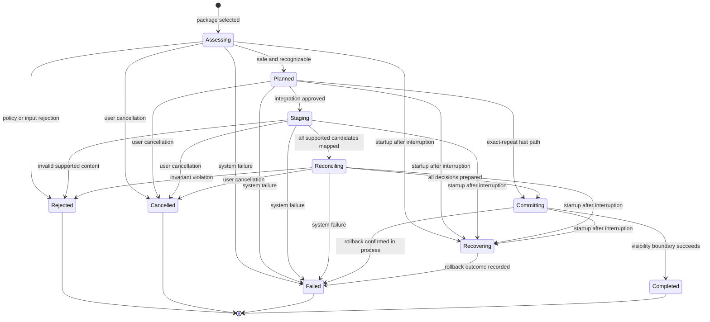

# Import Lifecycle and Consistency Model

## Status

Implemented Milestone 1 lifecycle foundation with the Milestone 2 source-subject and multi-family extensions. [ADR 0002](decisions/0002-select-sqlite-storage.md) selects SQLite as the single system of record. Schema version 2 implements durable states, terminal outcomes, coverage, provenance, an atomic visibility boundary, and startup recovery; schema versions 4 through 8 add source-subject correlation and the first canonical families; and schemas 15 and 16 add recorded training structure and route evidence without changing that boundary. Every extension preserves the same visibility boundary. The desktop presents localized terminal summaries, five-category totals, a privacy-safe family breakdown with reasons and next actions, subject-correlation failures, and provider-neutral activity, training, sleep, and recovery Insights.

## Goal

An import is repeatable, observable, cancellable before its visibility boundary, and recoverable after interruption. At no point may exploration see a partially integrated package or an import outcome that claims changes which are not visible in canonical history.

## State model

`Assessing`, `Planned`, `Staging`, `Reconciling`, `Committing`, and `Recovering` are durable non-terminal states. `Completed`, `Rejected`, `Cancelled`, and `Failed` are terminal outcomes. Domain rules reject undefined transitions and every transition out of a terminal state. Version 2 has no mutable terminal annotation mechanism.

## Phase contracts

### 1. Assessing

The application reads the selected package without changing canonical history:

1. establish the import-operation identity and local package handle;
2. stream the package fingerprint and validate central-directory integrity;
3. inspect the member-name inventory to distinguish the current source grammar, provider-shaped but unsupported
   evidence, and an unrecognized ZIP without decoding member content;
4. scan every member against path, link, encryption, duplicate-name, compression, size, count, nesting, and
   resource protections, giving genuine safety violations precedence over ordinary layout compatibility;
5. classify artifacts and derive a package assessment;
6. resolve a strong provider claim to an opaque observation origin under [ADR 0005](decisions/0005-use-library-scoped-source-subject-correlation.md); and
7. persist enough non-personal operation metadata to explain rejection or resume policy.

Assessment never trusts the filename extension, MIME declaration, archive paths, or compressed sizes alone.
[ADR 0029](decisions/0029-separate-package-identity-compatibility-and-safety.md) keeps package identity,
provider compatibility, current-content validity, and archive safety as separate outcomes. Provider-shaped
inventory never authorizes extraction or weakens the complete member scan.

### 2. Planned

The import plan fixes the adapter and mapping versions, artifact classification, intended work, resource budgets, and coverage baseline. It is deterministic for the same package bytes and application compatibility version.

An exact package fingerprint may take a fast path that avoids repeated parsing only when the earlier completed operation has complete coverage, a verified observation origin where required, and the same provider, adapter, and mapping versions. The new import operation still records an explainable completed outcome and links to the earlier evidence. Exact byte identity is not reused across a compatibility-contract change, as logical identity for a different package, or as a substitute for missing legacy subject evidence.

### 3. Staging

Supported artifacts are streamed through their source adapter. Structural validation and the anti-corruption layer produce typed normalized observations and local provenance locators in bounded batches. Relationships between separately exported artifacts, such as sleep results and scores, are validated and joined completely before any candidate becomes visible.

Training artifacts use a deliberate two-pass boundary. The first pass performs complete semantic mapping, records coverage, detects duplicate aggregate identities, and then retains only a lightweight locator, digest, and identity manifest. It does not retain all mapped sessions, routes, or future signal values in process memory. After the complete package is accepted, the visibility transaction reopens each exact member, verifies its digest and identity against that manifest, remaps it, and reconciles one session at a time. Any second-pass failure rolls back every canonical change. The cost is one additional bounded parse per training artifact; the benefit is package-level atomicity without memory proportional to the complete training history or a second durable staging schema with private cleanup state.

Staged candidates are not queryable as fitness history. Temporary state is private, bounded, permission-restricted, and either resumable under an exact implementation/version contract or safely disposable. Raw personal values never enter general application logs, public diagnostics, or test snapshots.

Known unsupported, deliberately ignored, and unrecognized artifacts remain in coverage. Invalid content intended for a supported mapping rejects the package unless a family specification explicitly defines an independently committable boundary and explains the resulting partial outcome. The MVP default is package-level atomicity for supported mappings.

### 4. Reconciling

Fitness History evaluates each candidate using the logical identity and invariant rules of its canonical concept. Every candidate receives one decision:

- **new:** create canonical information;
- **equivalent:** preserve canonical state and extend provenance when needed;
- **amended:** replace or enrich canonical information under a documented rule while retaining history of the decision;
- **conflicting:** preserve the conflict without silently choosing by source order;
- **rejected:** violate canonical invariants or an established semantic precondition.

The complete decision set is prepared before visible state changes. Reconciliation order cannot alter the resulting canonical state.

### 5. Committing

The visibility boundary atomically publishes:

- accepted canonical changes;
- provenance linking those changes to source evidence and mapping versions;
- reconciliation decisions and unresolved conflicts;
- the completed state that makes the already prepared complete coverage final;
- the completed import outcome.

The implementation persists coverage under a non-terminal operation. Bounded activity, sleep, and dated nightly-recovery candidates are mapped before the visibility transaction; training candidates follow the two-pass manifest boundary and are remapped one at a time inside it. Split sleep artifacts are assembled only after both supported families validate. Dated recovery summaries deliberately exclude undated sample blobs that have no safe identity relationship. The visible switch is atomic. The desktop presents localized terminal summaries, family guidance, and provider-neutral activity, training, sleep, and recovery Insights. High-resolution training additions must retain this per-artifact memory bound and pass measured import and query budgets.

`Committing` begins only after every canonical reconciliation unit has completed inside the rollback-safe
transaction. It exposes no item count or percentage because the remaining atomic database operation has no
truthful bounded presentation unit. Cancellation requested after committing begins is deferred until the atomic
boundary resolves. The interface explains this brief non-cancellable phase.

### 6. Recovering

On startup, the host starts recovery on a blocking worker while the independent WebView process initializes. A process-scoped completion barrier prevents locale persistence, import writes, history reads, update confirmation, and every post-shell task from exposing the library until recovery succeeds. Archive selection may proceed because it neither opens nor mutates the library; import remains disabled until the barrier is released. A recovery failure releases waiters into the existing closed `library-unavailable` outcome rather than leaving startup pending. This overlaps independent initialization without weakening the visibility boundary.

Version 2 can prove the recovery result without guessing: canonical changes and the transition to `Completed` share one SQLite transaction, so a surviving non-terminal row means the prior complete canonical state was retained. Recovery moves the operation through `Recovering` to `Failed`, records `interrupted` and `canonical-transaction-rolled-back`, and removes no source evidence needed to explain the outcome.

## Progress and outcomes

Progress is phase-aware and follows the normative
[import-control transport](../data-formats/guidance/import-control-v1.md). Fingerprinting reports bytes;
validation and mapping report source files; reconciliation reports actual canonical library items. Each bounded
phase starts its own monotonic count. Committing is explicitly indeterminate and never inherits a completed source
file count. If no authoritative progress changes for the presentation watchdog interval, the interface may explain
that local work is taking longer than usual, but it cannot invent a duration or percentage, terminate the work, or
change its persisted result.
The desktop host coalesces dense producer progress before IPC using bounded item, byte, and time thresholds. First,
phase-boundary, cancellation-boundary, exact-completion, and terminal events always cross the boundary; same-phase
regressions never do. The producer still performs every cancellation check and reconciliation step, while one dense
12,000-item synthetic stream produces no more than 50 channel events when no time boundary intervenes. The shell
shows the current phase and localized processed/total count outside Sources, so navigation does not hide countable
work.
The Sources presentation replaces competing acquisition choices with one dominant operation surface,
keeps cancellation explicit, and states that the existing library remains unchanged until commit. It
announces immediate localized importing or cancellation-requested feedback while the detailed phase stream
continues to report authoritative application progress. The chosen archive is rendered by filename only;
the presentation never exposes its local directory.

Every terminal outcome includes:

- package recognition and adapter/mapping version;
- exact-repeat status;
- coverage grouped by supported, unsupported, deliberately ignored, unrecognized, and invalid;
- a deterministic family-level breakdown containing only the family code, classification, reason code, and artifact count;
- counts of reconciliation decisions without personal values;
- warnings, conflicts, or failures with recovery guidance;
- whether canonical history changed and whether temporary state was removed.

The family breakdown prioritizes invalid, unrecognized, unsupported, and deliberately ignored content before supported content. Presentation translates stable family, classification, and reason codes into an explanation and next action. Public diagnostics use opaque operation references and sanitized aggregates. Archive locators, source hashes, account evidence, and detailed local provenance remain protected as personal-library data.

The terminal presentation separates three concerns. A consequence-led result states whether usable
history changed; a rejected or failed transaction places its specific localized reason and safe next action in
the primary result; and one exact incorporation disclosure contains reconciliation counts and family coverage.
Wrong ZIP selection, malformed current content, an unsupported provider version, suspicious member structure,
and each typed archive-resource limit remain distinct. Entry count, expanded member size, total expanded size,
compression ratio, and bounded read exhaustion have separate stable terminal codes without persisting archive paths
or personal values. Picker and official-link
failures are source-action errors outside the terminal import outcome, so a later source-action failure
cannot rewrite or mislabel the persisted transaction result.

## Reimport invariants

1. Reimporting the same package cannot duplicate canonical information.
2. Different package bytes can still be semantically equivalent.
3. A later overlapping package is reconciled per canonical concept, not by filename or import time.
4. Artifact iteration order and batch size cannot change the final result.
5. An operation that does not reach `Completed` exposes no canonical changes.
6. A completed outcome and its canonical effect become visible together.
7. Provenance can grow when canonical content remains equivalent.
8. Unknown, unsupported, ignored, invalid, and conflicting information remains visible in coverage.

## Verification obligations

- State-machine unit tests reject illegal transitions and changes to terminal operations.
- Domain tests prove new, equivalent, amended, conflicting, and rejected outcomes per canonical concept.
- Adapter integration tests prove streaming, safety limits, classification, mapping, and cancellation with synthetic packages.
- Persistence integration tests interrupt every durable phase and verify startup recovery and atomic visibility.
- Property tests vary artifact order and batch boundaries while preserving the expected canonical result.
- E2E tests verify duplicate and overlapping reimports, progress, cancellation, restart, coverage, and recovery through release-shaped entry points.

## Pending decisions

- Whether a future source family with a single artifact above the current per-member bound needs private resumable SQLite staging instead of the two-pass training boundary.
- The exact cancellation granularity and resource budgets after representative synthetic measurements.
- Family-specific exceptions, if any, to package-level atomicity for supported mappings.
- Retention duration and user controls for completed import operations and detailed provenance.
