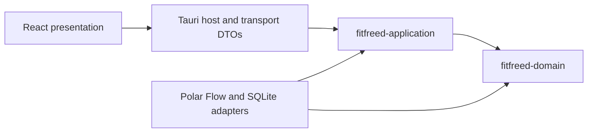

# Module Map

## Purpose

The selected Tauri, React, and SQLite technologies are adapters around FitFreed's Clean Architecture. Cargo crate boundaries make the two innermost dependency rules compile-time constraints instead of naming conventions.

## Ownership and allowed dependencies

| Module | Owns | May depend on |
|---|---|---|
| `fitfreed-domain` | Provider-neutral observations, identities, invariants, and reconciliation decisions | Rust standard library only |
| `fitfreed-application` | Use cases, input/output ports, Insights range and report rules, progress, cancellation, and application failures | `fitfreed-domain`, `chrono`, `thiserror` |
| `infrastructure` | ZIP safety, Polar Flow decoding, anti-corruption mapping, SQLite transactions, migrations, backup, and concrete port implementations | Application and domain crates plus adapter libraries |
| Tauri host and transport | Native lifecycle, command registration, blocking-worker dispatch, capabilities, and serialized DTO mapping | Application ports, concrete adapters, Tauri, and serialization |
| React presentation | Localized interaction, accessible visualization, and view state | Transport contracts exposed by the Tauri host |
| React desktop adapter | Native archive selection at the presentation boundary | Tauri dialog API; a compile-time test adapter replaces only this boundary in the instrumented E2E package |

The architecture check reads Cargo metadata and rejects adapter, serialization, persistence, desktop, or provider terms in the domain and application source. Cargo separately prevents either inner crate from importing a dependency absent from its own manifest.

## Milestone 1 foundation and MVP transition

The production adapter recognizes the documented daily-activity shape, resolves a library-scoped source subject, and records complete family coverage. The application owns the provider-neutral Insights read models: overview selects the latest 30 local dates by default or validates an explicit range of up to 366 inclusive dates, while comparison validates two such periods and calculates the exact comparison-minus-baseline change. Both keep origins separate, disclose missing and unavailable days, and calculate exact totals and rounded averages from canonical facts returned by an indexed port. SQLite owns bounds, the distinct origin catalog, and inclusive fact retrieval but no report rule; keeping the catalog separate preserves all-missing ranges. The Tauri transport validates typed range boundaries and encodes counts and signed changes as decimal strings to preserve precision in JavaScript. React owns localized labels, date entry, detail selection, comparison controls, locale-aware formatting, responsive visual scaling, and exact accessible table alternatives.

The current canonical concept, source mapping, persistence schema, artifact-family registry, Insights read models, and source-subject correlation are indexed in the [data format documentation](../data-formats/README.md); production-path performance evidence is defined in the [benchmark guide](../development/performance-benchmarks.md). The benchmark generator enters through the concrete SQLite adapter and provider-neutral application use cases, while packaged timing crosses Tauri transport and React without creating another product path. Richer daily activity and the remaining MVP capabilities enter through the same boundaries under the [Milestone 2 plan](../plans/milestone-2.md).
