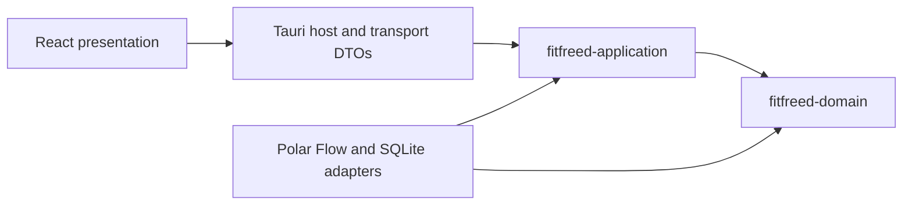

# Module Map

## Purpose

The selected Tauri, React, and SQLite technologies are adapters around FitFreed's Clean Architecture. Cargo crate boundaries make the two innermost dependency rules compile-time constraints instead of naming conventions.

## Ownership and allowed dependencies

| Module | Owns | May depend on |
|---|---|---|
| `fitfreed-domain` | Provider-neutral observations, identities, invariants, and reconciliation decisions | Rust standard library only |
| `fitfreed-application` | Use cases, input/output ports, progress, cancellation, and application failures | `fitfreed-domain`, `thiserror` |
| `infrastructure` | ZIP safety, Polar Flow decoding, anti-corruption mapping, SQLite transactions, migrations, backup, and concrete port implementations | Application and domain crates plus adapter libraries |
| Tauri host and transport | Native lifecycle, command registration, blocking-worker dispatch, capabilities, and serialized DTO mapping | Application ports, concrete adapters, Tauri, and serialization |
| React presentation | Localized interaction, accessible visualization, and view state | Transport contracts exposed by the Tauri host |

The architecture check reads Cargo metadata and rejects adapter, serialization, persistence, desktop, or provider terms in the domain and application source. Cargo separately prevents either inner crate from importing a dependency absent from its own manifest.

## Current vertical-slice limitation

The first promoted slice recognizes a deliberately small synthetic daily-activity shape. Its current canonical concept, source mapping, and persistence schema are indexed in the [data format documentation](../data-formats/README.md). Stable Polar subject identity, complete coverage reporting, richer daily activity, and the remaining MVP contexts are not implied by this foundation. They enter through the provider adapter and application ports without weakening the dependency direction above.
