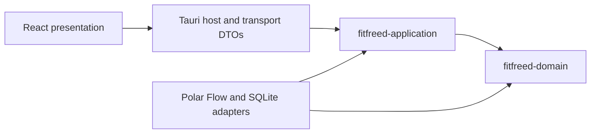

# Module Map

## Purpose

The selected Tauri, React, and SQLite technologies are adapters around FitFreed's Clean Architecture. Cargo crate boundaries make the two innermost dependency rules compile-time constraints instead of naming conventions.

## Ownership and allowed dependencies

| Module | Owns | May depend on |
|---|---|---|
| `fitfreed-domain` | Provider-neutral observations, sport classifications and recognition suggestions, identities, invariants, and reconciliation decisions | Rust standard library only |
| `fitfreed-application` | Use cases, input/output ports, Insights range, sport-identity resolution and compare-and-save rules, provider-neutral acquisition-guide validation and official-destination selection, progress, cancellation, and application failures | `fitfreed-domain`, `chrono`, `semver`, `thiserror`, `url` |
| `infrastructure` | ZIP safety, Polar Flow decoding, anti-corruption mapping, provider-specific acquisition guidance and sport-catalogue evidence, native official-destination launching, SQLite transactions, migrations, backup, and concrete port implementations | Application and domain crates plus adapter libraries |
| Tauri host and transport | Native lifecycle, command registration, blocking-worker dispatch, capabilities, and serialized DTO mapping | Application ports, concrete adapters, Tauri, and serialization |
| React presentation | Localized Home, Sources, History, Reports, and Settings interaction; result-first Answer Canvases; accessible visualization; navigation state; and source-guide rendering | Transport contracts exposed by the Tauri host |
| React desktop adapters | Native archive and report-destination selection at the presentation boundary | Tauri dialog APIs; compile-time test adapters replace only these operating-system surfaces in the instrumented E2E package |

The update capability follows the same direction. Provider-neutral update policy, authorization, recovery-transition rules, watchdog phase/event decisions, terminal outcome vocabulary, and import-versus-update exclusion belong to `fitfreed-application`; signed-feed transport, Minisign verification, replay persistence, package verification, application preservation, library backup, recovery-manifest and outcome persistence, restoration, terminal cleanup, watchdog authority resolution, and process coordination belong to infrastructure; Tauri supplies trusted host context and owns native updater integration; React receives only typed state and explicit actions. A fresh application check can produce an exact-package authorization for the native installation path, but the presentation mapper strips its key identifier, URL, digest, signature, and other installation authority before serialization. The Rust-only package adapter resolves that identifier from the active channel trust set, invokes the bounded Tauri download, and rechecks exact identity, size, and digest. Recovery preparation copies and verifies the macOS bundle and an atomic SQLite online backup before publishing one active versioned manifest. The installation orchestrator starts the verified preserved watchdog before allowing Tauri to replace the application and hands any post-publication failure to persisted recovery. Restoration validates the pair and both canonical destinations, preserves the failed application during recovery, replaces the inactive library atomically, and resumes safely after interruption. The host routes the exact private watchdog invocation before Tauri initialization; one preserved executable holds the watchdog lease and derives authority from its own fixed recovery layout. It coordinates bounded readiness, persisted installation deadlines, replacement launch, restart-safe PID/start-time/executable observation, confirmation waiting, candidate quiescence, verified restoration, and receipt-before-deletion terminal maintenance. The candidate host retains its recovery identifier, launch nonce, and process lease outside React, and a no-argument frontend readiness signal lets the host bind confirmation to the exact destination, target build, opened library schema, and intact fallback pair. The startup host maps only the completed outcome and source and target versions into presentation; the private recovery identifier remains in infrastructure and acknowledgement removes only its validated receipt. [ADR 0010](decisions/0010-run-update-recovery-from-the-preserved-application.md) owns this process boundary. The updater plug-in is registered for native Rust use but has no frontend package or capability. The host owns the ready-startup and manual commands plus a 24-hour process-lifetime scheduler under [ADR 0011](decisions/0011-schedule-update-discovery-in-the-desktop-host.md). One asynchronous coordinator serializes update-channel and update-state operations; a periodic attempt skips an occupied coordinator. React receives recurring results only through the closed `fitfreed://update-check-completed` event and applies the same scheduled visibility policy as launch discovery. React can request only the candidate version or acknowledge the currently retained outcome; the host derives paths, trust, timing, trigger, and native authority. The architecture check keeps the host and presentation event names equal. The provenance-checked updater source refinement is an external adapter dependency outside the FitFreed workspace package set; [ADR 0009](decisions/0009-bound-package-transfer-inside-tauri-updater.md) limits its local changes and upgrade process. The complete boundary is documented in [update trust architecture](update-trust.md).

The architecture check reads Cargo metadata and rejects adapter, serialization, persistence, desktop, or provider terms in the domain and application source. Cargo separately prevents either inner crate from importing a dependency absent from its own manifest.

Source acquisition follows the same dependency direction. The application owns the versioned provider-neutral guide contract, rejects incomplete, ambiguous, insecure, or unsupported adapter results, and selects an official destination from a typed source, purpose, and locale request. The Polar Flow infrastructure adapter owns the last-verified procedure keys, constraints, troubleshooting keys, and exact official destinations; a separate infrastructure port delegates only the application-selected URL to the operating system. The Tauri host serializes the validated guide and exposes the closed typed opening command without granting generic frontend URL authority. React resolves content keys from the locale catalogs and requests a provider page only after an explicit action. The core never receives provider credentials or automates account access, export requests, delivery polling, or archive download. [ADR 0028](decisions/0028-own-official-destination-opening-in-the-application.md) owns the native boundary; the complete importer boundary is documented in [source integration architecture](source-integration.md).

Sport recognition follows [ADR 0027](decisions/0027-resolve-sport-identity-from-versioned-provider-evidence.md).
Infrastructure validates and stores immutable provider catalogue snapshots, exact join identifiers, and active
selection. The domain validates provider-neutral localized-name and family suggestions; the application resolves
recognized, ambiguous, unknown, personally overridden, and unavailable identity under one discovery revision.
Tauri, React, and HTML receive no provider identifier. No Polar catalogue is bundled until the documented
retrieval and redistribution gate closes.

## Current MVP architecture

The production adapter first distinguishes current provider inventory, provider-shaped unsupported inventory, and an unrelated ZIP without decoding content; the independent complete member scan retains safety and resource precedence under [ADR 0029](decisions/0029-separate-package-identity-compatibility-and-safety.md). It then recognizes the documented daily-activity, training-session summary, sleep-result, sleep-score, and dated nightly-recovery shapes, resolves a library-scoped source subject, and records complete family coverage. The training anti-corruption layer streams past excluded nested detail, preserves aggregate rather than child semantics, and supplies separately persisted source-revision evidence for deterministic amendment. The sleep anti-corruption layer joins split artifacts, preserves offset boundaries and declared duration arithmetic, and maps optional phases, timelines, and score groups without importing provider objects into the core. The recovery anti-corruption layer separates shared physiological summaries from typed namespaced source assessment, baseline, and guidance components under [ADR 0006](decisions/0006-use-typed-source-specific-recovery-components.md). It preserves unordered reconciliation and excludes undated recovery samples rather than inventing a relationship.

The application owns provider-neutral activity, training, sleep, and recovery Insights read models: each overview selects the latest 30 local dates by default or validates an explicit range of up to 366 inclusive dates, and each comparison validates two such periods and calculates comparison-minus-baseline changes. Daily activity distinguishes unavailable measurements from missing observations. Its presentation Answer Canvas may select adjacent default periods and format the returned comparison, but it does not recalculate aggregates, combine origins, or replace unavailable evidence. Training distinguishes expected non-training dates from unavailable session measurements and carries metric-coverage counts with aggregates. Its comparison accepts any structurally valid period of at most 366 inclusive dates, including a bounded empty period outside the recorded-session `availableRange`; [training comparison version 1](../data-formats/insights/training-comparison-v1.md) owns that distinction. A separate `TrainingSportsPort` scans complete-history sport evidence, preserves origin separation, resolves active provider-neutral recognition candidates, returns only opaque presentation capabilities, and applies explicit user classifications with optimistic revision checks. One exact candidate is recognized, several remain ambiguous, none remains unknown, and personal meaning wins without deleting recognition; no provider identifier crosses the port. `TrainingSessionDiscoveryPort` is the distinct complete-history path: it validates optional date, sport, measurement, and identity-text filters; exact sort semantics; bounded pages; source-separated calendar days; ordered comparison and detail selection; opaque session and snapshot capabilities; and snapshot-change recovery without loading deep detail evidence. `TrainingDiscoveryWorkspacePort` stores and validates the disposable applied query, page, view, calendar origin, comparison order, and open lightweight detail required for exact restart restoration. Sleep exposes primary-period gaps, exact duration totals and averages, optional phase, score, goal, timeline, and power-status coverage, while keeping activity-family sleep summaries separate. Recovery exposes gaps and exact interval averages with assessment, baseline, and guidance coverage; it preserves source statuses as source-specific facts rather than converting them into provider-neutral health judgments. Their presentation Answer Canvases lead with recorded-night coverage and one existing application average, keep the per-night visual primary, place ranges and exact evidence behind explicit disclosures, and describe comparison direction without assigning physiological meaning. All four keep observation origins separate. React keeps the Activity daily visual and direct day navigation in the primary composition while the complete exact-value table and period controls remain mounted inside separate closed native disclosures. Opening either presentation boundary issues no application query; a successful period replacement closes its controls and leaves the new answer primary.

Under [ADR 0007](decisions/0007-compose-longitudinal-insights-by-origin-and-date.md), the application composes those four authoritative read models into a disposable longitudinal projection. It derives one global date range and ordered union of opaque origins, supplies the same bounded range and origin catalog to every domain use case, validates exact series and day alignment, and exposes only the daily values needed for the integrated view. Training remains an event count, activity retains unavailable versus missing, and sleep and recovery retain their source-assigned dates. The composition neither persists a dashboard cache nor creates a competing calculation path. Its comparison delegates to the existing domain comparison rules, and its transport preserves exact integers as decimal text.

React renders that projection as a result-first Answer Canvas: one provider-neutral analytical chart per
opaque origin, followed by deliberate exact-evidence and range-control disclosures. The chart places activity,
training, sleep, and recovery on independently scaled labelled lanes over the same exact local-date coordinate;
missing evidence is a gap, a zero training duration remains zero, and dense periods expose linked navigation
and bounded zoom. It formats only values supplied by the projection, keeps every origin separate, and routes
an exact table date to the existing typed domain destinations. Its comparison canvas presents the four
delegated aggregates without combining origins or inferring causation, health, or readiness. Contextual
retrieval failure retains the last valid answer and periods, while successful range and comparison operations
focus the new answer.

The application composes a provider-neutral Library Home from the four default overview use cases, complete sport discovery, bounded session discovery, a host calendar, and, only when explicitly correlated, the latest completed import outcome. One opaque outer revision and one shared training snapshot prevent mixed evidence; one observed change retries the complete composition and a repeated change fails closed. Home exposes complete training identity, bounded recent sessions, one conservative recent comparison or historical fallback, bounded measurement coverage, and question-to-explorer routes. Its temporal projection separates recorded evidence, usable measurements, and one explicitly scoped primary range, so a boundary from one domain cannot be presented as another domain's history. Recognized names, ambiguity, unknown evidence, personal precedence, and unavailable sport evidence retain exact distinct states; unresolved profiles keep separate safe presentation capabilities that target the existing classification use case without exposing provider identifiers or creating another mutation path. Home contains no provider diagnostic, recommendation, score, or duplicate report calculation. Its current normative fields and availability rules live in the [Library Home version 5 contract](../data-formats/insights/library-home-v5.md); [versions 1 through 4](../data-formats/insights/library-home-v4.md) remain immutable historical contract evidence.

SQLite owns bounds, distinct origin catalogs, inclusive indexed summary retrieval, exact sleep and recovery detail retrieval, canonical facts, provenance, immutable provider-catalogue evidence and active selection, compare-and-save sport-classification storage, and transactional report-definition storage but no report calculation or HTML rendering. Its longitudinal and Library Home adapters delegate application ports to the existing concrete libraries; neither queries joined report rows or introduces a second calculation path. Report preparation and resolution likewise enter the authoritative session-selection, route, training-comparison, and provenance ports, perform bounded endpoint redaction above those ports, and surround shared analytical queries with source-snapshot checks before handing an authorized bounded projection to the replaceable HTML adapter. Schema 23 stores versioned question, exact-exploration, session, or blank origin intent and presentation choices but no resolved totals. The adapter normalizes retained route geometry and renders exact analytical tables and CSS-only bars; recorded coordinates, exact samples, nonexistent provider relationships, provider catalogue identifiers, and opaque analytical source identities never enter the HTML bytes. Sport discovery uses a covering session index and joins active recognition candidates plus authored meaning without letting import mutate either. Full-history session discovery runs its revision check, exact count, source-separated filtered aggregates, calendar projection, ordered opaque selection, identity context, and bounded page inside read transactions; session, classification, and catalogue-selection changes invalidate stale snapshots, while duration and distance indexes support stable alternate ordering. SQLite stores one constrained detailed discovery workspace independently from the canonical library and top-level destination. Sleep overview and comparison avoid loading high-resolution transition rows; selecting one available night retrieves its complete ordered timeline. Recovery overview and comparison use a lightweight projection that reports only whether source baseline and guidance exist; their values and guidance text are loaded only for one exact detail identity. The Tauri transport validates typed range, detail, Home-request, workspace, sport-classification, training-session search, report start, generic report composition, and report export boundaries and encodes integer facts and signed changes as decimal strings to preserve precision in JavaScript. React owns the result-led Home, four detailed journeys, integrated longitudinal journey, localized ordered report composer, coordinate-free route preview, version-4 multi-origin analytical editor and preview, contextual return, navigation-focus restoration, action-result focus, contextual error ownership, and complete privacy review. Initial explorer and exact-detail loading labels are polite status regions while their owning surfaces expose the same pending state through `aria-busy`. A panel that renders an operation-specific alert or retry owns that failure; only errors without a contextual recovery surface propagate to the application-level alert, preventing duplicate announcements. Invalid controls remain associated with the exact alert or guidance that explains them and use one theme-aware presentation treatment. React moves focus to comparison and detail headings only while focus remains on the initiating control or the document during an asynchronous reveal; an explicit user focus change cancels that move. Form submissions identify that control from the native submit event's actual submitter rather than assuming the browser has already moved document focus. Opening a report privacy or stale-evidence review focuses its revealed heading, closing it restores the exact initiating action, and a completed export or refresh focuses its visible result. A cancelled or failed export returns focus to the stable export action without overriding an unrelated explicit focus move. Closing or invalidating a disposable detail restores the exact initiating control when it remains mounted and otherwise uses the stable explorer heading. Returning from a Home session, comparison, question, or resumable exploration restores focus to its exact initiating Home control after durable workspaces have been cleared, with the Home heading as a fail-safe only when that origin is no longer present. It derives saved-report source targets from resolved typed origins, sends exact session identities or comparison queries through existing application commands, and keeps the originating control, prior mounted destination, and reverse report identity only as transient presentation state. It mounts only the selected analytical journey or report workspace. SQLite persists the versioned destination, the detailed training workspace required for exact restart restoration, user-authored sport meaning, provider catalogue evidence, and report definitions; it does not persist presentation navigation snapshots, and report-source visits do not overwrite resumable exploration. Returning to Home clears exploration workspaces but not classification, recognition, or reports, while temporary shell navigation preserves the mounted training workspace.

Within React, `ProgressSubmitButton` owns the stable submit action and visible polite progress status used by training-session search, the five period-comparison, application-preference, sport-classification, and report-editor forms. `RangeFilterActions` composes that primitive with the stable latest-window action for all four overview filters and presents operation-specific apply, reset, or destination-navigation progress. Each panel continues to own its operation identity, busy state, validation, prior visible context, and any result-focus transition. Home navigation retains the selected question, resume action, or current explorer until its durable workspace mutation completes; one operation identity prevents duplicate requests and distinguishes opening the exact destination from returning to Home. Longitudinal day navigation similarly awaits both durable destination selection and any required date query while retaining the aligned detail, and discards its transient navigation target if persistence fails. `SourcesPanel` owns native ZIP selection, acquisition guidance, active-task dominance, filename-only source identity, factual source-file or canonical-item progress, delayed-progress explanation, and exact official-link operation identity until the corresponding least-privilege operating-system adapter resolves. `ImportOutcomePanel` owns the consequence-first terminal hierarchy, the primary terminal reason and safe action, and deliberate incorporation and family-coverage disclosures. Source-action failures and terminal import reasons are distinct presentation state, preventing duplicate announcements or a failed chooser from changing the meaning of a persisted import outcome. These boundaries prevent duplicate or competing requests without moving provider URLs or filesystem paths into the core. Non-submit report refresh and export actions follow the same stable-name and visible-status contract while retaining their cancellation and focus rules. A reset or secondary action that shares a mutation boundary also shares that busy state, retains its own stable action name, and announces its own operation instead of borrowing the submit action's progress. Personal segmentation derives the pending operation from the invoked mutation command so creating and applying, updating, reordering, applying, and removing criteria cannot collapse into generic save progress.

`App` owns the cross-workspace projection of an active import and the refresh state of Library Home because neither
state belongs to one mounted panel. `ApplicationShell` renders only that supplied projection: outside Sources it keeps
the authoritative phase and one route to the active task visible, and beside History it exposes the exact temporary
restriction and contextual retry. Returning to an active import deliberately starts Sources at its operation surface;
ordinary top-level navigation continues to restore each workspace's saved scroll position. Post-commit Home refresh
is a separate indeterminate presentation phase and never reuses a completed import percentage. `LibraryHomePanel`
turns only positive session and sport aggregates into controls. Their typed navigation requests select the existing
Sessions or Sports workspace; the session route first clears its disposable discovery workspace, both routes persist
the normal top-level training destination, and returning to Home restores the exact aggregate control. No new domain,
application, persistence, or transport path is introduced by these presentation routes.

`SettingsPanel` owns one unsaved preference draft, its representative preview, draft-only default
restoration, cancellation, and the Appearance and Updates category navigation. `App` guards requested
top-level navigation while that draft differs from the saved preferences; the person can keep editing or
explicitly discard before the requested destination opens. The preference save command is the sole Settings
write, and saved preferences remain the only durable source of truth. `UpdatePanel` keeps its separate command and
event lifecycle but is composed inside Settings and remains mounted while its category is hidden, so
category or locale changes cannot duplicate launch discovery or lose a scheduled result.

`presentation-format` owns shared locale grouping and the named summary, detail, and exact-evidence
policies for durations and other displayed measurements. Training, sleep, longitudinal, and report
components choose one of those roles while their feature-specific formatting modules retain only
domain vocabulary and composition. Stored and exported values remain exact and never depend on a
presentation role. The UI-contract check scans every production TypeScript and TSX source and rejects
direct `Intl` formatter construction outside this boundary, so a feature cannot silently introduce a
second grouping, date, sign, coordinate, or precision policy.

`DataTable` owns every production table's semantic caption, keyboard-reachable horizontal-scroll boundary,
optional distinct scroll-region name, and explicit numeric header and cell alignment. Presentation modules
choose alignment from the value type rather than column position; a static contract rejects direct production
tables and positional table-alignment selectors. Feature-specific modifier classes may size the shared table
and its scroll boundary but cannot replace their semantics. Segment and zone components keep their timeline
or distribution in the primary composition and mount the complete table inside a native disclosure. Set-level
authorship and source attribution remain in the containing explanation rather than becoming one repeated
table column.

Report refresh crosses the same boundaries: Tauri validates the exact saved definition revision, saved
snapshot, and reviewed candidate; the application re-resolves through authoritative ports and performs
optimistic compare-and-save; SQLite advances existing snapshot and revision columns without storing resolved
values; and React owns the localized current-candidate review. Import never enters this mutation path.

The current canonical concepts, source mappings, persistence schema, artifact-family registry, Insights read models, and source-subject correlation are indexed in the [data format documentation](../data-formats/README.md); production-path performance evidence is defined in the [benchmark guide](../development/performance-benchmarks.md). The benchmark generator enters through the concrete SQLite adapter and provider-neutral application use cases, while packaged timing crosses Tauri transport and React without creating another product path. Later capabilities enter through the same boundaries; the [Milestone 2 plan](../plans/milestone-2.md) remains the authority for MVP acceptance evidence and open gates.
