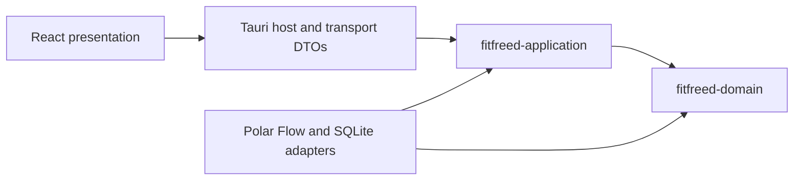

# Module Map

## Purpose

The selected Tauri, React, and SQLite technologies are adapters around FitFreed's Clean Architecture. Cargo crate boundaries make the two innermost dependency rules compile-time constraints instead of naming conventions.

## Ownership and allowed dependencies

| Module | Owns | May depend on |
|---|---|---|
| `fitfreed-domain` | Provider-neutral observations, identities, invariants, and reconciliation decisions | Rust standard library only |
| `fitfreed-application` | Use cases, input/output ports, Insights range and report rules, provider-neutral acquisition-guide validation, progress, cancellation, and application failures | `fitfreed-domain`, `chrono`, `semver`, `thiserror`, `url` |
| `infrastructure` | ZIP safety, Polar Flow decoding, anti-corruption mapping, provider-specific acquisition guidance, SQLite transactions, migrations, backup, and concrete port implementations | Application and domain crates plus adapter libraries |
| Tauri host and transport | Native lifecycle, command registration, blocking-worker dispatch, capabilities, and serialized DTO mapping | Application ports, concrete adapters, Tauri, and serialization |
| React presentation | Localized Sources, Explore, and Settings interaction, accessible visualization, navigation state, and source-guide rendering | Transport contracts exposed by the Tauri host |
| React desktop adapters | Native archive selection and allowlisted official-link opening at the presentation boundary | Tauri dialog and opener APIs; compile-time test adapters replace only these boundaries in the instrumented E2E package |

The update capability follows the same direction. Provider-neutral update policy, authorization, recovery-transition rules, watchdog phase/event decisions, terminal outcome vocabulary, and import-versus-update exclusion belong to `fitfreed-application`; signed-feed transport, Minisign verification, replay persistence, package verification, application preservation, library backup, recovery-manifest and outcome persistence, restoration, terminal cleanup, watchdog authority resolution, and process coordination belong to infrastructure; Tauri supplies trusted host context and owns native updater integration; React receives only typed state and explicit actions. A fresh application check can produce an exact-package authorization for the native installation path, but the presentation mapper strips its key identifier, URL, digest, signature, and other installation authority before serialization. The Rust-only package adapter resolves that identifier from the active channel trust set, invokes the bounded Tauri download, and rechecks exact identity, size, and digest. Recovery preparation copies and verifies the macOS bundle and an atomic SQLite online backup before publishing one active versioned manifest. The installation orchestrator starts the verified preserved watchdog before allowing Tauri to replace the application and hands any post-publication failure to persisted recovery. Restoration validates the pair and both canonical destinations, preserves the failed application during recovery, replaces the inactive library atomically, and resumes safely after interruption. The host routes the exact private watchdog invocation before Tauri initialization; one preserved executable holds the watchdog lease and derives authority from its own fixed recovery layout. It coordinates bounded readiness, persisted installation deadlines, replacement launch, restart-safe PID/start-time/executable observation, confirmation waiting, candidate quiescence, verified restoration, and receipt-before-deletion terminal maintenance. The candidate host retains its recovery identifier, launch nonce, and process lease outside React, and a no-argument frontend readiness signal lets the host bind confirmation to the exact destination, target build, opened library schema, and intact fallback pair. The startup host maps only the completed outcome and source and target versions into presentation; the private recovery identifier remains in infrastructure and acknowledgement removes only its validated receipt. [ADR 0010](decisions/0010-run-update-recovery-from-the-preserved-application.md) owns this process boundary. The updater plug-in is registered for native Rust use but has no frontend package or capability. The host owns the ready-startup and manual commands plus a 24-hour process-lifetime scheduler under [ADR 0011](decisions/0011-schedule-update-discovery-in-the-desktop-host.md). One asynchronous coordinator serializes update-channel and update-state operations; a periodic attempt skips an occupied coordinator. React receives recurring results only through the closed `fitfreed://update-check-completed` event and applies the same scheduled visibility policy as launch discovery. React can request only the candidate version or acknowledge the currently retained outcome; the host derives paths, trust, timing, trigger, and native authority. The architecture check keeps the host and presentation event names equal. The provenance-checked updater source refinement is an external adapter dependency outside the FitFreed workspace package set; [ADR 0009](decisions/0009-bound-package-transfer-inside-tauri-updater.md) limits its local changes and upgrade process. The complete boundary is documented in [update trust architecture](update-trust.md).

The architecture check reads Cargo metadata and rejects adapter, serialization, persistence, desktop, or provider terms in the domain and application source. Cargo separately prevents either inner crate from importing a dependency absent from its own manifest.

Source acquisition follows the same dependency direction. The application owns the versioned provider-neutral guide contract and rejects incomplete, ambiguous, insecure, or unsupported adapter results. The Polar Flow infrastructure adapter owns the last-verified procedure keys, constraints, troubleshooting keys, and exact official destinations. The Tauri host serializes only the validated guide and grants URL-opening capability only for those shipped HTTPS destinations. React resolves content keys from the locale catalogs and opens a provider page only after an explicit action. The core never receives provider credentials or automates account access, export requests, delivery polling, or archive download. The complete boundary is documented in [source integration architecture](source-integration.md).

## Current MVP architecture

The production adapter recognizes the documented daily-activity, training-session summary, sleep-result, sleep-score, and dated nightly-recovery shapes, resolves a library-scoped source subject, and records complete family coverage. The training anti-corruption layer streams past excluded nested detail, preserves aggregate rather than child semantics, and supplies separately persisted source-revision evidence for deterministic amendment. The sleep anti-corruption layer joins split artifacts, preserves offset boundaries and declared duration arithmetic, and maps optional phases, timelines, and score groups without importing provider objects into the core. The recovery anti-corruption layer separates shared physiological summaries from typed namespaced source assessment, baseline, and guidance components under [ADR 0006](decisions/0006-use-typed-source-specific-recovery-components.md). It preserves unordered reconciliation and excludes undated recovery samples rather than inventing a relationship.

The application owns provider-neutral activity, training, sleep, and recovery Insights read models: each overview selects the latest 30 local dates by default or validates an explicit range of up to 366 inclusive dates, and each comparison validates two such periods and calculates comparison-minus-baseline changes. Daily activity distinguishes unavailable measurements from missing observations. Training distinguishes expected non-training dates from unavailable session measurements, carries metric-coverage counts with aggregates, and never invents a sport name. Sleep exposes primary-period gaps, exact duration totals and averages, optional phase, score, goal, timeline, and power-status coverage, while keeping activity-family sleep summaries separate. Recovery exposes gaps and exact interval averages with assessment, baseline, and guidance coverage; it preserves source statuses as source-specific facts rather than converting them into provider-neutral health judgments. All four keep observation origins separate.

Under [ADR 0007](decisions/0007-compose-longitudinal-insights-by-origin-and-date.md), the application composes those four authoritative read models into a disposable longitudinal projection. It derives one global date range and ordered union of opaque origins, supplies the same bounded range and origin catalog to every domain use case, validates exact series and day alignment, and exposes only the daily values needed for the integrated view. Training remains an event count, activity retains unavailable versus missing, and sleep and recovery retain their source-assigned dates. The composition neither persists a dashboard cache nor creates a competing calculation path. Its comparison delegates to the existing domain comparison rules, and its transport preserves exact integers as decimal text.

SQLite owns bounds, distinct origin catalogs, inclusive indexed summary retrieval, exact sleep and recovery detail retrieval, canonical facts, and provenance but no report rule. Its longitudinal adapter delegates the four application ports to the existing concrete libraries; it does not query joined report rows. Sleep overview and comparison avoid loading high-resolution transition rows; selecting one available night retrieves its complete ordered timeline. Recovery overview and comparison use a lightweight projection that reports only whether source baseline and guidance exist; their values and guidance text are loaded only for one exact detail identity. The Tauri transport validates typed range and detail boundaries and encodes integer facts and signed changes as decimal strings to preserve precision in JavaScript. React owns the four detailed journeys and the integrated longitudinal journey, including localized accessible visual and exact-table alternatives, explicit coverage, source-context disclosure, same-date navigation into the authoritative explorers, and disposable detail and comparison state.

The current canonical concepts, source mappings, persistence schema, artifact-family registry, Insights read models, and source-subject correlation are indexed in the [data format documentation](../data-formats/README.md); production-path performance evidence is defined in the [benchmark guide](../development/performance-benchmarks.md). The benchmark generator enters through the concrete SQLite adapter and provider-neutral application use cases, while packaged timing crosses Tauri transport and React without creating another product path. Later capabilities enter through the same boundaries; the [Milestone 2 plan](../plans/milestone-2.md) remains the authority for MVP acceptance evidence and open gates.
