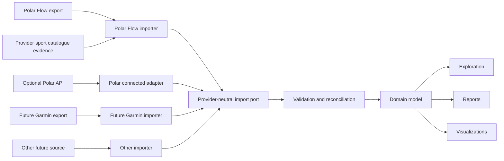

# Source Integration Architecture

## Status

Confirmed architectural direction. The current bounded-context proposal is documented in [`../domain/bounded-contexts.md`](../domain/bounded-contexts.md), and the import consistency proposal is documented in [`import-lifecycle.md`](import-lifecycle.md).

## Decision

The product core will be independent of Polar Flow, Garmin, and any other provider. Each provider export will be handled by a source-specific importer adapter and translated through an anti-corruption layer into provider-neutral application inputs and domain concepts.

Polar Flow is the only MVP source, but its importer will use the same boundary intended for future providers.

## Design rules

### Provider adapters

Each source adapter owns:

- Artifact and source detection.
- ZIP, file, and schema validation specific to that source.
- Historical source-format versions.
- External identifiers and provider terminology.
- Mapping from source records into application import inputs.
- Compatibility reporting and synthetic contract fixtures.
- Provider-catalogue retrieval shape, provenance, identifiers, name keys, hierarchy, and mapping into
  provider-neutral sport-recognition suggestions.

Source adapters do not own domain reconciliation, persistence policy, reports, or user-interface navigation beyond source-specific import guidance.

An archive adapter and a connected adapter for the same provider share source translation and canonical mapping
rules, but remain distinct delivery-channel adapters. The connected adapter additionally owns authorization scopes,
date-window and feature expansion, rate-limit handling, freshness, checkpoint input, and API response validation. It
does not give API arrival order authority over archive evidence.

### Package identity and protected input

[ADR 0029](decisions/0029-separate-package-identity-compatibility-and-safety.md) separates provider evidence
from archive protection. An adapter may classify a central-directory inventory as its current lexical grammar,
provider-shaped but unsupported, or unrecognized. This classification does not open or extract content. The
infrastructure boundary still scans every member for central-directory integrity, traversal, absolute paths,
symbolic links, encryption, duplicate names, expanded-size and compression-ratio limits before mapping begins.

Current lexical identity does not imply valid required content. A missing or malformed required claim is a
malformed recognized export; ordinary nesting with provider evidence is an unsupported provider version;
ordinary nesting without provider evidence is an unsupported input selection; and a genuine safety violation
retains precedence in every category. Application transport exposes stable provider-neutral outcome codes while
the adapter remains the sole owner of source-specific filename evidence.

### Provider-neutral core

The domain and application layers own:

- User-meaningful concepts and invariants.
- Logical identity and reconciliation policy.
- Import transactions and provenance requirements.
- Queries used by exploration, reports, and visualizations.
- Consistent units, time semantics, and normalized classifications.

Core types will not reproduce provider JSON objects or use a provider namespace as their product vocabulary.

### Execution independence

The import application workflow will not depend on the graphical interface. The desktop interface, integration tests, and any development-only headless driver will invoke the same use cases through the same input ports. Parsing, reconciliation, persistence, progress reporting, and recovery rules must not be duplicated in a CLI or presentation adapter.

A headless driver is permitted when it shortens feedback loops, enables representative performance tests, or makes failures reproducible. It is supporting tooling rather than a separate MVP delivery path.

### Source acquisition guidance

Source acquisition is a versioned importer capability, not presentation copy and not a network-fetched product feed. The application layer defines a provider-neutral `SourceAcquisitionGuidePort`; each source adapter supplies its own source identifier, guide version, last-verification date, expected archive kind, ordered content keys, provider-controlled constraints, troubleshooting keys, and official links. The application validates the complete result before presentation and treats a missing or invalid guide as unavailable rather than inventing instructions.

The desktop bundle contains the concise procedure and both initial locale catalogs, so a provider outage or website change cannot remove the last verified instructions. Presentation resolves the adapter-owned content keys through the normal localization catalogs. This keeps provider terminology outside the domain and application layers while allowing the adapter, localized presentation resources, tests, and documentation to evolve together.

Opening an official page is always a separate user action through the application use case selected in
[ADR 0028](decisions/0028-own-official-destination-opening-in-the-application.md). Presentation sends a source,
purpose, and supported locale rather than native URL authority. The application revalidates the guide, selects
the exact localized or locale-neutral HTTPS destination, and delegates it through an infrastructure port. On macOS,
the adapter waits for the system launcher to accept or reject that destination; spawning a process is not sufficient
evidence of acceptance. The host returns a factual accepted outcome or a stable native failure category; it grants no
generic frontend URL, path, credential, account, or download access. FitFreed never enters credentials, signs in,
requests an export, polls provider delivery, or downloads the archive on the person's behalf.

The normative version 1 application-to-presentation contract is documented in [`../data-formats/guidance/source-acquisition-guide-v1.md`](../data-formats/guidance/source-acquisition-guide-v1.md). An adapter guide change increments its own `guideVersion` when the procedure, archive expectation, constraint meaning, troubleshooting meaning, or official destination changes. A verification-only review updates `verifiedOn` without changing the contract schema version.

### Connected acquisition

[FR-024](../requirements.md#fr-024--incremental-connected-provider-synchronization) extends an established archive
history through an optional source-specific API adapter. The current architecture, external gates, account-to-origin
binding, polling strategy, archive/API collision rules, disconnection, and verification obligations are maintained in
[`connected-provider-synchronization.md`](connected-provider-synchronization.md). The descriptive Polar v4 contract is
maintained separately in
[`../data-formats/providers/polar-accesslink-v4.md`](../data-formats/providers/polar-accesslink-v4.md).

Connected responses use the same provider-neutral reconciliation decisions as archive imports while retaining their
delivery channel, retrieval interval, component completeness, source revision, and mapping provenance. A summary API
response is discovery evidence, not authority to clear components that an archive or earlier complete response
supplied. Missing records are not tombstones unless a provider contract explicitly makes them so.

Provider authorization belongs outside the core. A client secret never enters a public desktop build. The proposed
confidential-client topology in
[ADR 0038](decisions/0038-isolate-confidential-provider-oauth.md) keeps fitness data provider-to-device and limits a
possible broker to transient token exchange. It cannot be accepted or implemented until the provider and product
authority gates close.

### Sport-catalogue evidence

[ADR 0027](decisions/0027-resolve-sport-identity-from-versioned-provider-evidence.md) separates provider
recognition from both canonical training facts and user-authored classification. An adapter may install an
immutable evidence snapshot containing exact provider identifiers, localized names, provider hierarchy,
retrieval provenance, source digest, catalogue revision, and mapping version. Those provider fields remain
inside infrastructure. The application receives deterministic candidates containing only localized names,
an optional provider-neutral family suggestion, opaque evidence identity, and candidate cardinality.

Activation selects one snapshot per provider and advances training-discovery revision. One candidate becomes
`recognized`; multiple candidates remain `ambiguous`; no candidate remains `unknown`; absence of source sport
evidence remains `unavailable`. Input order never chooses a candidate. A `personally-overridden` family or
label has presentation precedence without deleting source recognition. Exact archive reimport does not overwrite
either evidence class.

The supported Polar adapter activates a bundled, versioned compatibility snapshot so archive-only use resolves every
identifier covered by the supported takeout contract without provider authorization. A deterministic maintainer
command generates that snapshot from Polar Flow's public sport-identifier mapping and versioned public localization
namespaces, and records their provenance, source digests, update policy, ambiguity handling, and mapping rules. A
later optional connected-provider adapter
may install a newer authorized provider snapshot through the same evidence port. It enriches the local baseline; it
does not make account connection a prerequisite for archive interpretation.

The normative input and output fragments are the
[provider sport catalogue evidence](../data-formats/providers/provider-sport-catalogue-v1.md) and
[training sport identity](../data-formats/insights/training-sport-identity-v3.md) contracts. The catalogue is eligible
for bundling only after deterministic generation, contract validation, provenance verification, source-identifier
coverage, and upgrade and rollback tests pass. Route, speed, distance, heart rate, device, and other session evidence
are never recognition substitutes.

[ADR 0031](decisions/0031-scope-training-target-sport-evidence-to-one-session.md) adds a narrower source
relationship that remains useful when catalogue evidence is absent or older than an exact target. A completed training target may
contribute its exact detailed-sport code only when its normalized local start identifies one and only one current
session in the same resolved origin. Sport-profile order and content do not join to session `sport.id`; neither do
shared opaque values, frequency, measurements, routes, or device context. The adapter persists attributed private
source evidence and exposes only its provider-neutral suggestion. Distinct exact codes remain ambiguous, and
personal meaning still wins without erasing recognition.

### Planned-training intent

[ADR 0033](decisions/0033-model-planned-training-as-versioned-intent.md) maps supported provider targets into a
provider-neutral planned-training aggregate rather than attaching their phases to recorded sessions. Source
Translation owns filename grammar, target-item identity evidence, JSON validation, provider enum translation,
unmapped source locations, source sport codes, and mapping versions. Fitness History owns target identity, ordered
exercise and phase invariants, goals and units, transition and repeat semantics, mapping coverage, completion ordering,
reconciliation, conflicts, and planned-to-recorded relationship cardinality.

Scheduled targets and favourite templates share canonical structure but retain distinct lifecycle kinds. Favourite
exports remain ordered immutable snapshots, including explicit emptiness; omission from a later snapshot cannot delete
history. A mapping revision may enrich equal source evidence, but package order cannot resolve an unorderable changed
definition. Exact source candidates may establish one recorded-session relationship after both aggregates reconcile;
name, date proximity, duration, sport family, route, measurements, and phase shape are never substitutes.

Application queries compose planned intent with recorded evidence only after reading each authority through its own
port. Reports and portable export consume the same provider-neutral aggregate or read model. They never query the
provider adapter or infer canonical meaning from the SQLite schema.

The [portable planned-training contract](../data-formats/portable/planned-training-v1.md) exits canonical intent and
its attributed source evidence without making provider tokens part of the domain or publishing SQLite as an
interchange format. Provider codes survive only as explicit opaque source evidence in the user-controlled export.

### No lowest-common-denominator model

Vendor neutrality does not mean flattening every observation into generic key-value data. The model will distinguish:

1. Shared domain concepts with stable product meaning.
2. Source-specific observations that have useful meaning but no established shared equivalent.
3. Raw external fields that are unsupported, unknown, or retained only for diagnostics according to the eventual retention policy.

[ADR 0006](decisions/0006-use-typed-source-specific-recovery-components.md) selects typed namespaced components for useful source-specific recovery assessments, baselines, and guidance. Shared measurements remain provider-neutral. Each component carries a versioned semantic scheme as data, while core behavior depends on its typed contract rather than provider conditionals or arbitrary key-value fields.

### Provenance

Normalized information will retain the minimum metadata required to:

- Identify its source provider and import operation.
- Trace the source record or artifact without exposing personal values in diagnostics.
- Reconcile repeated and overlapping exports.
- Explain source-specific limitations or mapping decisions.
- Prevent silent merging of semantically different observations.

### Source-subject correlation

[ADR 0005](decisions/0005-use-library-scoped-source-subject-correlation.md) defines the accepted correlation boundary. A provider adapter extracts one versioned strong claim and passes it to a library-owned resolver without promoting that value into canonical identity. The resolver returns an opaque, library-local observation origin or a privacy-safe rejection.

The Polar Flow MVP requires exactly one structurally valid account-data username claim. The raw value exists only while resolving the import. Persistence retains a library-scoped HMAC-SHA-256 digest and its opaque origin; canonical observations receive only that origin. Filename tokens, package fingerprints, mutable profile values, artifact UUIDs, and the number of existing subjects are never identity fallbacks.

An equal scoped claim reuses its origin. Missing, malformed, multiple, changed, unmatched, or contradictory claims fail closed whenever safe automatic correlation cannot be proved. Public diagnostics expose fixed codes and aggregates, not raw claims, digests, or identity-bearing filenames.

### Evolution

A new provider may reveal a domain concept not previously modeled. Adding that concept is a legitimate domain evolution when it provides user value; it is not a reason to prebuild speculative abstractions during the Polar-only MVP.

A runtime plug-in system is not required to prove importer independence. The MVP needs a stable code boundary, contract tests, and one Polar Flow implementation. Dynamic discovery and third-party importer packaging remain possible post-MVP capabilities.

## Verification

- Domain and application modules compile and test without provider adapters.
- The Polar Flow importer is tested against synthetic compatibility fixtures through the provider-neutral import contract.
- Architecture checks reject provider dependencies and provider terminology in core modules.
- Reimport and reconciliation tests distinguish parsing identity from domain identity.
- Adding a synthetic second importer in an architecture test does not require changes to existing domain use cases.
- Synthetic catalogue tests prove validation, immutable installation, activation, ambiguity, personal
  precedence, reimport stability, revision invalidation, and the absence of provider identifiers from public
  projections.

## Pending decisions

- Canonical units and time-zone semantics.
- Cross-provider identity and reconciliation beyond the same-provider archive/API rules confirmed in
  [`connected-provider-synchronization.md`](connected-provider-synchronization.md).
- Original-artifact and unsupported-field retention policy.
- Importer packaging and discovery model after the MVP.
- User-controlled recovery for a changed provider identifier and multiple accounts from one provider.

[ADR 0004](decisions/0004-adopt-capability-and-lifecycle-bounded-contexts.md) accepts the capability and lifecycle context boundaries after the daily-activity vertical exercised them. Later evidence may refine physical modules without changing context ownership; a conflicting ownership model requires a superseding decision.
