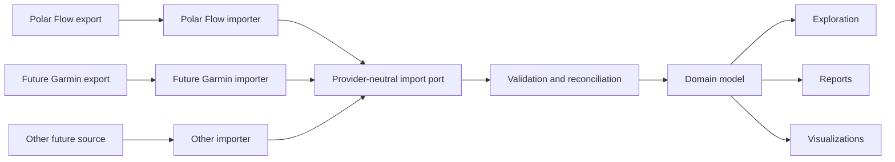

# Source Integration Architecture

## Status

Confirmed architectural direction. The current bounded-context proposal is documented in [`../domain/bounded-contexts.md`](../domain/bounded-contexts.md), and the import consistency proposal is documented in [`import-lifecycle.md`](import-lifecycle.md).

## Decision

The product core will be independent of Polar Flow, Garmin, and any other provider. Each provider export will be handled by a source-specific importer adapter and translated through an anti-corruption layer into provider-neutral application inputs and domain concepts.

Polar Flow is the only MVP source, but its importer will use the same boundary intended for future providers.

## Design rules

### Provider adapters

Each source adapter owns:

- Artifact and source detection.
- ZIP, file, and schema validation specific to that source.
- Historical source-format versions.
- External identifiers and provider terminology.
- Mapping from source records into application import inputs.
- Compatibility reporting and synthetic contract fixtures.

Source adapters do not own domain reconciliation, persistence policy, reports, or user-interface navigation beyond source-specific import guidance.

### Provider-neutral core

The domain and application layers own:

- User-meaningful concepts and invariants.
- Logical identity and reconciliation policy.
- Import transactions and provenance requirements.
- Queries used by exploration, reports, and visualizations.
- Consistent units, time semantics, and normalized classifications.

Core types will not reproduce provider JSON objects or use a provider namespace as their product vocabulary.

### Execution independence

The import application workflow will not depend on the graphical interface. The desktop interface, integration tests, and any development-only headless driver will invoke the same use cases through the same input ports. Parsing, reconciliation, persistence, progress reporting, and recovery rules must not be duplicated in a CLI or presentation adapter.

A headless driver is permitted when it shortens feedback loops, enables representative performance tests, or makes failures reproducible. It is supporting tooling rather than a separate MVP delivery path.

### No lowest-common-denominator model

Vendor neutrality does not mean flattening every observation into generic key-value data. The model will distinguish:

1. Shared domain concepts with stable product meaning.
2. Source-specific observations that have useful meaning but no established shared equivalent.
3. Raw external fields that are unsupported, unknown, or retained only for diagnostics according to the eventual retention policy.

The controlled representation for source-specific observations remains a Milestone 0 design decision. It must preserve semantics and provenance without making provider conditionals spread through the core.

### Provenance

Normalized information will retain the minimum metadata required to:

- Identify its source provider and import operation.
- Trace the source record or artifact without exposing personal values in diagnostics.
- Reconcile repeated and overlapping exports.
- Explain source-specific limitations or mapping decisions.
- Prevent silent merging of semantically different observations.

### Evolution

A new provider may reveal a domain concept not previously modeled. Adding that concept is a legitimate domain evolution when it provides user value; it is not a reason to prebuild speculative abstractions during the Polar-only MVP.

A runtime plug-in system is not required to prove importer independence. The MVP needs a stable code boundary, contract tests, and one Polar Flow implementation. Dynamic discovery and third-party importer packaging remain possible post-MVP capabilities.

## Verification

- Domain and application modules compile and test without provider adapters.
- The Polar Flow importer is tested against synthetic compatibility fixtures through the provider-neutral import contract.
- Architecture checks reject provider dependencies and provider terminology in core modules.
- Reimport and reconciliation tests distinguish parsing identity from domain identity.
- Adding a synthetic second importer in an architecture test does not require changes to existing domain use cases.

## Pending decisions

- Acceptance or refinement of the candidate context boundaries after the first vertical concept exercises their contracts.
- Canonical units and time-zone semantics.
- Controlled representation of genuinely source-specific observations.
- Cross-source reconciliation and user-visible conflict handling.
- Original-artifact and unsupported-field retention policy.
- Importer packaging and discovery model after the MVP.
