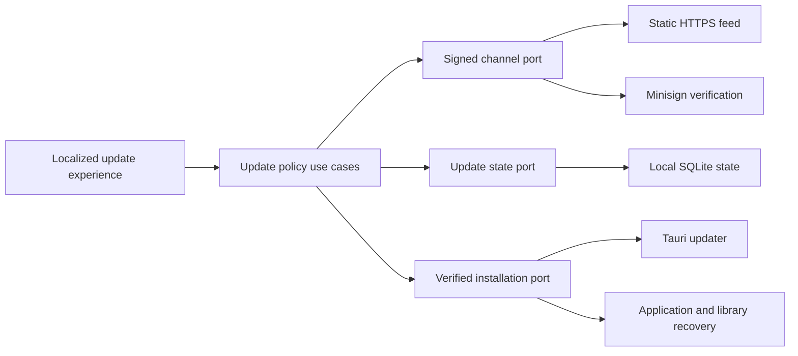

# Update Trust Architecture

## Status

Current Milestone 3 engineering under [ADR 0008](decisions/0008-authenticate-update-policy-above-tauri.md) and [ADR 0020](decisions/0020-compose-product-and-update-pages.md). The private-alpha version 1 and public stable version 2 contracts, application policy, bounded HTTPS transport, exact-byte signature verification, restart-safe replay and notification state, fresh exact-package installation authorization, typed host orchestration, localized launch, recurring and manual checks, preference and installation presentation, native bounded-download and replacement adapters, recovery-transition policy, atomic verified application/library recovery-pair preparation, restart-safe preserved-executable watchdog runner, replacement-side startup confirmation, terminal recovery cleanup, privacy-minimized outcome presentation, packaged success-and-recovery update journey, release-bound upgrade matrix, compile-time public trust boundary, atomic update-only Pages staging, and the complete product-site and update-channel compositor exist. The compositor is live at the canonical public origin while preserving an inactive update boundary; the [public-release readiness ledger](../testing/public-release-readiness.md) owns its current evidence and remaining gates. [ADR 0011](decisions/0011-schedule-update-discovery-in-the-desktop-host.md) defines the implemented periodic schedule. [ADR 0012](decisions/0012-publish-two-dimensional-upgrade-support.md) separates real application release baselines from direct library-schema migration. No production updater trust or private signing key is configured.

## Trust boundary

The update channel is an infrastructure adapter behind provider-neutral application use cases. The application layer owns update policy and user-visible outcomes. Infrastructure owns transport, exact-byte signature verification, replay-state persistence, package download, library backup, application preservation, native installation, and recovery coordination. The Tauri host exposes typed commands; React never receives a signing key, unrestricted URL, package bytes, filesystem path, or native installer authority.

Dependency direction remains inward: neither the domain nor application crate imports Tauri, HTTP, Minisign, SQLite, package formats, or operating-system APIs.

[SQLite schema version 9](../data-formats/persistence/sqlite-v9.md) implements the `UpdateStatePort` as one constrained singleton row in the existing local library. The row contains only the accepted sequence, exact payload digest, candidate version, and an optional matching dismissal or postponement. Reads and writes validate SemVer, RFC 3339, digest syntax, safe sequence bounds, completeness, and mutual exclusion. No row is created until state is first accepted or explicitly saved. A version 8 library migrates atomically without reapplying the immutable version 8 migration.

The HTTPS adapter accepts only one static URL with no credentials, query, or fragment, uses platform-verified rustls roots, honors the system proxy, disables TLS key logging and redirects, and stores no cookies. Connection and complete-request limits are 5 and 10 seconds. Both declared and streamed response size are bounded before the exact bytes enter the verifier. Network, timeout, read, non-success-status, and redirect failures map to the provider-neutral `offline` outcome; an oversize response maps to `untrusted`. Its `unconfigured` construction performs no network access and is the ordinary-build path; configured construction rejects absent or malformed trust before a request.

The verifier selects one complete contract before reading a response. Private-alpha trust accepts only envelope and
payload version 1 with channel `private-alpha`. Public trust accepts either the closed stable version 2 contract or the
recovery-capable stable version 3 contract, according to one explicit build selector; neither verifier accepts the
other contract's schema or fields. Version 3 additionally validates the complete ordered predecessor set before
selecting only the current target's evidence for the application layer. Its current and predecessor URLs are immutable
credential-free HTTPS locations without a query or fragment. The public endpoint and up to eight active public keys
come from the versioned [public update configuration](../data-formats/release/public-update-configuration-v2.md), then
become explicit compile-time inputs only for a public candidate build. The checked-in version 1 instance still selects
stable version 2 until every release producer and verifier moves to configuration version 2. All three compile-time values are absent in an ordinary build;
a partial, malformed, unsupported, or mixed instrumented/public configuration fails closed.

The Tauri host supplies the compiled application version, current SQLite schema version, persisted locale, UTC timestamp, and fixed manual or launch trigger. React cannot submit or override those policy inputs. Network and SQLite work runs outside the UI thread. The host returns only closed camel-case DTOs and stable error codes; endpoint URLs, response bodies, signing material, package paths, and database errors never cross the command boundary. The application result retains exact current-target package expectations and the authenticated signing-key identifier only in a transient authorization for native installation; the presentation mapper deliberately omits that authorization. A launch check runs only after locale initialization. A successfully persisted locale change causes a new launch-style evaluation so authenticated release text changes language with the interface. A candidate process retains its validated recovery identifier in host state; React emits only a no-argument readiness signal after locale startup. The host serializes the claim and derives the current executable, compiled version and schema, library path, and recovery root independently before confirmation.

The Rust-only package adapter resolves the authorization's signing-key identifier from the same active trust set that authenticated the metadata. It requires the current host target and a canonical credential-free immutable HTTPS URL, prepares Tauri's native update without an endpoint read, and rechecks exact version, target, URL, and package signature before transfer. Its client permits five seconds to connect and fifteen minutes for the complete bounded package request, disables redirects and TLS key logging, and never exposes an updater capability to React. Tauri requires an explicit plug-in configuration object at startup, so the ordinary configuration supplies empty `pubkey` and `endpoints` values; repository automation rejects null, populated, or dangerous values. A separate closed Tauri overlay enables updater artifact creation without embedding endpoint or key values. Tauri verifies the candidate package signature; FitFreed then rechecks exact size and SHA-256. The predecessor transfer uses the same selected key, TLS policy, time bounds, and exact authenticated artifact expectation while streaming the package once to a private temporary file. It rejects a declared or observed size mismatch before excess bytes can be retained, verifies the prehashed updater signature and SHA-256 during transfer, synchronizes the file, reopens it without following a symbolic link, and repeats all three checks before no-clobber handoff to recovery preparation. Any incomplete, mutated, wrongly signed, or unpublishable staging file is removed. Transport failure remains distinct from an integrity failure. Verified bytes remain inaccessible outside the recovery-owned infrastructure path. The installation command accepts only the displayed candidate version; the host obtains every path and trusted package field independently.

Recovery preparation accepts only the canonical installed `FitFreed.app`, `fitfreed.sqlite`, a newer authorized version, and the current-or-newer target schema. The macOS adapter copies bundle metadata with the system `ditto` implementation, verifies bundle identity, version, executable, every file, permission, and bundle-confined symbolic link through a deterministic tree digest, and synchronizes the complete copy. SQLite backup now verifies the source, writes through the online backup API to a private temporary file, reopens it read-only, checks exact schema and `PRAGMA integrity_check`, synchronizes it, and promotes it atomically only after verification. A closed 64 KiB manifest and no-clobber active pointer are published only after both assets reopen and verify. Recovery actors serialize compare-and-transition writes with a private operating-system state lock; the manifest remains the state source of truth, and symbolic lock substitution fails closed. Candidate launch atomically binds `launching` to the macOS-observed process identifier, process start time, a fresh launch nonce, and an absolute confirmation deadline before an exact private pipe record releases the candidate into Tauri startup. The candidate then holds a separate validated process lease; restoration must acquire that lease file and therefore cannot mutate the application or library while the candidate still owns them. The watchdog derives its authority from the exact preserved-executable layout, the active pointer, the verified manifest and pair, an independently supplied installed-application path, and the recovery-root-derived library path. Replacement confirmation requires the exact installed bundle, target version, target library schema, fixed library path, SQLite integrity, still-valid recovery pair, exact process record, launch nonce, and held candidate lease. Restoration revalidates the complete recovery pair and exact canonical destinations before mutation, stages and verifies the previous bundle beside its destination, retains the failed candidate, atomically restores the library after removing only its fixed inactive sidecars, and converges after interruption on the same verified pair. Symlink boundaries, tampering, interrupted preparation or restoration, a second active attempt, and illegal transitions are rejected.

The host routes the exact private watchdog invocation before Tauri initialization. The installer-side launcher starts only the preserved executable, disconnects input and diagnostics, and requires an exact process-bound readiness record within ten seconds. One watchdog holds a private process-lifetime lease before announcing readiness. The runner accepts every valid active phase, observes the locked persisted lifecycle, derives the installation deadline from `preparedAt`, launches the exact installed executable behind a process-bound startup gate, and allows a parent stop only while that identifier still names its direct parent. Reparenting proves that the original application terminated even when an automation host has not yet reaped its zombie process; the watchdog neither waits for that stale PID nor allows later escalation to target it after reuse. A restarted runner reconstructs an inherited candidate only from the persisted PID, macOS start timestamp, and exact executable path; it revalidates those facts before either signal and treats exit or PID reuse as candidate termination. It stops the candidate after atomically winning recovery authority, must acquire the candidate lease before restoring, and relaunches only after `recovered`. The candidate host accepts only the exact private recovery identifier and nonce shape, requires the matching startup record, validates and retains its process lease before ordinary startup recovery, and can win `launching → confirmed` only through the existing complete pair and destination validation. Confirmation failure retains the claim for diagnosis while the watchdog remains authoritative.

The installation command holds the application coordinator's exclusive operation lease so import and update cannot overlap. It reruns the complete manual authorization for the exact requested version, downloads and verifies the package, resolves the installed macOS bundle, prepares the recovery pair, and waits for the preserved watchdog before recording `replacement-started`. Only then may Tauri perform native replacement. Success records `replacement-installed` and exits the original application; native installation failure records `recovering` for the already-running watchdog. If the watchdog never becomes ready, the still-quiescent `prepared` attempt is removed under all three recovery locks. If the first lifecycle transition fails, the watchdog is stopped before that same bounded discard. A published attempt is never discarded after replacement begins. After `confirmed` or `recovered`, maintenance validates the exact installed pair under the watchdog, candidate, state, and outcome locks; writes a minimal durable outcome receipt; removes the matching active pointer; removes only an exact failed candidate after recovery; and deletes the one verified attempt. An interruption resumes only from the exact receipt-bound attempt. `recovery-failed`, unrelated orphans, changed destinations, symbolic boundaries, and busy locks fail closed and retain their evidence.

## Linux and Windows recovery extension

[ADR 0042](decisions/0042-recover-packaged-updates-from-authenticated-predecessors.md) extends the recovery
architecture without reinterpreting the closed macOS version 1 format. Linux Debian and Windows NSIS packages own
native installation state beyond a copied application directory. Their next recovery-contract version therefore binds
an authenticated predecessor installer, a minimum complete runnable predecessor image, the matching library backup,
and the candidate authorization before replacement begins.

The application layer retains the same lifecycle policy and provider-neutral outcomes. Its authorization now carries
the authenticated predecessor package selected by exact installed version, native package target, and current library
schema. A Debian or NSIS update without that exact predecessor is `manual-recovery-required` and exposes no
installation action; macOS continues to preserve its running application locally and requires no predecessor entry. An
infrastructure installation port owns target and package identity, installed destination derivation, predecessor
material, package-state validation, native rollback, runnable fallback, filesystem durability, exclusive leases,
process creation evidence, process control, and launch. Linux and Windows adapters must never infer authority from a
process identifier or caller-supplied path alone.

Native predecessor installation remains the only terminal application rollback because it restores package-manager
state. A validated runnable predecessor may be launched when native rollback is temporarily unavailable, but that is a
distinct non-terminal recovery state: it retains all recovery assets, blocks another update, and offers a safe retry
path. Preparation is allowed to use the network only before replacement; every artifact needed after replacement is
already local, authenticated, reopened, and bound by the recovery manifest.

The Linux adapter owns the first native recovery primitives. It derives the installed `fitfreed` version and
`amd64` architecture through fixed `/usr/bin/dpkg-query` invocations, requires the package manager to report an
installed package that owns `/usr/bin/fitfreed` and `/usr/share/applications/fitfreed.desktop`, and reopens both as
non-symbolic regular files before accepting the identity. Native predecessor restoration derives only
`previous/package.deb` below the canonical attempt directory, invokes the fixed `/usr/bin/pkexec /usr/bin/dpkg
--install` boundary, and revalidates the resulting native identity and files. Linux process authority binds the PID to
the current boot identifier, field 22 of `/proc/<pid>/stat`, and the exact `/usr/bin/fitfreed` executable target.

Package preparation accepts only exact bytes already bound to the authenticated candidate and predecessor
expectations. It preserves both packages through private no-clobber files, checks their fixed Debian control identity,
and extracts the predecessor with `/usr/bin/dpkg-deb --extract` without running maintainer scripts. A bounded,
path-confined tree walk rejects unsupported entries and escaping links, requires the executable and desktop entry,
records a deterministic tree digest, synchronizes every regular file and directory, publishes the runnable image, and
reopens the complete package pair and tree. Failed preparation removes only assets created by that operation. Atomic
version 2 preparation now binds those assets to an online, integrity-checked library backup, the installed native
identity, and the exact authenticated candidate in one private attempt before publishing its active pointer. The
application layer owns a separate provider-neutral packaged-recovery policy whose additional non-terminal state
cannot be represented by or written into the closed macOS version 1 format. Linux state transitions serialize through
the attempt lock, candidate launch records exact `/proc` identity, and watchdog authority resolves only from the
preserved executable's validated attempt layout. Exclusive watchdog and candidate leases are bound back to the active
attempt; candidate acquisition additionally requires the complete recorded process identity, launch nonce, and exact
installed target package identity. Candidate confirmation holds that lease while it revalidates the complete recovery
attempt, exact target package identity, application version, library location, target schema, and SQLite integrity
before entering `confirmed`. A still-quiescent `prepared` attempt can be discarded only while holding the outcome,
watchdog, candidate, and state locks; once replacement starts, the attempt and its evidence cannot be discarded.
Linux recovery replaces the library atomically from the verified predecessor copy, reinstalls the fixed native package
through the operating-system authorization boundary, and verifies its version and critical installed bytes against the
runnable image. Authorization, package-manager, and invalid-installed-state failures are persisted separately; two
failures retain a retriable non-terminal state and the third enters terminal failure without removing evidence.
The platform-neutral outcome store now owns the one closed receipt format used by both recovery contracts. Linux
terminal maintenance holds the outcome and process locks, revalidates either the exact installed target pair or the
restored predecessor pair, writes that receipt before removing authority, and can resume cleanup only from its
matching durable receipt after interruption. Busy actors defer cleanup; non-terminal and failed attempts retain all
evidence. The host now obtains the authenticated predecessor before the candidate, publishes the complete version 2
attempt, starts the watchdog from the preserved predecessor, records `replacement-started`, and installs only
`candidate/package.deb` through the fixed `/usr/bin/pkexec /usr/bin/dpkg --install` boundary. The watchdog dispatches
before Tauri startup, launches and owns the installed candidate through exact `/proc` identity and a private nonce
handshake, confirms the candidate through the held lease, and drives failed launch or confirmation into offline native
recovery. When native recovery cannot finish, it launches only the verified runnable predecessor without candidate
authority and leaves the non-terminal attempt intact. An ordinary Linux startup now resolves only the active verified
attempt, applies application-owned restart policy, probes the exclusive watchdog lease, and relaunches the preserved
watchdog under a distinct private restart mode when interrupted work remains. That mode closes a merely prepared
attempt, begins recovery immediately after an interrupted native replacement, and continues later phases from their
persisted evidence without duplicating an active watchdog. It does not automatically repeat unavailable native
authorization. The host instead exposes a privacy-minimized, read-only recovery intervention derived from the active
verified attempt. The application layer permits a bounded explicit retry only from `native-recovery-unavailable` and
requires manual reinstall after the third failed native attempt. The Linux adapter proves exclusive watchdog
availability before the transition and returns to the unavailable state if a new watchdog cannot start. The
instrumented Linux installation boundary can publish and hold one test-only synchronization point immediately after
`replacement-started`; production builds contain no marker, wait, or environment-driven branch. The package-shaped
restart scenario terminates both coordinator and watchdog at that point, relaunches the ordinary installed
application, and requires startup reattachment to recover from the durable attempt.

The Windows adapter begins from the separate current-user NSIS installation contract. It derives the installation
and application-data roots from Windows known folders, accepts only the fixed per-user Add or Remove Programs identity,
and requires its registered version, product, publisher, homepage, main binary, install location, uninstaller, and
non-reparse critical files to agree. Candidate and predecessor installation derive only the fixed package below a
canonical recovery attempt, invoke that package with the closed NSIS silent argument, and revalidate the resulting
native version and installation identity. Process authority opens the native process, records its Windows creation
`FILETIME`, resolves its canonical executable, and compares both with the PID. Termination reopens one handle with
query, synchronization, and terminate rights and repeats those identity checks on that same handle before acting.
Post-recovery validation reopens the installed application and uninstaller without following reparse points and
requires both byte streams to equal their fixed counterparts in the preserved runnable predecessor.
The NSIS adapter reports a failed installer invocation separately from an installer that returns success but leaves
an unreadable registration, an unexpected version, or another invalid native identity. Recovery state can therefore
persist `installer-failed` and `installed-state-invalid` without inferring the cause from an incomplete installation.

Windows package preparation validates the authenticated predecessor and candidate byte lengths and SHA-256 digests,
requires their x86-64 PE product, description, file version, and product version to match the expected FitFreed
identity, and requires the current native installation to be the same predecessor version. It copies the complete
installed directory into a no-clobber staging tree, rejecting reparse points, special files, unsafe Windows names,
excessive paths, entry counts, or expanded size. The preserved tree must contain the exact application and uninstaller;
its deterministic digest and both packages are reopened after no-clobber promotion. Failed preparation removes only
the directories it created.

The Windows-local [recovery contract version 3](../data-formats/release/update-recovery-v3.md) fixes that attempt to
one x86-64 current-user NSIS identity. It binds the two authenticated installers, complete runnable predecessor,
matching library, exact known-folder-derived native paths, native retry state, and lossless process creation `FILETIME`
without reinterpreting the closed macOS or Linux schemas. Its lock files use Windows no-sharing handles rather than
Unix advisory locks. Rust preparation now derives and canonicalizes the native installation and application-data
identity, rejects changed authorization before creating state, acquires the outcome boundary, prepares both packages
and the complete runnable predecessor, creates and integrity-checks the matching SQLite backup, and writes the closed
manifest through private no-clobber staging. It publishes the active pointer only after reopening and verifying every
asset, fixed relationship, lock file, digest, package expectation, schema, and lifecycle invariant. Interrupted
preparation removes only its owned staging attempt; an existing active attempt, redirected path, substituted lock,
or mutated package, runnable image, library, or manifest fails closed. Windows uses a no-sharing file handle for the
production outcome lease, while portable tests exercise the equivalent non-blocking exclusive ownership boundary.
Lifecycle mutation now serializes through the state lock, requires the active pointer and manifest identity to agree,
and admits only application-owned transitions. The generic transition cannot forge `launching`; that phase is written
atomically only with the exact process identifier, lossless creation `FILETIME`, canonical installed executable path,
fresh launch nonce, and absolute confirmation deadline. The preserved executable resolves watchdog authority only
through its exact active attempt layout; a watchdog lease revalidates that immutable context, and a candidate lease
requires the exact persisted PID, creation `FILETIME`, executable, nonce, and target native installation identity.
Both process-lifetime leases use the same exclusive-handle boundary without reopening their held lock on Windows.
Candidate confirmation holds its lease, derives the fixed library beside the recovery root, and requires the active
manifest, launch nonce, target native identity, running version, target schema, and SQLite integrity before the
specialized transition can enter `confirmed`; the generic transition API cannot claim that state. Restoration holds
the watchdog, candidate, and state ownership boundaries together, reopens the complete attempt, atomically restores
the fixed library from its verified backup, and invokes only the preserved predecessor package. It enters `recovered`
only after the exact source registration and preserved critical files agree. Failed NSIS execution and an invalid
resulting installation remain distinct durable reasons; the first two failures retain a retryable attempt and the
third is terminal. Ordinary restart resolution derives the same verified watchdog context from the active pointer,
without accepting an attempt identifier or executable path from presentation. A privacy-minimized intervention
describes only retryable or terminal native recovery. Explicit retry first proves that no watchdog owns the attempt,
then returns to `recovering`; cancellation with the matching new watchdog lease returns it to
`native-recovery-unavailable`. A still-quiescent `prepared` attempt can be discarded only while the outcome, watchdog,
candidate, and state boundaries are all exclusively held; the active pointer is removed before those Windows handles
are closed and the exact attempt is deleted, while every later phase remains preserved. Watchdog orchestration,
terminal validation, receipt-bound cleanup, native Windows execution, and release-shaped recovery evidence remain
required before Windows recovery is operational.

The current presentation always offers an explicit check. A ready startup performs an immediate scheduled-policy evaluation. The desktop host then owns a process-lifetime 24-hour schedule, skips missed ticks and ticks that coincide with another update operation, and emits only the existing closed outcome DTO. Scheduled launch and recurring outcomes remain quiet when they are unconfigured, offline, current, dismissed, or postponed; available releases, withdrawal guidance, manual-recovery requirements, and rejected trust are announced. A manual check reveals every outcome. The update surface marks itself busy, keeps check, installation, candidate dismissal, and postponement action names stable, and announces the exact localized operation without replacing the trusted outcome. One asynchronous host coordinator serializes launch, manual, dismissal, postponement, and installation operations so channel access and persisted policy state cannot race. Install, dismiss, and 24-hour postpone actions are offered only for an ordinary available release. Installation sends only the exact displayed version, announces that application and library preservation precede replacement, exposes a distinct busy state, and disables update, import, archive-selection, and locale mutations while the command owns the workflow. An active import disables installation. A native success closes the original process; a failure returns a fixed localized code, restores the controls, and retains the authenticated release for retry. On the next ready startup, the host returns only `updated` or `recovered` and the source and target versions from the durable receipt. React presents the localized result until explicit acknowledgement succeeds; its stable dismissal action and separate busy announcement preserve the result throughout that write. Neither the private recovery identifier nor a filesystem locator enters the DTO or failure message. Dismiss and postpone revalidate the same exact candidate against persisted trusted state. None of these actions is offered for a withdrawn installed version. The ordinary development build has no channel or trust key, performs no network request, and therefore exposes no installable candidate. The public build wrapper strips inherited public-update values and adds them only from a complete active versioned configuration. E2E transport accepts one explicitly named synthetic contract and cannot coexist with compiled public trust.

On Linux, the update surface resolves recovery intervention before making any channel request. An available recovery
retry replaces every ordinary update control with the exact source and target versions, completed-attempt count,
retained-evidence statement, and one explicit retry-and-restart action. Exhaustion replaces that action with manual
reinstall guidance. Failure to verify intervention state hides every update action; a separate channel-check failure
does not hide manual checking. Query, retry, installation, and import are serialized through the host coordinators,
and a retry never accepts a recovery identifier, path, package, or command from React.

The native Debian E2E campaign installs signed predecessor and candidate packages through the production `pkexec` and
`dpkg` boundary. It covers successful replacement and automatic native rollback after either candidate rejection or
a real Debian pre-installation failure. The failure candidate is derived from the ordinary synthetic package, receives
one closed failing maintainer script, is rebuilt with root ownership, signed independently, and traverses the same
authenticated download, recovery preparation, native installation, rollback, package-identity, library-preservation,
terminal-cleanup, localized-result, and explicit-acknowledgement boundaries. A separate scenario initially grants
authority only for candidate installation: denied predecessor installation must retain one failed attempt, launch the
verified runnable predecessor, expose the localized recovery intervention without a private identifier, and block
ordinary update controls. The scenario then grants the same narrowly scoped predecessor authority and activates the
real retry action; recovery must finish from the local preserved package without another channel request. Attempt
exhaustion keeps predecessor authorization unavailable across all three explicit attempts, verifies each durable
increment, and requires the retained failed attempt to expose only manual reinstall guidance. Restart resumption uses
the test-only synchronization point to remove both live recovery actors before an ordinary application launch resumes
the preserved watchdog and restores the predecessor pair. The exact native Ubuntu result remains an M4.2 admission
gate rather than a source-level claim.

## Verification pipeline

An update check uses this fail-closed order:

1. Reject an unconfigured channel without attempting network access. Ordinary application behavior continues.
2. Fetch one bounded response from the configured static HTTPS endpoint without request parameters, custom identity headers, or cookies.
3. Validate the closed envelope shape and encoded-size limit.
4. Select an embedded public key by `keyId`, decode the payload, and verify the Minisign Ed25519 signature over those exact decoded bytes before parsing them.
5. Validate the closed payload schema, expected channel, time interval, maximum 14-day validity, sequence, and previously accepted sequence/digest pair.
6. Require the outer Tauri `version`, platform URL, and package signature to equal the values inside the authenticated payload for the current target.
7. Evaluate installed-version withdrawal, candidate withdrawal, SemVer direction, minimum supported application version, and current library-schema readability locally.
8. Persist a newly accepted sequence and payload digest atomically. An identical sequence and digest is an idempotent check; a lower sequence or different digest at the same sequence is rejected.
9. On explicit installation, rerun steps 2 through 8 and require the requested candidate to equal the fresh installable release. Retain the authenticated sequence, payload digest, signing-key identifier, target schema, target, URL, expected size, SHA-256 digest, and package signature as one host-internal authorization.
10. Resolve only the identified active key, construct Tauri's native update from the authorization without another metadata read, require exact version, target, URL, and signature equality, and download without redirects under the signed byte limit. Tauri verifies its package signature; FitFreed then compares exact size and SHA-256 digest.
11. Preserve and verify the current application and library before making the already verified package installable to the native replacement path. On Linux and Windows, also obtain and authenticate the exact predecessor installer and runnable image required by the target package adapter.
12. Record the update as pending, launch a recovery watchdog, replace and relaunch the application, migrate the library transactionally, and mark success only after the new application opens the expected library and confirms its version and schema. Any owned failure restores the matching application and library pair. A terminal result becomes user-visible only after the installed pair is revalidated and its minimal receipt is durable; cleanup is receipt-bound and restart-safe.

No parsed field from the outer response is shown or acted on before steps 4 through 7 pass. Release notes come only from the verified payload.

## Application policy states

The application use case and its transient presentation state expose a finite provider-neutral lifecycle rather than raw transport or cryptographic exceptions:

- `unconfigured`: no production trust root or endpoint exists;
- `checking`: an explicit or scheduled check is active;
- `up-to-date`: the authenticated latest release equals the installed release;
- `available`: a newer compatible non-withdrawn release can be installed;
- `dismissed`: the current verified non-withdrawn candidate was dismissed locally;
- `postponed`: the verified candidate remains available after a local user choice;
- `withdrawn-installed`: the installed version has signed withdrawal guidance;
- `manual-recovery-required`: the installed version is below the supported in-app baseline, no safe replacement exists, or schemas are incompatible;
- `offline`: the service was unreachable and ordinary local use continues;
- `untrusted`: signature, key, shape, mirror, time, replay, or equivocation checks failed;
- `installing`, `restart-required`, `recovered`, and `installation-failed`: explicit installation lifecycle outcomes.

Dismissal hides only the current non-withdrawn candidate from scheduled notifications until its signed sequence or version changes. The initial postponement action stores a deadline 24 hours after the explicit request and never changes channel trust. A manual check still reports the candidate and permits installation. Neither action suppresses withdrawal guidance. Whether installation is available is an application-use-case result; presentation never reimplements version, withdrawal, or schema policy.

## Privacy model

An update check uses a single static URL. It does not place installed version, target, architecture, locale, library schema, installation identifier, or usage information in the URL. The server, configured system proxy, or network provider can necessarily observe request time, source network address, destination, TLS metadata, and standard fields emitted by the HTTP stack or proxy. The client adds no identity, version, locale, account, or usage header. Downloading a platform artifact additionally reveals which artifact URL was requested. FitFreed sends no imported health, activity, training, sleep, recovery, route, account, source-provider, library, locale, or interaction data.

Checks are non-blocking and bounded by timeout. A service failure does not block launch, import, exploration, export, backup, or removal. Repeated scheduled failures do not create repeated intrusive messages. Diagnostics use stable error codes and omit endpoint URLs, response bodies, package paths, key material, and library content.

## Recovery ownership

Application replacement and library migration are separate reversible transitions joined by the platform recovery
manifest and the external-watchdog design in [ADR 0010](decisions/0010-run-update-recovery-from-the-preserved-application.md).
macOS uses the closed [version 1 recovery contract](../data-formats/release/update-recovery-v1.md). Linux x86-64
Debian installations use [version 2](../data-formats/release/update-recovery-v2.md), which additionally preserves and
authenticates the exact predecessor Debian package, a runnable extraction of that package, and native package-manager
identity. A failed Linux native rollback remains a non-terminal condition with retained assets and a bounded explicit
retry path; launching the runnable predecessor does not masquerade as restored native installation.

The recovery-capable [stable update channel version 3](../data-formats/release/update-channel-v3.md) authenticates the
exact predecessor package for every declared Debian or NSIS application baseline. The Rust consumer rejects absent,
unordered, cross-target, wrong-package-kind, mutable-URL, incompatible-schema, non-predecessor, malformed-signature,
and contract-crossing evidence before policy evaluation. The host maps supported packaged targets exactly as
`linux-x86_64-deb` and `windows-x86_64-nsis`; unsupported platform and architecture combinations fail closed. Stable
version 2 remains a closed contract. Configuration version 2 and the host build mapping can select version 3. The
atomic Pages generator accepts only an independently declared recovery-baseline set, derives every signed predecessor
field from reopened package bytes, and stages those exact bytes beside the current packages. Predecessor discovery
derives its required directory set from the matrix, rejects stale or missing evidence, reopens the prior Linux release
manifest, package inventory, complete checksum set, release signature, and updater signature, and returns only the
verified package and detached-signature paths. The recoverable Linux release manifest version 5 and candidate verifier
then bind `stable-v3` to that same matrix and verify every current and predecessor Pages byte, canonical path, digest,
size, and updater signature. Production activation waits until the platform recovery adapters accept this evidence.
The [upgrade matrix version 2](../data-formats/release/upgrade-matrix-v2.md) is the only matrix contract that can declare
Debian and NSIS application baselines; version 1 remains valid for its closed macOS-only target vocabulary.

Both contracts preserve these invariants:

- The application recovery copy contains the exact previously running application image and lives outside Tauri's temporary replacement directory.
- The library backup is produced through SQLite's online backup API and passes an integrity check before replacement begins.
- The previous application is paired only with its pre-update library. A migrated library is never handed to an application whose declared maximum schema is lower.
- The recovery watchdog is launched from the preserved previous executable before replacement, launches the replacement itself, retains its child-process handle, and requires confirmation from the expected new version and schema.
- Terminal cleanup happens only after exact `confirmed` or `recovered` destination validation and while every recovery process lock is owned. A durable minimal receipt precedes bounded deletion, permits restart-safe continuation for only its named attempt, and remains until explicit acknowledgement. `recovery-failed` retains the active authority and recovery assets for actionable, sanitized guidance.

Normal rollback does not install a numerically lower version. Maintainers publish a newer release containing reverted application code. Emergency recovery restores the exact preserved prior application/library pair and does not redefine channel ordering.

## Authority gates

The following inputs do not belong in Git and are not implied by this architecture:

- production private keys or passwords;
- a live private-alpha or public stable deployment and any participant list;
- uploaded application, DMG, updater archive, signature, or signed channel payload;
- a tag, GitHub release, package publication, or withdrawal action; and
- Developer ID or notarization credentials.

Synthetic test keys are generated or scoped to test artifacts and are never accepted by an ordinary production build. A production build without the real embedded public trust and endpoint reports `unconfigured`.

The feature-gated packaged update journey generates a fresh Minisign key and a one-certificate HTTPS authority for each run. Only the instrumented host accepts that additional root from a test-process environment path; the metadata and package clients parse exactly one certificate, and ordinary builds expose neither the constructor nor the environment configuration. The current journey selects public stable version 2, while Rust and schema tests retain private-alpha version 1 coverage and reject cross-channel input. Each success or deliberate candidate-rejection scenario has its own embedded-WebDriver port, installed bundle, SQLite library, and recovery root. The journey proves native package verification and replacement, process-bound startup, candidate confirmation, exact previous-pair restoration, terminal cleanup, privacy-safe localized outcome presentation and acknowledgement, retained locale, and SQLite integrity without weakening the production trust store.

Public Pages staging is an ignored artifact containing exactly the stable envelope, every current platform package,
and every authenticated predecessor package named by it. The payload binds direct URL, size, SHA-256, package
signature, compatibility, localized notes, recovery baselines, and withdrawal state before the complete tree replaces
the previous staging tree as one operation. Generation or signing failure preserves the previous complete tree. Live
Pages deployment remains a protected release action.

## External implementation boundary

The [official Tauri updater documentation](https://v2.tauri.app/plugin/updater/) defines mandatory package signatures, static-feed fields, HTTPS enforcement, generated macOS updater archives, and the Rust download/install API. FitFreed treats those guarantees as one layer, not as authentication for its application-owned metadata. [ADR 0009](decisions/0009-bound-package-transfer-inside-tauri-updater.md) records why the pinned upstream download API cannot enforce the signed byte bound and selects a minimal, provenance-checked source refinement that prepares an update without a second fetch and aborts package transfer before excess bytes are copied. Tauri remains responsible for package-signature verification and native installation. The infrastructure verifier accepts only bounded closed objects before mapping authenticated policy into the application layer. The metadata adapter uses the maintained [Reqwest blocking client](https://docs.rs/reqwest/latest/reqwest/blocking/) because its response implements `Read`, allowing a hard streaming bound; Reqwest is dual Apache-2.0/MIT licensed and its rustls stack is configured with the same ring provider selected by the Tauri updater. Public macOS distribution still requires the separate [Tauri macOS signing guidance](https://v2.tauri.app/distribute/sign/macos/), Developer ID signing, notarization, and Gatekeeper evidence.
