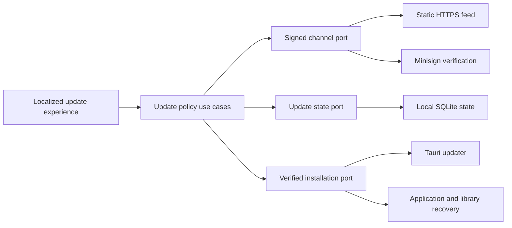

# Update Trust Architecture

## Status

Current Milestone 2 implementation under [ADR 0008](decisions/0008-authenticate-update-policy-above-tauri.md). The versioned contracts, application policy, bounded HTTPS transport, exact-byte signature verification, restart-safe replay and notification state, typed host orchestration, and localized check and preference presentation exist. Native installation, recovery automation, periodic scheduling, and release-shaped evidence are still being implemented. No real update endpoint or production signing key is configured.

## Trust boundary

The update channel is an infrastructure adapter behind provider-neutral application use cases. The application layer owns update policy and user-visible outcomes. Infrastructure owns transport, exact-byte signature verification, replay-state persistence, package download, library backup, application preservation, native installation, and recovery coordination. The Tauri host exposes typed commands; React never receives a signing key, unrestricted URL, package bytes, filesystem path, or native installer authority.

Dependency direction remains inward: neither the domain nor application crate imports Tauri, HTTP, Minisign, SQLite, package formats, or operating-system APIs.

[SQLite schema version 9](../data-formats/persistence/sqlite-v9.md) implements the `UpdateStatePort` as one constrained singleton row in the existing local library. The row contains only the accepted sequence, exact payload digest, candidate version, and an optional matching dismissal or postponement. Reads and writes validate SemVer, RFC 3339, digest syntax, safe sequence bounds, completeness, and mutual exclusion. No row is created until state is first accepted or explicitly saved. A version 8 library migrates atomically without reapplying the immutable version 8 migration.

The HTTPS adapter accepts only one static URL with no credentials, query, or fragment, uses platform-verified rustls roots, honors the system proxy, disables TLS key logging and redirects, and stores no cookies. Connection and complete-request limits are 5 and 10 seconds. Both declared and streamed response size are bounded before the exact bytes enter the verifier. Network, timeout, read, non-success-status, and redirect failures map to the provider-neutral `offline` outcome; an oversize response maps to `untrusted`. Its `unconfigured` construction performs no network access and is the ordinary-build path; configured construction rejects absent or malformed trust before a request.

The Tauri host supplies the compiled application version, current SQLite schema version, persisted locale, UTC timestamp, and fixed manual or launch trigger. React cannot submit or override those policy inputs. Network and SQLite work runs outside the UI thread. The host returns only closed camel-case DTOs and stable error codes; endpoint URLs, response bodies, signing material, package paths, and database errors never cross the command boundary. A launch check runs only after locale initialization. A successfully persisted locale change causes a new launch-style evaluation so authenticated release text changes language with the interface.

The current presentation always offers an explicit check. Scheduled launch outcomes remain quiet when they are unconfigured, offline, current, dismissed, or postponed; available releases, withdrawal guidance, manual-recovery requirements, and rejected trust are announced. A manual check reveals every outcome. Dismiss and 24-hour postpone commands accept only the exact displayed candidate and revalidate it against the persisted trusted snapshot. They are offered only for an ordinary available release and never for a withdrawn installed version. The development preview explicitly states that download and installation are not enabled.

## Verification pipeline

An update check uses this fail-closed order:

1. Reject an unconfigured channel without attempting network access. Ordinary application behavior continues.
2. Fetch one bounded response from the configured static HTTPS endpoint without request parameters, custom identity headers, or cookies.
3. Validate the closed envelope shape and encoded-size limit.
4. Select an embedded public key by `keyId`, decode the payload, and verify the Minisign Ed25519 signature over those exact decoded bytes before parsing them.
5. Validate the closed payload schema, expected channel, time interval, maximum 14-day validity, sequence, and previously accepted sequence/digest pair.
6. Require the outer Tauri `version`, platform URL, and package signature to equal the values inside the authenticated payload for the current target.
7. Evaluate installed-version withdrawal, candidate withdrawal, SemVer direction, minimum supported application version, and current library-schema readability locally.
8. Persist a newly accepted sequence and payload digest atomically. An identical sequence and digest is an idempotent check; a lower sequence or different digest at the same sequence is rejected.
9. On explicit installation, preserve and verify the current application and library, download through Tauri's signature-verifying updater, then compare the bytes with the signed size and SHA-256 digest before native replacement.
10. Record the update as pending, launch a recovery watchdog, replace and relaunch the application, migrate the library transactionally, and mark success only after the new application opens the expected library and confirms its version and schema. Any owned failure restores the matching application and library pair.

No parsed field from the outer response is shown or acted on before steps 4 through 7 pass. Release notes come only from the verified payload.

## Application policy states

The application use case and its transient presentation state expose a finite provider-neutral lifecycle rather than raw transport or cryptographic exceptions:

- `unconfigured`: no production trust root or endpoint exists;
- `checking`: an explicit or scheduled check is active;
- `up-to-date`: the authenticated latest release equals the installed release;
- `available`: a newer compatible non-withdrawn release can be installed;
- `dismissed`: the current verified non-withdrawn candidate was dismissed locally;
- `postponed`: the verified candidate remains available after a local user choice;
- `withdrawn-installed`: the installed version has signed withdrawal guidance;
- `manual-recovery-required`: the installed version is below the supported in-app baseline, no safe replacement exists, or schemas are incompatible;
- `offline`: the service was unreachable and ordinary local use continues;
- `untrusted`: signature, key, shape, mirror, time, replay, or equivocation checks failed;
- `installing`, `restart-required`, `recovered`, and `installation-failed`: explicit installation lifecycle outcomes.

Dismissal hides only the current non-withdrawn candidate from scheduled notifications until its signed sequence or version changes. The initial postponement action stores a deadline 24 hours after the explicit request and never changes channel trust. A manual check still reports the candidate and permits installation. Neither action suppresses withdrawal guidance. Whether installation is available is an application-use-case result; presentation never reimplements version, withdrawal, or schema policy.

## Privacy model

The private-alpha check uses a single static URL. It does not place installed version, target, architecture, locale, library schema, installation identifier, or usage information in the URL. The server, configured system proxy, or network provider can necessarily observe request time, source network address, destination, TLS metadata, and standard fields emitted by the HTTP stack or proxy. The client adds no identity, version, locale, account, or usage header. Downloading a platform artifact additionally reveals which artifact URL was requested. FitFreed sends no imported health, activity, training, sleep, recovery, route, account, source-provider, library, locale, or interaction data.

Checks are non-blocking and bounded by timeout. A service failure does not block launch, import, exploration, export, backup, or removal. Repeated scheduled failures do not create repeated intrusive messages. Diagnostics use stable error codes and omit endpoint URLs, response bodies, package paths, key material, and library content.

## Recovery ownership

Application replacement and library migration are separate reversible transitions joined by one pending-update record:

- The application recovery copy contains the exact previously running bundle and lives outside Tauri's temporary replacement directory.
- The library backup is produced through SQLite's online backup API and passes an integrity check before replacement begins.
- The previous application is paired only with its pre-update library. A migrated library is never handed to an application whose declared maximum schema is lower.
- The recovery watchdog is launched from the preserved previous executable before replacement and requires a success marker from the expected new version and schema.
- Cleanup happens only after success. Failure restoration is idempotent and retains evidence needed for actionable, sanitized guidance.

Normal rollback does not install a numerically lower version. Maintainers publish a newer release containing reverted application code. Emergency recovery restores the exact preserved prior application/library pair and does not redefine channel ordering.

## Authority gates

The following inputs do not belong in Git and are not implied by this architecture:

- production private keys or passwords;
- a real private-alpha endpoint or participant list;
- uploaded application, DMG, updater archive, signature, or signed channel payload;
- a tag, GitHub release, package publication, or withdrawal action; and
- Developer ID or notarization credentials.

Synthetic test keys are generated or scoped to test artifacts and are never accepted by an ordinary production build. A production build without the real embedded public trust and endpoint reports `unconfigured`.

## External implementation boundary

The [official Tauri updater documentation](https://v2.tauri.app/plugin/updater/) defines mandatory package signatures, static-feed fields, HTTPS enforcement, generated macOS updater archives, and the Rust download/install API. FitFreed treats those guarantees as one layer, not as authentication for its application-owned metadata. The infrastructure verifier uses the same [Minisign verification implementation](https://docs.rs/minisign-verify/) as the official updater and accepts only bounded closed objects before mapping authenticated policy into the application layer. The metadata adapter uses the maintained [Reqwest blocking client](https://docs.rs/reqwest/latest/reqwest/blocking/) because its response implements `Read`, allowing a hard streaming bound; Reqwest is dual Apache-2.0/MIT licensed and its rustls stack is configured with the same ring provider selected by the Tauri updater. Public macOS distribution still requires the separate [Tauri macOS signing guidance](https://v2.tauri.app/distribute/sign/macos/), Developer ID signing, notarization, and Gatekeeper evidence.
