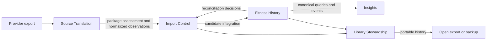

# Candidate Bounded Contexts

## Status

Proposed Milestone 0 context map. It applies Clean Architecture within each context and keeps provider models outside the canonical fitness domain. Context boundaries will be accepted only after the first vertical concept proves their contracts.

## Context map

### Source Translation

**Purpose:** understand one provider's export contracts and protect the rest of the application from their terminology and evolution.

**Owns:** provider detection, safe container access rules, artifact families, format variants, source record locators, structural validation, compatibility status, source-to-canonical mappings, mapping versions, and synthetic provider fixtures.

**Does not own:** canonical identity, cross-package reconciliation, storage visibility, reports, or product-wide navigation.

Each provider adapter is a replaceable outer implementation of this context's ports. Polar Flow is the first adapter, not a context of its own.

### Import Control

**Purpose:** execute an observable, repeatable, recoverable import operation without exposing partial canonical state.

**Owns:** import-operation identity and lifecycle, package fingerprinting, assessment coordination, coverage outcomes, import planning, progress, cancellation, staging coordination, terminal outcomes, and links between provenance evidence and an operation.

**Does not own:** the semantic identity or amendment rules of fitness concepts, provider JSON mapping, or persistence-engine transactions.

### Fitness History

**Purpose:** maintain the provider-neutral longitudinal record that users explore and understand.

**Owns:** canonical fitness concepts, their identities and invariants, canonical units and time semantics, semantic equivalence, amendment and conflict rules, and accepted provenance relationships.

**Initial modules under evaluation:** activity, training, sleep, recovery, physical evolution, tests, planning, devices, and sport configuration. These are not separate bounded contexts merely because the provider exports separate artifacts. A split requires distinct language, invariants, ownership, or life cycle demonstrated by product behavior.

### Insights

**Purpose:** answer user questions through exploration, reports, comparisons, and visualizations.

**Owns:** query use cases, report definitions, calculation and aggregation rules, visualization-ready read models, period comparison, gap disclosure, and accessible representations.

**Does not own:** source parsing, canonical writes, or reconciliation. Derived read models are disposable projections of documented canonical facts and report rules.

### Library Stewardship

**Purpose:** preserve user control over the complete local library across application and schema evolution.

**Owns:** library creation and location, schema-version coordination, migrations, backup, restore, portable export, verification, retention, and explicit destructive operations.

**Does not own:** provider-specific interpretation or fitness-domain meaning. Concrete persistence and file-system implementations remain outer adapters.

## Relationships and translation rules

- **Source Translation → Import Control:** a conformist relationship is forbidden. The contract consists of a package assessment, explicit coverage items, and typed normalized observations rather than provider objects.
- **Import Control ↔ Fitness History:** Import Control orchestrates; Fitness History decides logical identity and reconciliation. The returned decision is recorded in the import outcome and provenance.
- **Fitness History → Insights:** Insights consumes stable query contracts and domain events. It cannot infer canonical semantics from persistence tables.
- **Import Control/Fitness History → Library Stewardship:** application ports request atomic visibility, migration, backup, or export behavior; storage technology does not dictate use cases.

## Cross-cutting capabilities

Localization, accessibility, privacy, diagnostics, application updates, packaging, and contributor automation are required capabilities but are not fitness-domain bounded contexts. They apply through explicit policies and outer adapters without becoming provider or persistence concepts in the core.

## Architecture verification

- Provider names and provider schema types occur only in Source Translation adapters, compatibility documentation, and mapping specifications.
- Fitness History compiles and its domain tests run without ZIP, JSON, database, UI, operating-system, or network dependencies.
- Import Control tests use ports for source translation, domain reconciliation, staging, and time.
- Insights tests consume canonical query contracts, not database tables or provider fixtures.
- Library Stewardship can replace persistence and export adapters without changing canonical domain types.
- An architecture fixture can add a second synthetic provider adapter without modifying existing use cases.

## Decisions still requiring evidence

- Whether Fitness History remains one bounded context or later splits along independently evolving capabilities.
- Which first canonical concept best proves the Source Translation → Import Control → Fitness History → Insights path.
- Where source-specific but user-valuable observations live when no shared canonical concept is established.
- The exact consistency boundary between an import operation, provenance, and visible canonical history.
- The separation between portable export and full-library backup representations.
