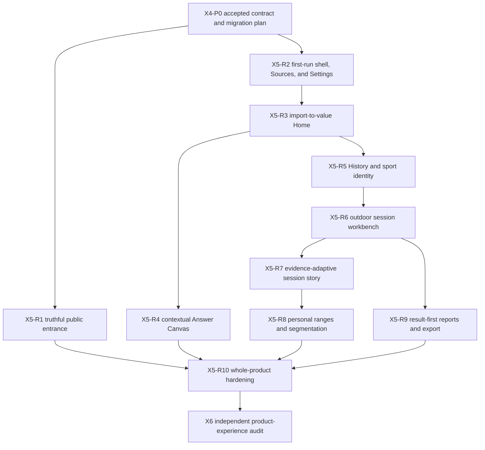

# MVP Redesign Production Migration Plan

## Status and authority

Authorized for autonomous execution as of 2026-08-21. X4-P0 through X5-R3 and X5-R4.1 through
X5-R4.2 are complete locally; X5-R4.3 is next.
The X5-R1 product entrance is live; exact hosted verification of its CI resource optimizer remains
pending synchronization of the workflow-changing commit. The product owner accepted the X3
direction and its amendments on 2026-08-21. This
document is the single implementation-facing plan for X4 and X5 of the systemic MVP redesign.

The [MVP experience specification](../design/experience-specification.md) owns screen, interaction,
state, navigation, adaptive, localization, and accessibility behavior. The
[UI and UX redesign plan](ui-redesign.md) owns the design method, rationale, and gates. The
[original MVP experience delivery plan](mvp-experience-delivery.md) remains immutable engineering
and evidence history for D0 through E6; it is not edited into a fictional record of the redesign.
This plan maps that implemented baseline into small production migrations without creating another
executable or a second product path.

The ordinary application does not yet conform to the accepted experience merely because the design
contract and prototype do. Each increment below becomes current product behavior only after its own
code, data, test, documentation, and release-shaped gates pass.

Reports and personal range definition remain **Alpha UX** throughout this plan. Alpha permits
substantial later interaction and composition refinement; it does not relax identity, persistence,
authorship, provenance, safety, export, accessibility, localization, or recovery guarantees.

## Outcome

Transform the implemented technical MVP into one coherent experience that earns attention quickly,
makes a person's sports history recognizable, makes outdoor-session investigation exceptional, and
keeps exact evidence and data exit under the person's control.

The production journey at completion is:

> understand the local product → obtain or choose an export → import without risking the existing
> library → see what became useful → find a remembered session → investigate its visual story →
> define personal meaning when useful → create, reopen, and export a durable report

This is a presentation migration only where the existing application contract is sufficient. Where
the accepted experience requires a composed result or durable user object that does not yet exist,
the increment starts in domain and application layers and reaches production UI only after the lower
boundary is verified.

## Scope boundary

### Included

- The accepted five-workspace shell: Home, History, Reports, Sources, and Settings.
- First run, source acquisition, archive selection, import progress and outcomes.
- Result-led Home, conservative questions, contextual activity, sleep, recovery, training, and
  aligned-history answers.
- Structured full-history discovery, sport identity, classification, filters, chronology, and
  comparison.
- Evidence-dependent session stories, including a dominant interactive local route workbench,
  synchronized recorded signals, source structure, zones, provenance, exact alternatives, partial
  sessions, and non-routed sessions.
- Reusable personal segmentation and session-owned, user-named contiguous ranges.
- Result-first report library, contextual creation, composition, deliberate refresh, privacy review,
  deterministic self-contained HTML export, and deletion.
- `en-US` and `es-ES`, system/light/dark appearance, 100%–200% content zoom, reduced motion, WCAG 2.2
  AA and WCAG2ICT behavior, privacy, performance, documentation, packaging, and update regressions.
- Early truthful renewal of the public product site and repository entrance.

### Excluded

- Additional providers, provider APIs, MCP, Linux, Windows, public application downloads, signing,
  notarization, production update-channel activation, and public-release publication.
- External map, tile, geocoding, routing, or telemetry requests. Recorded location remains on the
  current device.
- Invented place names, inferred samples, hidden interpolation, provider-sport guesses, medical
  conclusions, recommendations, gamification, or promotional claims unsupported by the library.
- A free-form publishing system, generic dashboard builder, reusable route-segmentation rules, or a
  second saved-view/saved-answer library.
- Functional expansion beyond the accepted FR-005, FR-025, and FR-026 boundaries.

## Verified production baseline and missing contracts

The inventory below is derived from the current application commands, DTOs, use cases, domain
aggregates, SQLite adapters, React surfaces, architecture documents, and their retained tests. A UI
increment must verify the named lower layers again before changing its surface.

| Accepted experience need | Reusable implemented support | Missing production contract | First owner |
|---|---|---|---|
| Five stable workspaces and settings | `ApplicationShell`, typed homes, persisted language, appearance, and zoom | Accepted hierarchy, density, adaptive labels, first-run composition, and exact return behavior | Presentation |
| Source acquisition and safe import | Provider guide, native chooser, transactional import, progress, cancellation, coverage, repeated and extended import | Calm outcome hierarchy and direct value handoff | Presentation and Library Home application use case |
| Recognizable Home | Library Home v1 coverage, questions, post-import reveal, resumable destination | Recent recognizable sessions and sports, one bounded answer, and honest historical fallback | Application composition |
| Contextual answers | Four authoritative Insights models and longitudinal composition | Accepted Answer Canvas hierarchy and origin restoration | Presentation |
| Full-history discovery | Search, selectors, sorting, calendar, comparison selection, durable workspace, and sport classification | Results-first composition, coherent icons, structured refinements, and accepted navigation | Presentation |
| Outdoor session investigation | Independent structure, route, signal, zone, segmentation, and provenance queries | One revision-coherent session-story projection and synchronized route/signal interaction | Application composition, then presentation |
| Partial and non-routed sessions | Explicit unavailable, absent, empty, populated, unsupported, and gap states | Evidence-dependent page composition rather than empty visual placeholders | Application projection and presentation |
| Reusable segmentation | Versioned `SegmentCriterion`, commands, SQLite persistence, and derived sections | Integration into the map-led workbench without merging source and authored identity | Presentation |
| Session-owned ranges | No domain aggregate or persistence | Stable range identity, ordered boundaries, revision, persistence, summary query, and exact evidence | Domain, application, persistence |
| Result-first reports | Versioned definitions, typed blocks, multi-origin resolution, staleness, refresh, persistence, privacy review, and deterministic HTML export | Meaningful library projection, report deletion, optional narrative invariant, accepted result-first composition | Domain, application, persistence, presentation |
| Public entrance | Generated localized Pages artifact, automatic locale selection, manual locale control, and truthful product-status source | Accepted sincere product narrative and new visual hierarchy | Product surfaces |

No field or control may be added on the assumption that the corresponding missing contract will be
implemented later. The table identifies the lower-layer starting point for each affected increment.

## Delivery rules

### What counts as one functional increment

Every runtime increment must:

1. give a person one complete new or materially improved outcome through the ordinary application or
   public product site;
2. preserve every previously completed outcome through the same executable and local library;
3. add required domain, application, persistence, transport, presentation, localization, and
   documentation changes together rather than leaving disconnected layers;
4. remain coherent if all later increments are cancelled;
5. contain no dormant production control, synthetic success state, alternate executable, hidden
   prototype route, or claim about a later increment;
6. pass its focused behavior tests, complete fast lane, production build, privacy checks, and all
   affected release-shaped gates before commit; and
7. produce one focused commit followed by a bounded normal push to `origin/main`.

The ignored prototype is evaluation evidence only. Production code is implemented from the accepted
specification and application contracts, never copied as a parallel source of truth.

### TDD order inside every increment

1. State the observable outcome and affected acceptance rows in the increment notes.
2. Inspect current commands, DTOs, use cases, ports, adapters, schema, and tests.
3. Add failing domain and application tests for missing business behavior.
4. Add failing persistence and migration tests for durable behavior.
5. Implement the minimum lower-layer behavior and refactor under passing tests.
6. Add or update strict host DTO and public-schema contract tests.
7. Add failing React behavior tests using meaningful input, all actions, validation, cancellation,
   multiple items, persistence, reload, and focus behavior.
8. Implement the complete localized, adaptive, accessible presentation outcome.
9. Extend packaged E2E through the real production boundary and assert persisted outcomes after
   restart.
10. Update canonical user, developer, architecture, format, test, and product-status documentation.
11. Run the applicable verification ladder, inspect the actual screen, and run the independent
    falsification checklist before commit.

### Verification ladder

The cheapest authoritative check runs first. Later gates never compensate for an earlier failure.

1. Focused Rust, React, script, schema, and contract tests.
2. Formatting, strict Clippy, TypeScript production build, architecture, data-contract, localization,
   documentation, site, workflow, repository-content, secret, and diff checks.
3. Complete contributor fast lane.
4. Focused performance benchmark when query shape, storage, rendering volume, startup, or export is
   affected.
5. Instrumented packaged macOS functional and accessibility journey whenever executable inputs
   change.
6. Import, dense-history, cold-launch, packaging, installation, update, migration, and recovery gates
   only when their inputs or protected behavior change, plus once for the final exact candidate.
7. Hosted campaign once per distinct executable-input fingerprint; an unchanged fingerprint is never
   rebuilt merely because documentation changed.

Retries, muted errors, disabled strictness, removed assertions, reduced fixtures, or skipped packaged
behavior are not resource optimizations. CI path selection and artifact reuse provide cost control.

### Mandatory UX falsification before each increment closes

The implemented surface is inspected independently of its implementation checklist at:

- wide and short laptop viewports, compact desktop width, and the narrow supported window;
- 100%, 175%, and 200% content zoom;
- English/light and Spanish/dark, including longest realistic content;
- first, empty, loading, populated, partial, stale, invalid, cancelled, failed, and recovery states
  affected by the increment;
- pointer, keyboard, reduced-motion, and screen-reader semantics; and
- initial viewport, complete scrolled journey, focus movement, return, restart, and persisted state.

The pass explicitly looks for wrong hierarchy, excessive numeric density, unreadable precision,
clipping, hidden navigation labels, undersized controls, unnoticed content below the viewport,
obstructed visual evidence, duplicate warnings, marketing language, and functionality that appears
more capable than its evidence. Critical or major findings reopen the increment before review.

## Dependency and delivery map

Execution is sequential by default so each increment receives complete local and hosted evidence and
the next increment starts from a known source revision. Work may overlap only when it changes disjoint
non-runtime artifacts and does not obscure the executable-input fingerprint.

## Increment status

| Increment | Status | Functional checkpoint |
|---|---|---|
| X4-P0 | Complete — 2026-08-21 | Accepted X3 contract, exhaustive production plan, traceable roadmap |
| X5-R1 | Local implementation complete; optimizer hosted verification pending | A truthful visitor can understand and follow the product |
| X5-R2.1 | Complete locally — exact packaged gates passed 2026-08-22 | A new person can orient and act through the labelled shell and first-run Home |
| X5-R2.2 | Complete locally — exact packaged gates passed 2026-08-22 | Sources leads with acquisition, a protected active task, and a calm exact outcome |
| X5-R2.3 | Complete locally — exact packaged gates passed 2026-08-22 | Durable language, appearance, zoom, and update settings form one coherent workspace |
| X5-R3 | Complete locally — exact packaged and dense-history gates passed 2026-08-22 | Import ends in recognizable personal value |
| X5-R4 | In progress — R4.1–R4.2 complete locally 2026-08-22 | Existing health and aligned-history questions read as answers |
| X5-R5 | Pending | A remembered session is findable and sports are recognizable |
| X5-R6 | Pending | A routed workout is investigated through a dominant synchronized map |
| X5-R7 | Pending | Every session composition reflects its actual evidence |
| X5-R8 | Pending | Personal ranges and reusable criteria work end to end |
| X5-R9 | Pending | Reports open as results and leave FitFreed safely |
| X5-R10 | Pending | The complete release-shaped product is coherent and documented |
| X6 | Pending | Independent audit has no unresolved material finding |

## X4-P0 — Freeze the executable contract

**User outcome:** implementation can proceed without redesign-by-accident, hidden scope growth, or
repeated routine decisions.

**Work:**

1. Record X3 acceptance and the report/range Alpha boundary in the canonical design documents.
2. Correct compact prototype navigation so every workspace retains visible text.
3. Inventory reusable and missing production contracts across all architecture layers.
4. Define this dependency sequence, verification policy, documentation ownership, and human gates.
5. Link the active plan from the roadmap and redesign plan without rewriting the historical D0–E6
   evidence record.

**Exit evidence:** prototype contract checks; documentation, links, product-surface, repository-content,
privacy, and diff checks; one focused commit and push.

## X5-R1 — Renew the truthful public entrance

**User outcome:** a first-time visitor understands within seconds what FitFreed does, why owned data
matters, what is available now, and why the project is worth following or contributing to.

**Product work:**

1. Recompose the generated product site around concise purpose, recognizable history, outdoor-session
   investigation, reports and export, local processing, current status, and participation.
2. Use sincere factual language. Separate implemented capability, accepted migration work, Alpha
   experience, later roadmap, and unavailable download status visually and semantically.
3. Refresh the repository README as the scan-friendly project entrance; link rather than duplicate
   technical, product, support, and contribution detail.
4. Preserve automatic locale selection with English fallback and manual `en-US`/`es-ES` switching.
5. Preserve the canonical `product-status.json` generation boundary and inactive download boundary.
6. Use only project-owned brand and illustrative assets. Any target-experience visual is explicitly
   identified as a product direction until its production increment lands.

**Tests and evidence:** generated-artifact equality, localized content parity, links, canonical origin,
no redirects, no download leak, 200% layout, narrow/wide layout, light/dark contrast, keyboard order,
automated accessibility, no personal or machine-specific data, Pages workflow preservation of the
update subtree, live deployment, and remote byte verification.

**Documentation:** `site/README.md` remains contributor-focused and excludes DNS-operation history;
product status, README, user links, and contribution links remain generated or canonical at one source.

**Rollback/coherence:** the site remains usable and truthful if application R2–R10 never land; no
future screen is described as current product behavior.

## X5-R2 — Deliver the first-run shell, Sources, and Settings

**User outcome:** a new person can understand the local product, learn how to obtain an export, choose
an archive, and configure durable interface behavior without becoming trapped or reading diagnostics.

**Lower-layer precondition:** verify existing preference, acquisition-guide, archive-picker, official
link, import-concurrency, and update-concurrency contracts. No new persistence shape is expected unless
the verification exposes a real contract gap.

**Production work:**

1. Establish the production visual tokens and reusable shell primitives used by all later surfaces.
2. Implement the five-workspace shell with visible icon-and-text labels at every supported width and
   zoom. Use a labelled compact rail or labelled horizontal navigation; never icon-only navigation.
3. Use the complete desktop workspace rather than a narrow promotional document column.
4. Present the first-run purpose, illustrative multi-sport preview, local-device boundary, no-account
   boundary, ZIP action, and provider-owned acquisition route with restrained language.
5. Recompose Sources around acquisition, import readiness, active operation, outcome history, and
   exact coverage disclosure. Technical detail is deliberate, not repeated across the app.
6. Recompose Settings around explicit save/reset of language, appearance, and zoom with preview,
   recovery of obsolete values, and stable update controls.
7. Preserve actual native archive-picker and official-link adapters in production; instrumented E2E
   adapters remain isolated from ordinary packages.

**Behavior coverage:** every workspace action; direct and return navigation; invalid/stale origin;
all preference values, save, reset, cancel-by-navigation, restart, invalid stored values; both source
paths; picker cancellation and failure; official-link cancellation and failure; import/update mutual
exclusion; keyboard focus and current-location semantics; all locales, themes, and zoom levels.

**Documentation:** first-run, source acquisition, settings, navigation, development preview, module
map, UI contract checks, and contributor component guidance.

**Rollback/coherence:** existing Home, History/Explore, and Reports capabilities stay reachable through
the new shell until their own surfaces are replaced. No duplicate shell or hidden legacy route remains.

## X5-R3 — Turn import into a recognizable Home

**User outcome:** a successful import immediately reveals what history became useful; a later launch
starts with recognizable personal context rather than maintenance controls.

**Application-first work:**

1. Version the Library Home contract without breaking v1 migration evidence.
2. Add bounded recent-session and sport-family projections using authoritative discovery and
   classification ports.
3. Add one conservative bounded comparison or observation selected by explicit availability rules.
4. Add an honest historical fallback when recent evidence cannot support a current comparison.
5. Keep source coverage, import outcome, and answer evidence under one coherent library revision.
6. Preserve explicit added, enriched, amended, unchanged, repeated, unsupported, and invalid import
   semantics without exposing artifact locators.

**Production work:**

1. Lead Home with imported span, session count, recognizable sports, recent sessions, and one bounded
   evidence-backed answer.
2. Lead post-import with what became usable and one useful next action; keep exact incorporation
   coverage one deliberate action away.
3. Present old-history fallback without implying recent performance or wellness.
4. Route recent sessions to their exact current detail identity and questions to the Answer Canvas.
5. Keep absent evidence quiet unless it affects the current result.

**Behavior coverage:** empty library, first import, repeat, extended import, mapping-version reassessment,
multiple origins, old-only history, partial domains, no training, unresolved sport, invalid and failed
archives, cancellation, restart, direct session entry, stale recent identity, and canonical fallback.
Performance covers dense ten-year Home composition and post-import reveal within the common-query budget.

**Data and documentation:** Library Home versioned contract, transport schema, composition architecture,
import lifecycle, user import/result guidance, localization, synthetic fixtures, and product status.

## X5-R4 — Reframe contextual questions as Answer Canvases

**User outcome:** activity, sleep, recovery, training-period, and aligned-history questions produce a
clear answer first while retaining exact evidence and provider-neutral uncertainty.

**Lower-layer precondition:** verify the four Insights read models and longitudinal composition already
own every calculation. Add a presentation-facing result field only when the application cannot express
the accepted factual conclusion without UI calculation.

**Production work:**

1. Host supported questions in a bounded Answer Canvas within the stable shell rather than a generic
   maintenance-oriented Explore destination.
2. Lead with a plain result and useful visual relationship; disclose evidence counts, coverage, exact
   tables, and limitations progressively.
3. Format dates, durations, quantities, units, changes, and precision at a human scale while retaining
   exact source values on request.
4. Preserve range selection, comparison, exact day/night detail, cross-navigation, missing versus zero,
   and origin separation.
5. Restore originating Home state, focus, scroll, periods, selections, and result when returning.

**Behavior coverage:** meaningful values in every range field, invalid and inverted dates, apply/reset,
both periods, missing/zero/unavailable values, multiple origins, exact detail, all navigation actions,
partial data, loading, contextual failure and retry, return, restart where promised, locale, theme,
zoom, reduced motion, exact visual parity, and dense-history performance.

**Documentation:** Insights contracts only if their fields change; user exploration, interpretation,
precision, missing-data, and navigation guidance; architecture ownership and presentation tests.

### R4 delivery increments

R4 is delivered as five independently usable vertical increments. Each increment retains the current
exact-data route and leaves the application coherent if the following increment has not landed.

**Status:** R4.1 and R4.2 passed their focused, full fast, packaged functional, packaged performance,
and actual wide and 200%-zoom macOS visual gates on 2026-08-22. R4.3 is next; R4 as a whole remains
open.

| Increment | User-visible outcome | Required implementation and evidence |
|---|---|---|
| R4.1 — Activity answer | The Home question about changing daily activity opens an immediate equal-period answer. A plain conclusion and proportional relationship lead; period controls and exact metrics remain available on request. | Reuse the activity comparison use case without presentation-owned aggregation; add direct question navigation, result-first composition, meaningful default periods, coverage disclosure, exact-table disclosure, focus/return restoration, component tests, both locales, responsive review, and the affected packaged journey. |
| R4.2 — Training-period answer | A Home training comparison opens on its exact accepted periods and reads as an answer rather than a form followed by a table. | Preserve report creation, exact comparison evidence, multiple origins, no-distance and no-energy states, period editing, origin focus, and existing report-return behavior. Test direct Home entry, manual comparison, report handoff, return, and dense-history performance. |
| R4.3 — Sleep and recovery answers | The latest supported sleep and recovery patterns lead with human-scale results and useful visual relationships; exact nights and physiological evidence remain deliberate disclosures. | Recompose the existing overview and comparison use cases without medical interpretation. Preserve exact-night navigation, missing nights, source-specific recovery boundaries, meaningful ranges, locale precision, loading/failure retry, and keyboard behavior. |
| R4.4 — Aligned-history answer | The cross-domain question opens a bounded aligned-history canvas whose visual relationship is primary and whose exact day and domain links remain reachable. | Preserve independent availability, origin separation, cross-domain day navigation, range/comparison modes, and the explicit non-causality boundary. Test partial combinations, multiple origins, exact day detail, destination return, and high zoom. |
| R4.5 — Coherence gate | All supported Home questions use the same answer grammar and restore the exact originating Home state while ordinary History remains recognizable and independently navigable. | Complete shared presentation semantics, remove superseded control-first paths, run both locales/themes, 100%–200% zoom, reduced motion, accessibility, packaged functional and performance suites, privacy checks, documentation checks, and an actual wide/compact macOS visual audit before recording R4 complete. |

For every increment, the red test must describe the user consequence before presentation code changes.
An Answer Canvas may format an existing application result and choose a visual hierarchy; it must not
recalculate domain aggregates, combine origins, infer causality, classify physiological meaning, or
silently replace unavailable evidence. If a supported plain conclusion cannot be expressed from the
existing result, extend the application contract and its schema first.

## X5-R5 — Make History recognizable and searchable

**User outcome:** a person can find a remembered session by sport, date, available evidence, label, or
imprecise text and can understand the result set without provider terminology.

**Lower-layer precondition:** verify search, calendar, selection, workspace, sport discovery, sport
classification, and optimistic persistence commands before replacing the UI.

**Production work:**

1. Open History on visible sport families and sessions, with refinements secondary.
2. Use one coherent provider-neutral icon family plus visible text across Home, History, session,
   reports, filters, and empty states. Placeholder glyphs are prohibited.
3. Use structured sport, date, and measurement selectors populated from application values. Free text
   complements but never replaces them.
4. Display active refinements, individual removal, clear-all, exact result count, and stable sorting.
5. Preserve chronology/calendar views, comparison selection, pagination, and complete-history scope.
6. Present unresolved sport in context and complete classification with family, authored label,
   validation, save, cancel, optimistic conflict recovery, restart, and reimport preservation.
7. Open session detail from list, calendar, comparison, recent Home, or report while retaining an exact
   origin descriptor.

**Behavior coverage:** realistic multi-sport input; every filter alone and in combination; multiple
items; add/remove comparison; all sorts; pagination; calendar movement; empty filtered result; clear;
classification edit/save/cancel/reset/conflict; authored labels; navigation from every origin; reload;
stale snapshot; keyboard; both locales/themes; 100%–200%; accessibility; dense-history p95.

**Documentation:** sport classification and discovery contracts remain canonical; update user History,
classification, filters, calendar, comparison, navigation, icon semantics, and developer component guidance.

## X5-R6 — Deliver the outdoor session workbench

**User outcome:** a routed session becomes an exceptional investigation surface in which recorded
position, time, pace or speed, heart rate, elevation, cadence, stroke rate, temperature, or power stay
visibly synchronized when those facts exist.

**Application-first work:**

1. Introduce one `SessionStory` query and projection over the authoritative session selection,
   structure, route, signal, zone, classification, and provenance ports.
2. Bind every sub-result to one discovery and evidence revision; reject mixed snapshots.
3. Align route points and signal slots only by compatible recorded elapsed time. Preserve route gaps,
   signal gaps, absent timestamps, source roles, units, exact ordinals, and unavailable values.
4. Project sport-specific primary labels and eligible overlays without choosing presentation color.
5. Return bounded overview geometry and lanes plus stable capabilities for exact pagination.
6. Add no joined cache or presentation reconstruction in SQLite.

**Spatial rendering decision:** the accepted interaction now justifies re-evaluating ADR 0013 for one
bounded spatial exception. Measure a custom semantic SVG implementation and maintained GPL-compatible
local renderers against pan/zoom, synchronized selection, keyboard parity, accessibility, bundle size,
WebView reliability, contributor cost, and offline privacy. Record the durable choice in a new ADR;
do not rewrite ADR 0013. External tiles, geocoding, invented labels, and network requests remain excluded.

**Production work:**

1. Lead with compact session identity and evidence availability, then give the full-width route the
   majority of the primary viewport.
2. Keep the complete track visible initially with direction, start/end, selected point, gaps, north/
   coordinate context, and scale. Support pan, zoom, full-track reset, and focused/full-screen map.
3. Offer eligible sport-specific route overlays with a legend and non-color structured alternative.
4. Synchronize map, attached value strip, full-width signal lanes, elapsed-position control, and exact
   table for pointer and keyboard selection.
5. Keep exact coordinates, samples, provenance, and source versions behind deliberate disclosure.
6. Preserve context, overlay, selected point, and origin when focusing the map or returning.

**Behavior coverage:** running and paddling routes, cycling eligibility, one point, empty route, primary
and transition routes, anti-meridian, missing elapsed times, signal gaps, multiple signals, overlay
changes, pointer/keyboard traversal, pan, zoom, reset, focus/restore, exact pagination, locale units,
responsive component widths, 200% zoom, reduced motion, contrast, no external request, and dense-session
performance. Visual and exact selected values must agree at every tested point.

**Documentation:** composed Session Story v1 contract, transport schema, architecture and ADR, privacy,
route/signal interpretation, exact evidence, synthetic contract examples, performance benchmark, and
user session/map guidance.

## X5-R7 — Make session composition evidence-adaptive

**User outcome:** indoor, partial, mixed, and non-routed sessions foreground their best recorded evidence
without empty map boxes, repeated warnings, fabricated structure, or loss of analytical depth.

**Application-first work:** extend Session Story composition states for route absence, absent or empty
structure, unsupported and unavailable series, recorded zones, provenance changes, and mixed exercises.
The application describes availability and attribution; presentation selects the accepted composition.

**Production work:**

1. Render no map when no route exists. Give the primary supported signal or structure the visual region.
2. Keep one concise evidence account and one route to exact source detail; never repeat a general
   missing-data warning across sections.
3. Integrate source laps, pauses, phases, recorded zones, aligned signals, and provenance through
   progressive disclosure without implying nonexistent chronology.
4. Adapt sport-specific labels, units, defaults, and visuals while preserving the common interaction
   grammar.
5. Preserve exact origin-aware return for all entry paths and meaningful scroll/focus state.

**Behavior coverage:** outdoor complete, indoor structured, indoor unstructured, no route, no heart
rate, zones without timeline, transitions, mixed exercises, empty collections, unsupported series,
gaps, amended evidence, failed independent query, exact tables, section navigation, disclosure scroll,
collapse focus, direct entry, stale origin, report return, both locales/themes/zoom levels, and all
performance budgets.

**Documentation:** Session Story state table, user evidence/limitations guidance, architecture, UI state
ownership, and synthetic scenario catalogue.

## X5-R8 — Add personal ranges and integrate segmentation

**User outcome:** a person can name and revisit a contiguous part of one session and can apply reusable
criteria without confusing either object with provider laps or recorded evidence.

**Domain-first work:**

1. Add a session-owned `TrainingSessionRange` aggregate with stable local identity, user authorship,
   non-blank title, ordered elapsed boundaries, evidence revision, optimistic revision, and explicit
   create, rename, adjust, and remove transitions.
2. Keep a range distinct from reusable `SegmentCriterion`, derived section, and attributed source range.
3. Define reimport behavior: retain exact boundaries only while the referenced session and compatible
   elapsed evidence revision remain valid; otherwise preserve the authored object in a review-required
   state rather than redirecting it silently.

**Application and persistence work:** commands and ports for create/update/remove; additive recoverable
SQLite migration; bounded listing; one revision-coherent Range Summary query aligning route, signals,
gaps, source attribution, direction, duration, distance, sport-specific measurements, coverage, and exact
boundary evidence. Publish canonical, portable/backup, persistence, migration, and read-model contracts
with independent synthetic fixtures.

**Production work:**

1. Create a temporary range from map, signal lane, source structure, or exact evidence with synchronized
   adjustable handles.
2. Keep the route visible during naming and adjustment; use an in-workbench inspector on wide screens
   and a stacked task mode at compact width/high zoom.
3. Validate a non-blank name and ordered boundaries locally and in the domain.
4. Save, reopen, rename, adjust, cancel, remove, and survive restart/reimport review.
5. Present source ranges and user ranges with authorship independent of color.
6. Integrate existing equal-time, recorded-distance, heart-rate-range, and manual criteria with complete
   create/update/apply/reorder/remove behavior and distinct authorship.

**Behavior coverage:** boundary selection from every representation; pointer and keyboard adjustment;
invalid, equal, reversed, outside-session, gapped, and unavailable boundaries; multiple overlapping
ranges; duplicate names where allowed; save/cancel/reload/edit/remove; stale revision conflict; reimport;
multiple criteria; every criterion rule; add/remove/reorder/apply; missing prerequisites; restart;
locale/theme/zoom; accessibility; dense-session performance and migration recovery.

**Alpha evidence:** a separate density, discoverability, and boundary-selection review records findings
without weakening correctness or delaying unrelated accepted work.

## X5-R9 — Make reports result-first and portable

**User outcome:** a saved report opens as a useful resolved document, can be deliberately edited, and can
leave FitFreed as a trustworthy self-contained file.

**Domain and application work:**

1. Permit an empty narrative when title and supported evidence form a factual report; retain narrative
   as an optional authored block.
2. Add optimistic report deletion through domain/application policy and persistence, naming the exact
   removed object and preserving imported history and other reports.
3. Add a bounded report-library projection with subject, one meaningful resolved result, evidence state,
   period/date, sensitivity summary, and current/stale/unavailable status.
4. Preserve older blank-origin reports as readable data while removing the generic blank start from the
   ordinary MVP UI.
5. Preserve exact deliberate refresh, stable reviewed revision, deterministic HTML, privacy limits, and
   atomic failure behavior.

**Production work:**

1. Open Reports on a visual result library; an item opens its result, never its editor.
2. Start creation contextually from a supported session or comparison with compatible evidence selected.
3. Make result/finding and visual evidence primary; source, evidence state, export, edit, and delete are
   visible secondary actions.
4. Keep the editor's outline, substantial result preview, and focused inspector coordinated. Save returns
   to result; cancel restores the saved definition or creates nothing.
5. Replace the result with stale-evidence or export review rather than appending controls below a long
   editor. Reveal and collapse move focus and scroll predictably.
6. Show exactly what leaves FitFreed. Sensitive choices appear only for included sensitive blocks and
   cannot expand saved authority.
7. Export one deterministic self-contained HTML report; failed or cancelled write changes neither the
   saved report nor the destination.

**Behavior coverage:** contextual session/comparison starts; title and evidence validation; optional
narrative; multiple blocks; every compatible add; remove; move up/down; inspector edits; save; cancel;
reload; multiple reports; result-first reopen; current/stale/unavailable; refresh review cancel/accept/
conflict; source navigation and return; delete cancel/confirm/conflict; all privacy combinations; export
cancel/failure/success; independent output inspection; locale/theme/zoom; keyboard; accessibility;
restart; migration; report-library and export performance.

**Documentation:** reporting architecture, report-definition versioning, persistence/migration, HTML
format, user report lifecycle, privacy and export, deletion/recovery, test fixtures, and product status.

**Alpha evidence:** report hierarchy and composition receive a focused review; findings may refine the
Alpha interaction without changing its durable identity or export guarantees implicitly.

## X5-R10 — Harden the complete product journey

**User outcome:** the entire release-shaped application feels like one serious product and preserves the
existing library through installation, restart, update simulation, migration, and recovery.

**Work:**

1. Inventory every legacy presentation component, route, locale key, test, script, CSS selector, and
   incoming reference. Rehome live behavior and prove no live reference remains before removal.
2. Audit terminology, tone, hierarchy, dates, units, precision, icons, visuals, progressive disclosure,
   empty/partial/error states, exact evidence, focus, navigation, responsive behavior, reduced motion,
   theme, zoom, and privacy across every workspace.
3. Consolidate reusable components only where repeated responsibility is proven. Do not abstract merely
   to make the redesign appear internally uniform.
4. Exercise the complete first-run → acquisition → import → Home → answer → History → outdoor/indoor
   session → range/criterion → report → export → restart journey.
5. Repeat dense-history, dense-session, cold-start, import, query, report, bundle, memory, packaging,
   clean installation, migration, update replacement, forced recovery, and removal evidence for one
   exact executable-input fingerprint.
6. Update all version-matched user guidance, contributor onboarding, architecture, data formats,
   translation guidance, testing, troubleshooting, security, privacy, support, readiness, and product
   status. Remove stale claims only from current documents; historical closed plans remain unchanged.
7. Run the mandatory pre-human falsification audit and close every critical or major internal finding.

**Exit evidence:** complete local fast/full lanes as applicable, exact packaged E2E, Axe plus manual
keyboard and VoiceOver evidence, all responsive/locale/theme/zoom matrices, performance budgets,
repository privacy and content gates, hosted campaign for the exact fingerprint, and a coherent source
revision handed to the independent audit.

## X6 — Repeat the independent product-experience audit

The audit starts from a clean first run and does not use milestone status, prototype familiarity, test
knowledge, or implementation intent as evidence. It evaluates:

1. five-second purpose and trust comprehension;
2. acquisition and real production archive selection;
3. safe compatibility, import, repeat, extension, and recovery;
4. time to the first evidence-backed personally recognizable result;
5. remembered-session discovery and origin-aware return;
6. outdoor route investigation, signal synchronization, exact evidence, and partial-session honesty;
7. personal range and criterion control;
8. report result, edit, refresh, deletion, and independent export;
9. settings, localization, appearance, zoom, keyboard, assistive technology, responsive layout, and
   serious factual tone; and
10. desire and credible reasons to continue using the product after the first minutes.

Any unresolved critical or major finding reopens the owning increment. Green automation, attractive
screens, or successful lower-layer operations cannot override the finding. Final human product-owner
experience review occurs only after the independent machine-assisted audit has challenged and corrected
the candidate.

## Traceability to the retained D0–E6 baseline

| Retained baseline | Redesign migration |
|---|---|
| D0 boundaries | Preserved throughout; map renderer receives a focused ADR only because accepted interaction changed |
| P1 product site | X5-R1 replaces public presentation while preserving generator and publication boundaries |
| E1 shell, sources, settings | X5-R2 replaces the ordinary composition and retains tested behavior |
| E2 Library Home and import reveal | X5-R3 versions the result projection and presentation |
| E3 discovery and classification | X5-R5 replaces the History presentation |
| E4 session evidence and segmentation | X5-R6 through X5-R8 compose and present the same evidence, adding only accepted story/range contracts |
| E5 reports and export | X5-R9 replaces report hierarchy and adds the accepted missing lifecycle contracts |
| E6 hardening | X5-R10 reruns it against the redesigned product rather than reusing obsolete experience evidence |
| Independent audit | X6 repeats it from clean first use and may reopen any increment |

## Documentation ownership

Each fact has one canonical home:

| Knowledge | Canonical home |
|---|---|
| Normative product behavior | `docs/requirements.md` |
| Accepted screen and interaction behavior | `docs/design/experience-specification.md` |
| Current production sequence and status | This plan |
| Milestone sequencing and exclusions | `docs/roadmap.md` |
| Durable structure and responsibility | Thematic architecture plus a new ADR when the decision is structural |
| Provider, canonical, mapping, Insights, portable, persistence, or migration representation | `docs/data-formats/` indexed by its README |
| Current executable evidence | `docs/testing/public-release-readiness.md` and applicable test records |
| User tasks | Version-matched `docs/user/` English and Spanish resources where published |
| Build, test, diagnose, translate, or contribute tasks | `docs/development/`, `CONTRIBUTING.md`, and linked policies |
| Public capability/status statement | `docs/product-status.json` and generated product surfaces |
| Historical implementation evidence | Closed milestone and D0–E6 plans, unchanged |

Implementation notes do not duplicate durable architecture. Prototype notes do not become product
documentation. Machine-specific paths, dimensions, accounts, data, and incidents never enter public
evidence.

## Autonomous execution and human intervention

Execution continues through X5-R1 to X5-R10 without routine confirmation. Each verified increment is
committed and pushed under the repository's standing authority. If SSH approval is unavailable, the
bounded push stops and later local increments continue; synchronization is retried when possible.

Human intervention is required only for:

- a material change to accepted scope, platform, privacy, licensing, or product behavior;
- a new dependency with unresolved licence or supply-chain risk;
- destructive operations on a real personal library;
- Apple credentials, signing, notarization, tags, releases, public application downloads, or
  production update-channel authority; or
- the final product-owner usability/accessibility gate after X6.

Pages content publication within the existing authorized workflow remains autonomous. Alpha review
findings for reports or personal ranges are documented and corrected when they are critical or major;
they do not create routine approval stops.

## Completion rule

This plan is complete only when X5-R1 through X5-R10 pass, X6 has no unresolved critical or major
finding, every user-visible capability has verified lower-layer support, all affected documentation is
current, all provider and FitFreed-owned formats remain fully specified, one exact release-shaped source
fingerprint passes its applicable gates, and the final human gate accepts the complete experience.

Completion does not authorize a public application release. Milestone 3 signing, notarization, trusted
download, update-channel activation, and publication remain separate release gates.
