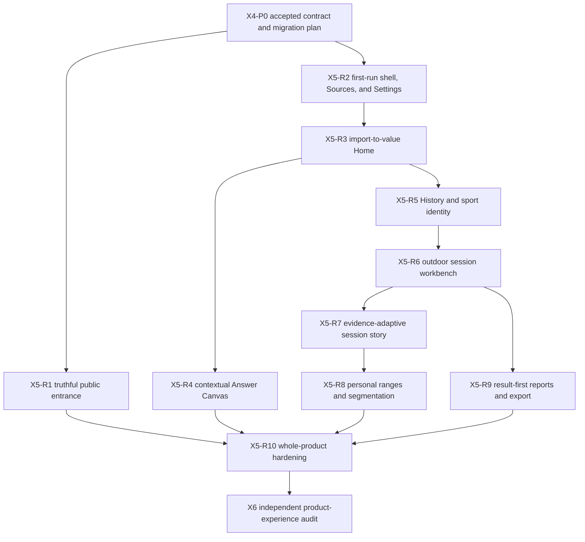

# MVP Redesign Production Migration Plan

## Status and authority

Authorized for autonomous execution as of 2026-08-21. The independent R5 checkpoint audit completed on
2026-08-22 and reopened X5-R3 and X5-R5 before X5-R6. Its immutable findings are recorded in the
[R5 checkpoint audit](../research/mvp-redesign-r5-checkpoint-audit.md).
The X5-R1 product entrance is live; exact hosted verification of its CI resource optimizer remains
pending synchronization of the workflow-changing commit. The product owner accepted the X3
direction and its amendments on 2026-08-21. This
document is the single implementation-facing plan for X4 and X5 of the systemic MVP redesign.

The [MVP experience specification](../design/experience-specification.md) owns screen, interaction,
state, navigation, adaptive, localization, and accessibility behavior. The
[UI and UX redesign plan](ui-redesign.md) owns the design method, rationale, and gates. The
[original MVP experience delivery plan](mvp-experience-delivery.md) remains immutable engineering
and evidence history for D0 through E6; it is not edited into a fictional record of the redesign.
This plan maps that implemented baseline into small production migrations without creating another
executable or a second product path.

The ordinary application does not yet conform to the accepted experience merely because the design
contract and prototype do. Each increment below becomes current product behavior only after its own
code, data, test, documentation, and release-shaped gates pass.

Reports and personal range definition remain **Alpha UX** throughout this plan. Alpha permits
substantial later interaction and composition refinement; it does not relax identity, persistence,
authorship, provenance, safety, export, accessibility, localization, or recovery guarantees.

## Outcome

Transform the implemented technical MVP into one coherent experience that earns attention quickly,
makes a person's sports history recognizable, makes outdoor-session investigation exceptional, and
keeps exact evidence and data exit under the person's control.

The production journey at completion is:

> understand the local product → obtain or choose an export → import without risking the existing
> library → see what became useful → find a remembered session → investigate its visual story →
> define personal meaning when useful → create, reopen, and export a durable report

This is a presentation migration only where the existing application contract is sufficient. Where
the accepted experience requires a composed result or durable user object that does not yet exist,
the increment starts in domain and application layers and reaches production UI only after the lower
boundary is verified.

## Scope boundary

### Included

- The accepted five-workspace shell: Home, History, Reports, Sources, and Settings.
- First run, source acquisition, archive selection, import progress and outcomes.
- Result-led Home, conservative questions, contextual activity, sleep, recovery, training, and
  aligned-history answers.
- Structured full-history discovery, sport identity, classification, filters, chronology, and
  comparison.
- Evidence-dependent session stories, including a dominant interactive local route workbench,
  synchronized recorded signals, source structure, zones, provenance, exact alternatives, partial
  sessions, and non-routed sessions.
- Reusable personal segmentation and session-owned, user-named contiguous ranges.
- Result-first report library, contextual creation, composition, deliberate refresh, privacy review,
  deterministic self-contained HTML export, and deletion.
- `en-US` and `es-ES`, system/light/dark appearance, 100%–200% content zoom, reduced motion, WCAG 2.2
  AA and WCAG2ICT behavior, privacy, performance, documentation, packaging, and update regressions.
- Early truthful renewal of the public product site and repository entrance.

### Excluded

- Additional providers, provider APIs, MCP, Linux, Windows, public application downloads, signing,
  notarization, production update-channel activation, and public-release publication.
- External map, tile, geocoding, routing, or telemetry requests. Recorded location remains on the
  current device.
- Invented place names, inferred samples, hidden interpolation, provider-sport guesses, medical
  conclusions, recommendations, gamification, or promotional claims unsupported by the library.
- A free-form publishing system, generic dashboard builder, reusable route-segmentation rules, or a
  second saved-view/saved-answer library.
- Functional expansion beyond the accepted FR-005, FR-025, and FR-026 boundaries.

## Verified production baseline and missing contracts

The inventory below is derived from the current application commands, DTOs, use cases, domain
aggregates, SQLite adapters, React surfaces, architecture documents, and their retained tests. A UI
increment must verify the named lower layers again before changing its surface.

| Accepted experience need | Reusable implemented support | Missing production contract | First owner |
|---|---|---|---|
| Five stable workspaces and settings | `ApplicationShell`, typed homes, persisted language, appearance, and zoom | Accepted hierarchy, density, adaptive labels, first-run composition, and exact return behavior | Presentation |
| Source acquisition and safe import | Provider guide, native chooser, transactional import, progress, cancellation, coverage, repeated and extended import | Calm outcome hierarchy and direct value handoff | Presentation and Library Home application use case |
| Recognizable Home | Library Home v1 coverage, questions, post-import reveal, resumable destination | Recent recognizable sessions and sports, one bounded answer, and honest historical fallback | Application composition |
| Contextual answers | Four authoritative Insights models and longitudinal composition | Accepted Answer Canvas hierarchy and origin restoration | Presentation |
| Full-history discovery | Search, selectors, sorting, calendar, comparison selection, durable workspace, and sport classification | Results-first composition, coherent icons, structured refinements, and accepted navigation | Presentation |
| Outdoor session investigation | Independent structure, route, signal, zone, segmentation, and provenance queries | One revision-coherent session-story projection and synchronized route/signal interaction | Application composition, then presentation |
| Partial and non-routed sessions | Explicit unavailable, absent, empty, populated, unsupported, and gap states | Evidence-dependent page composition rather than empty visual placeholders | Application projection and presentation |
| Reusable segmentation | Versioned `SegmentCriterion`, commands, SQLite persistence, and derived sections | Integration into the map-led workbench without merging source and authored identity | Presentation |
| Session-owned ranges | Version-2 exercise-owned domain aggregate, application transitions, SQLite schema 26, and desktop transport | Revision-coherent Range Summary, production interaction, and reusable-criteria integration | Application composition, then presentation |
| Result-first reports | Versioned definitions, typed blocks, multi-origin resolution, staleness, refresh, persistence, privacy review, and deterministic HTML export | Meaningful library projection, report deletion, optional narrative invariant, accepted result-first composition | Domain, application, persistence, presentation |
| Public entrance | Generated localized Pages artifact, automatic locale selection, manual locale control, and truthful product-status source | Accepted sincere product narrative and new visual hierarchy | Product surfaces |

No field or control may be added on the assumption that the corresponding missing contract will be
implemented later. The table identifies the lower-layer starting point for each affected increment.

## Delivery rules

### What counts as one functional increment

Every runtime increment must:

1. give a person one complete new or materially improved outcome through the ordinary application or
   public product site;
2. preserve every previously completed outcome through the same executable and local library;
3. add required domain, application, persistence, transport, presentation, localization, and
   documentation changes together rather than leaving disconnected layers;
4. remain coherent if all later increments are cancelled;
5. contain no dormant production control, synthetic success state, alternate executable, hidden
   prototype route, or claim about a later increment;
6. pass its focused behavior tests, complete fast lane, production build, privacy checks, and all
   affected release-shaped gates before commit; and
7. produce one focused commit followed by a bounded normal push to `origin/main`.

The ignored prototype is evaluation evidence only. Production code is implemented from the accepted
specification and application contracts, never copied as a parallel source of truth.

### TDD order inside every increment

1. State the observable outcome and affected acceptance rows in the increment notes.
2. Inspect current commands, DTOs, use cases, ports, adapters, schema, and tests.
3. Add failing domain and application tests for missing business behavior.
4. Add failing persistence and migration tests for durable behavior.
5. Implement the minimum lower-layer behavior and refactor under passing tests.
6. Add or update strict host DTO and public-schema contract tests.
7. Add failing React behavior tests using meaningful input, all actions, validation, cancellation,
   multiple items, persistence, reload, and focus behavior.
8. Implement the complete localized, adaptive, accessible presentation outcome.
9. Extend packaged E2E through the real production boundary and assert persisted outcomes after
   restart.
10. Update canonical user, developer, architecture, format, test, and product-status documentation.
11. Run the applicable verification ladder, inspect the actual screen, and run the independent
    falsification checklist before commit.

### Verification ladder

The cheapest authoritative check runs first. Later gates never compensate for an earlier failure.

1. Focused Rust, React, script, schema, and contract tests.
2. Formatting, strict Clippy, TypeScript production build, architecture, data-contract, localization,
   documentation, site, workflow, repository-content, secret, and diff checks.
3. Complete contributor fast lane.
4. Focused performance benchmark when query shape, storage, rendering volume, startup, or export is
   affected.
5. Instrumented packaged macOS functional and accessibility journey whenever executable inputs
   change.
6. Import, dense-history, cold-launch, packaging, installation, update, migration, and recovery gates
   only when their inputs or protected behavior change, plus once for the final exact candidate.
7. Hosted campaign once per distinct executable-input fingerprint; an unchanged fingerprint is never
   rebuilt merely because documentation changed.

Retries, muted errors, disabled strictness, removed assertions, reduced fixtures, or skipped packaged
behavior are not resource optimizations. CI path selection and artifact reuse provide cost control.

### Mandatory UX falsification before each increment closes

The implemented surface is inspected independently of its implementation checklist at:

- wide and short laptop viewports, compact desktop width, and the narrow supported window;
- 100%, 175%, and 200% content zoom;
- English/light and Spanish/dark, including longest realistic content;
- first, empty, loading, populated, partial, stale, invalid, cancelled, failed, and recovery states
  affected by the increment;
- pointer, keyboard, reduced-motion, and screen-reader semantics; and
- initial viewport, complete scrolled journey, focus movement, return, restart, and persisted state.

The pass explicitly looks for wrong hierarchy, excessive numeric density, unreadable precision,
clipping, hidden navigation labels, undersized controls, unnoticed content below the viewport,
obstructed visual evidence, duplicate warnings, marketing language, and functionality that appears
more capable than its evidence. Critical or major findings reopen the increment before review.

## Dependency and delivery map

Execution is sequential by default so each increment receives complete local and hosted evidence and
the next increment starts from a known source revision. Work may overlap only when it changes disjoint
non-runtime artifacts and does not obscure the executable-input fingerprint.

## Increment status

| Increment | Status | Functional checkpoint |
|---|---|---|
| X4-P0 | Complete — 2026-08-21 | Accepted X3 contract, exhaustive production plan, traceable roadmap |
| X5-R1 | Local implementation complete; optimizer hosted verification pending | A truthful visitor can understand and follow the product |
| X5-R2.1 | Complete locally — exact packaged gates passed 2026-08-22 | A new person can orient and act through the labelled shell and first-run Home |
| X5-R2.2 | Complete locally — exact packaged gates passed 2026-08-22 | Sources leads with acquisition, a protected active task, and a calm exact outcome |
| X5-R2.3 | Complete locally — exact packaged gates passed 2026-08-22 | Durable language, appearance, zoom, and update settings form one coherent workspace |
| X5-R3 | Complete locally — R3.1 and R3.2 exact packaged gates passed 2026-08-22 | Import ends in recognizable personal value |
| X5-R4 | Complete locally — exact packaged and exhaustive adaptive gates passed 2026-08-22 | Existing health and aligned-history questions read as answers |
| X5-R5 | Complete locally — R5.4, R5.5, and real-process restart gates passed 2026-08-22 | A remembered session is findable and sports are recognizable |
| X5-R6 | Complete locally — R6.1 through R6.5 passed exact packaged, adaptive visual, and dense-route gates on 2026-08-22; R8.4 subsequently removed unproven route-signal alignment | A routed workout is investigated through a dominant local map without invented relationships |
| X5-R7 | Complete locally — R7.1 through R7.6 passed the exact fast, functional, restart, adaptive, accessibility, visual, and performance gates on 2026-08-22 | Every session composition reflects its actual evidence |
| X5-R8 | Complete locally — R8.1 through R8.6 passed the final Alpha gate on 2026-08-23 | Personal ranges and reusable criteria work end to end |
| X5-R9 | Complete locally — all six slices passed fast, packaged, restart, accessibility, visual, migration, and performance gates on 2026-08-23 | Reports open as results and leave FitFreed safely |
| X5-R10 | In progress — R10.1 live-surface inventory complete locally 2026-08-23 | The complete release-shaped product is coherent and documented |
| X6 | Pending | Independent audit has no unresolved material finding |

## X4-P0 — Freeze the executable contract

**User outcome:** implementation can proceed without redesign-by-accident, hidden scope growth, or
repeated routine decisions.

**Work:**

1. Record X3 acceptance and the report/range Alpha boundary in the canonical design documents.
2. Correct compact prototype navigation so every workspace retains visible text.
3. Inventory reusable and missing production contracts across all architecture layers.
4. Define this dependency sequence, verification policy, documentation ownership, and human gates.
5. Link the active plan from the roadmap and redesign plan without rewriting the historical D0–E6
   evidence record.

**Exit evidence:** prototype contract checks; documentation, links, product-surface, repository-content,
privacy, and diff checks; one focused commit and push.

## X5-R1 — Renew the truthful public entrance

**User outcome:** a first-time visitor understands within seconds what FitFreed does, why owned data
matters, what is available now, and why the project is worth following or contributing to.

**Product work:**

1. Recompose the generated product site around concise purpose, recognizable history, outdoor-session
   investigation, reports and export, local processing, current status, and participation.
2. Use sincere factual language. Separate implemented capability, accepted migration work, Alpha
   experience, later roadmap, and unavailable download status visually and semantically.
3. Refresh the repository README as the scan-friendly project entrance; link rather than duplicate
   technical, product, support, and contribution detail.
4. Preserve automatic locale selection with English fallback and manual `en-US`/`es-ES` switching.
5. Preserve the canonical `product-status.json` generation boundary and inactive download boundary.
6. Use only project-owned brand and illustrative assets. Any target-experience visual is explicitly
   identified as a product direction until its production increment lands.

**Tests and evidence:** generated-artifact equality, localized content parity, links, canonical origin,
no redirects, no download leak, 200% layout, narrow/wide layout, light/dark contrast, keyboard order,
automated accessibility, no personal or machine-specific data, Pages workflow preservation of the
update subtree, live deployment, and remote byte verification.

**Documentation:** `site/README.md` remains contributor-focused and excludes DNS-operation history;
product status, README, user links, and contribution links remain generated or canonical at one source.

**Rollback/coherence:** the site remains usable and truthful if application R2–R10 never land; no
future screen is described as current product behavior.

## X5-R2 — Deliver the first-run shell, Sources, and Settings

**User outcome:** a new person can understand the local product, learn how to obtain an export, choose
an archive, and configure durable interface behavior without becoming trapped or reading diagnostics.

**Lower-layer precondition:** verify existing preference, acquisition-guide, archive-picker, official
link, import-concurrency, and update-concurrency contracts. No new persistence shape is expected unless
the verification exposes a real contract gap.

**Production work:**

1. Establish the production visual tokens and reusable shell primitives used by all later surfaces.
2. Implement the five-workspace shell with visible icon-and-text labels at every supported width and
   zoom. Use a labelled compact rail or labelled horizontal navigation; never icon-only navigation.
3. Use the complete desktop workspace rather than a narrow promotional document column.
4. Present the first-run purpose, illustrative multi-sport preview, local-device boundary, no-account
   boundary, ZIP action, and provider-owned acquisition route with restrained language.
5. Recompose Sources around acquisition, import readiness, active operation, outcome history, and
   exact coverage disclosure. Technical detail is deliberate, not repeated across the app.
6. Recompose Settings around explicit save/reset of language, appearance, and zoom with preview,
   recovery of obsolete values, and stable update controls.
7. Preserve actual native archive-picker and official-link adapters in production; instrumented E2E
   adapters remain isolated from ordinary packages.

**Behavior coverage:** every workspace action; direct and return navigation; invalid/stale origin;
all preference values, save, reset, cancel-by-navigation, restart, invalid stored values; both source
paths; picker cancellation and failure; official-link cancellation and failure; import/update mutual
exclusion; keyboard focus and current-location semantics; all locales, themes, and zoom levels.

**Documentation:** first-run, source acquisition, settings, navigation, development preview, module
map, UI contract checks, and contributor component guidance.

**Rollback/coherence:** existing Home, History/Explore, and Reports capabilities stay reachable through
the new shell until their own surfaces are replaced. No duplicate shell or hidden legacy route remains.

## X5-R3 — Turn import into a recognizable Home

**User outcome:** a successful import immediately reveals what history became useful; a later launch
starts with recognizable personal context rather than maintenance controls.

**Application-first work:**

1. Version the Library Home contract without breaking v1 migration evidence.
2. Add bounded recent-session and sport-family projections using authoritative discovery and
   classification ports.
3. Add one conservative bounded comparison or observation selected by explicit availability rules.
4. Add an honest historical fallback when recent evidence cannot support a current comparison.
5. Keep source coverage, import outcome, and answer evidence under one coherent library revision.
6. Preserve explicit added, enriched, amended, unchanged, repeated, unsupported, and invalid import
   semantics without exposing artifact locators.

**Production work:**

1. Lead Home with imported span, session count, recognizable sports, recent sessions, and one bounded
   evidence-backed answer.
2. Lead post-import with what became usable and one useful next action; keep exact incorporation
   coverage one deliberate action away.
3. Present old-history fallback without implying recent performance or wellness.
4. Route recent sessions to their exact current detail identity and questions to the Answer Canvas.
5. Keep absent evidence quiet unless it affects the current result.

**Behavior coverage:** empty library, first import, repeat, extended import, mapping-version reassessment,
multiple origins, old-only history, partial domains, no training, unresolved sport, invalid and failed
archives, cancellation, restart, direct session entry, stale recent identity, and canonical fallback.
Performance covers dense ten-year Home composition and post-import reveal within the common-query budget.

**Data and documentation:** Library Home versioned contract, transport schema, composition architecture,
import lifecycle, user import/result guidance, localization, synthetic fixtures, and product status.

## X5-R4 — Reframe contextual questions as Answer Canvases

**User outcome:** activity, sleep, recovery, training-period, and aligned-history questions produce a
clear answer first while retaining exact evidence and provider-neutral uncertainty.

**Lower-layer precondition:** verify the four Insights read models and longitudinal composition already
own every calculation. Add a presentation-facing result field only when the application cannot express
the accepted factual conclusion without UI calculation.

**Production work:**

1. Host supported questions in a bounded Answer Canvas within the stable shell rather than a generic
   maintenance-oriented Explore destination.
2. Lead with a plain result and useful visual relationship; disclose evidence counts, coverage, exact
   tables, and limitations progressively.
3. Format dates, durations, quantities, units, changes, and precision at a human scale while retaining
   exact source values on request.
4. Preserve range selection, comparison, exact day/night detail, cross-navigation, missing versus zero,
   and origin separation.
5. Restore originating Home state, focus, scroll, periods, selections, and result when returning.

**Behavior coverage:** meaningful values in every range field, invalid and inverted dates, apply/reset,
both periods, missing/zero/unavailable values, multiple origins, exact detail, all navigation actions,
partial data, loading, contextual failure and retry, return, restart where promised, locale, theme,
zoom, reduced motion, exact visual parity, and dense-history performance.

**Documentation:** Insights contracts only if their fields change; user exploration, interpretation,
precision, missing-data, and navigation guidance; architecture ownership and presentation tests.

### R4 delivery increments

R4 is delivered as five independently usable vertical increments. Each increment retains the current
exact-data route and leaves the application coherent if the following increment has not landed.

**Status:** R4.1 through R4.5 passed their focused, full fast, packaged functional, packaged
performance, privacy, and actual macOS visual gates on 2026-08-22. R4 remains complete; current
execution status is maintained in the increment table above.

| Increment | User-visible outcome | Required implementation and evidence |
|---|---|---|
| R4.1 — Activity answer | The Home question about changing daily activity opens an immediate equal-period answer. A plain conclusion and proportional relationship lead; period controls and exact metrics remain available on request. | Reuse the activity comparison use case without presentation-owned aggregation; add direct question navigation, result-first composition, meaningful default periods, coverage disclosure, exact-table disclosure, focus/return restoration, component tests, both locales, responsive review, and the affected packaged journey. |
| R4.2 — Training-period answer | A Home training comparison opens on its exact accepted periods and reads as an answer rather than a form followed by a table. | Preserve report creation, exact comparison evidence, multiple origins, no-distance and no-energy states, period editing, origin focus, and existing report-return behavior. Test direct Home entry, manual comparison, report handoff, return, and dense-history performance. |
| R4.3 — Sleep and recovery answers | The latest supported sleep and recovery patterns lead with human-scale results and useful visual relationships; exact nights and physiological evidence remain deliberate disclosures. | Recompose the existing overview and comparison use cases without medical interpretation. Preserve exact-night navigation, missing nights, source-specific recovery boundaries, meaningful ranges, locale precision, loading/failure retry, and keyboard behavior. |
| R4.4 — Aligned-history answer | The cross-domain question opens a bounded aligned-history canvas whose visual relationship is primary and whose exact day and domain links remain reachable. | Preserve independent availability, origin separation, cross-domain day navigation, range/comparison modes, and the explicit non-causality boundary. Test partial combinations, multiple origins, exact day detail, destination return, and high zoom. |
| R4.5 — Coherence gate | All supported Home questions use the same answer grammar and restore the exact originating Home state while ordinary History remains recognizable and independently navigable. | Complete shared presentation semantics, remove superseded control-first paths, run both locales/themes, 100%–200% zoom, reduced motion, accessibility, packaged functional and performance suites, privacy checks, documentation checks, and an actual wide/compact macOS visual audit before recording R4 complete. |

R4.3 is implemented in two coherent checkpoints without weakening its joint acceptance boundary:

1. **R4.3a — Sleep answer:** the latest selected sleep period leads with observed-night coverage,
   human-scale recorded duration, and the existing per-night visual. Range controls, complete summary
   coverage, the exact night table, and physiological or source-derived detail become deliberate
   disclosures. The comparison leads with the recorded-duration change, observed-night evidence, and
   a proportional visual; editing and exact values follow the answer. Missing nights remain visible
   and exact-night navigation retains focus restoration.
2. **R4.3b — Recovery answer and joint gate:** the latest selected recovery period leads with recorded-
   interval coverage and its existing per-night relationship without assigning wellness meaning.
   Exact shared intervals and source-specific assessment, baseline, and guidance remain deliberate
   disclosures. The comparison leads with the factual beat-to-beat interval change and explicit
   coverage, never a better/worse interpretation. This checkpoint closes R4.3 only after both domains
   pass localized loading, empty, partial, multi-origin, detail, comparison, failure/retry, keyboard,
   high-zoom, packaged, performance, privacy, and documentation gates together.

Neither checkpoint changes an Insights calculation or merges origins. Presentation may round a primary
duration or interval for reading, but the exact application values and comparison-minus-baseline changes
remain available unchanged.

R4.4 reuses longitudinal read-model version 1 because it already owns the required source-separated
calendar alignment, complete daily values, independent domain summaries, comparison changes, and exact
domain destinations. Presentation does not count new overlap categories or infer a relationship that the
application has not supplied. It gives the existing facts a result-first hierarchy in two checkpoints:

1. **R4.4a — Aligned-period answer:** the current shared period leads with its calendar span and one
   source-separated four-lane timeline. Direct domain coverage follows the visual; the complete summary
   and exact-day table become deliberate disclosures. Selecting an exact day replaces the canvas with a
   focused synopsis whose available domain destinations return through the existing origin-aware path.
   The non-causality boundary remains next to the visual evidence rather than hidden in diagnostics.
2. **R4.4b — Aligned comparison and joint gate:** a completed comparison leads with four factual
   baseline-versus-comparison relationships per origin. Range controls and exact values follow the
   result, and a contextual failure preserves the last valid comparison with a retry. This checkpoint
   closes R4.4 only after partial-domain, zero-event, unavailable, multi-origin, exact-day, destination,
   focus, locale, high-zoom, packaged, performance, privacy, and documentation gates pass together.

Neither checkpoint labels co-occurrence as causation, turns recovery evidence into a readiness measure,
normalizes unequal periods, combines origins, treats missing observations as zero, or claims that a
visually aligned date proves a physiological relationship.

R4.4 verification on 2026-08-22 covered 12 focused longitudinal presentation tests and the complete
fast suite: 152 automation tests, 219 React tests, 2 vendored-updater tests, 211 host tests, 147
application tests, and 33 domain tests. The packaged functional journey passed the complete import,
navigation, reimport, accessibility, restart, and cross-domain path. The packaged two-year benchmark
measured the longitudinal common range at 18 ms p95, maximum range at 51 ms p95, and comparison at
18 ms p95 against respective 500 ms, 2,000 ms, and 500 ms budgets. Actual 1280-by-820 macOS WebView
inspection covered the overview and comparison in English light appearance at 100% and Spanish dark
appearance at 200%, with no document overflow or clipped primary action. Repository-content and complete
reachable-history secret scans passed without versioning local host evidence.

R4.5 closes R4 through three independently reviewable checkpoints:

1. **R4.5a — Answer grammar audit:** exercise the activity, training-period, sleep, recovery, and
   aligned-history entry paths against one behavioral matrix. Each supported answer must lead with a
   localized factual conclusion and bounded visual, retain source separation and missing semantics,
   disclose exact evidence and period editing deliberately, preserve the last valid answer on a
   contextual failure, and focus the resulting answer without stealing an explicit focus change. Remove
   any superseded control-first question path, but do not turn ordinary History discovery into a forced
   answer or hide its recognizable session and sport navigation.
2. **R4.5b — Origin and workspace continuity:** verify every question, the recent training comparison,
   and a recent session from Home through open, temporary top-level navigation, contextual return, and
   restart where the destination is durable. **Back to Home** must clear only disposable exploration,
   restore the exact initiating control and its Home scroll state, and never leave a longitudinal day,
   report return, period, or training selection attached to a later unrelated question. History workspace
   choices, exact detail close actions, comparison results, and entered periods must retain their existing
   bounded ownership.
3. **R4.5c — Joint adaptive and release-shaped gate:** inspect all five answers and their comparisons in
   both locales, light and dark appearance, wide and compact allocation, 100%, 175%, and 200% content
   zoom, keyboard operation, reduced motion, and automated accessibility. Exact alternatives must remain
   reachable, wide evidence must scroll only inside its labelled region, focus and errors must not depend
   on color, and no page may overflow horizontally. Run the complete fast, packaged functional, packaged
   performance, privacy, documentation, and actual macOS visual gates before recording R4 complete.

R4.5 changes no domain calculation, storage contract, or provider mapping. A coherence defect is fixed at
the presentation or navigation owner that causes it; a missing factual capability returns to the
application boundary rather than being approximated in React.

R4.5 verification on 2026-08-22 covered exact question-origin return, temporary shell navigation, and
preserved aligned-history state in 54 application-shell tests; semantic Answer Canvas hierarchies and
form-origin behavior in 39 focused presentation tests; and the complete fast suite of 152 automation,
224 React, 2 vendored-updater, 211 host, 147 application, and 33 domain tests. A WebKit stress test
recalculated an already-visible training comparison 30 consecutive times. It exposed that a submit event
may precede focus transfer to its button; every form-driven result now uses the event's actual submitter
as its initiating control, while explicit user focus changes still cancel restoration.

The packaged functional journey passed import, reimport, cancellation, both locales, maximum zoom,
every analytical workspace, reports, accessibility, restart, and origin-aware return in 1 minute 18
seconds. The isolated two-year packaged campaign kept every accepted performance budget: the slowest
common interaction p95 was 33 ms, the slowest maximum-range p95 was 132 ms, and the bounded signal
overview p95 was 63 ms. The actual macOS WebView then passed 192 Answer Canvas inspections covering the
complete product of `en-US` and `es-ES`, light and dark appearance, wide and compact allocation, and
100%, 175%, and 200% content zoom. Every inspection retained focused and visible conclusions, bounded
visual and exact alternatives, zero page-level horizontal overflow, and zero Axe violations. Human
inspection of the representative wide, compact 175%, and dark 200% contact sheets found no clipped or
obscured primary result. The reduced-motion contract found its single motion declaration inside the
`no-preference` boundary. Repository-content, complete reachable-history secret, formatting,
documentation, localization, site, and product-surface checks passed without versioning local evidence.

For every increment, the red test must describe the user consequence before presentation code changes.
An Answer Canvas may format an existing application result and choose a visual hierarchy; it must not
recalculate domain aggregates, combine origins, infer causality, classify physiological meaning, or
silently replace unavailable evidence. If a supported plain conclusion cannot be expressed from the
existing result, extend the application contract and its schema first.

## X5-R5 — Make History recognizable and searchable

**User outcome:** a person can find a remembered session by sport, date, available evidence, label, or
imprecise text and can understand the result set without provider terminology.

**Lower-layer precondition:** verify search, calendar, selection, workspace, sport discovery, sport
classification, and optimistic persistence commands before replacing the UI.

The precondition is satisfied by the existing application ports and validated DTOs. Session discovery
already owns canonical date bounds, stable sorting, bounded pagination, measurement and sport filters,
imprecise text, immutable snapshot continuity, calendar projection, a four-session comparison selection,
and a versioned persisted workspace. Sport discovery already owns provider-neutral evidence grouping,
unknown and unavailable states, authored family and label validation, revision-checked persistence, and
conflict detection. Tauri commands are transport adapters over those use cases, and SQLite remains the
authoritative local implementation. R5 therefore changes composition and presentation without
recalculating discovery or classification facts in React.

### R5.1 — Establish the recognizable History Desk

Deliver a functional default History surface whose first viewport contains real sessions and recognizable
sport identity rather than a filter form. Keep chronology, calendar, pagination, comparison selection,
session opening, and persisted workspace behavior operational. Add the same semantic sport icon and
visible label to sport summaries, session results, comparison headings, and the dedicated classification
workspace; unknown and unavailable sport remain explicit states rather than invented identities. Move
refinements behind a clearly named secondary disclosure without changing their query contract.

The increment is complete only when focused React journeys prove initial results, all existing History
actions, exact return focus, keyboard operation, both locales, and narrow layouts. A visual self-review
must reject clipped identity, a controls-first first viewport, placeholder symbols, or loss of comparison
and calendar power before the increment is offered for review.

R5.1 verification on 2026-08-22 covered 19 focused History and sport-presentation journeys and the
complete fast suite of 226 React, 2 vendored-updater, 211 host, 147 application, and 33 domain tests.
The packaged macOS journey passed archive selection, outcomes, cancellation, cumulative reimport, both
locales, maximum zoom, History filters and summaries, reports, accessibility, restart, and durable state
in 1 minute 20 seconds. Its isolated two-year performance campaign retained every accepted budget; the
slowest History interaction p95 was 33 ms and the bounded signal overview p95 was 63 ms.

The first actual WebKit visual pass rejected the implementation because the first session began below a
728 px viewport. The causal composition was the accumulated shell introduction, duplicated History
introduction, separately stacked control rows, and aggregate summary before results—not the filter
disclosure alone. The corrected hierarchy keeps sport identity and sessions before optional detail,
places refinements and view controls together, and moves the aggregate result summary after the session
list. A repeated light, dark, wide, compact, and real 175% zoom matrix retained visible session evidence,
labelled navigation, zero page-level horizontal overflow, and zero Axe violations. Repository-content,
complete reachable-history secret, formatting, documentation, localization, site, product-surface, and
diff checks passed without versioning local evidence.

### R5.2 — Make every refinement legible and reversible

Present sport, date, measurement, text, and sorting as structured, domain-backed controls. Show the
applied query independently from the editable draft, with a localized chip for every active refinement,
individual removal, clear-all, and exact result count. Keep text complementary to structured choices.
An empty result names the active query, confirms that the library was not changed, and offers a direct
clear action. Preserve stable sort, pagination reset, calendar bounds, selection, and snapshot recovery
for every individual and combined refinement.

The increment is complete only after realistic multi-sport tests enter and apply every field, remove each
kind of refinement, reload persisted state, exercise every sort, navigate both result views and multiple
pages, recover from stale snapshots, and prove the same behavior in both locales with no accessibility or
horizontal-overflow regression from 100% through 200% zoom.

R5.2 verification on 2026-08-22 covered 21 focused History journeys, including draft-versus-applied
state, individual removal, clear-all, all four sorts, empty recovery, unavailable saved sports, durable
workspace restoration, both locales, focus restoration, equivalent empty recovery in both views, and atomic
failure in chronology and calendar. The complete fast suite passed 152 automation, 234 React, 2
vendored-updater, 211 host, 147 application,
and 33 domain tests. The packaged macOS journey passed the complete functional, localized, maximum-zoom,
accessibility, restart, reimport, and durable-state campaign in 1 minute 21 seconds. The isolated two-year
performance campaign retained every accepted budget; the slowest common-interaction p95 was 34 ms, the
slowest maximum-range p95 was 124 ms, and the bounded signal-overview p95 was 62 ms.

The first actual WebKit pass rejected the default composition because the applied-query block left too
little of the first session visible. The corrected unrefined state is one compact result sentence; an
active query expands only for refinements a person can remove. Further review removed a duplicate clear
action from the empty state, kept the editor below the sticky compact navigation, and changed the
maximum-zoom editor from four cramped columns to two legible columns. The final nine-state macOS matrix
covered default, editor, applied, and chronology/calendar empty results across wide and compact allocation,
light and dark appearance, and 100%, 175%, and 200% zoom with zero page-level horizontal overflow and zero Axe
violations. The packaged journey also exposed that Tauri WebKit's native WebDriver select command did not
change this sorting control; the retained event adapter now verifies both the selected value and the
visible applied order instead of accepting a silently untested sort. Repository-content, reachable-history
secret, formatting, documentation, localization, site, product-surface, and diff checks passed without
versioning local evidence.

### R5.3 — Classify in context and close the identity system

Place one restrained classification task beside an unresolved sport where it is encountered, while the
full sport workspace remains the management surface. Both entry points use the same application command,
family vocabulary, label rules, optimistic revision, conflict recovery, and saved overview; there is no
second editor contract. Saving updates Home, History, filters, session identity, reports, and both sport
surfaces. Cancel restores the prior presentation, reset returns to an explicit unknown state, and restart
or reimport preserves the authored classification.

The increment closes with an icon-and-label coherence audit across every product surface and every state,
origin-aware navigation tests from Home, chronology, calendar, comparison, and reports, the full fast and
packaged suites, dense-history performance, both locales and appearances, 100%–200% zoom, Axe, repository
content, privacy, documentation, and an actual macOS visual matrix. R5 remains incomplete if any surface
uses a placeholder, provider terminology, a divergent classification editor, or an inexact return target.

**Production work:**

1. Open History on visible sport families and sessions, with refinements secondary.
2. Use one coherent provider-neutral icon family plus visible text across Home, History, session,
   reports, filters, and empty states. Placeholder glyphs are prohibited.
3. Use structured sport, date, and measurement selectors populated from application values. Free text
   complements but never replaces them.
4. Display active refinements, individual removal, clear-all, exact result count, and stable sorting.
5. Preserve chronology/calendar views, comparison selection, pagination, and complete-history scope.
6. Present unresolved sport in context and complete classification with family, authored label,
   validation, save, cancel, optimistic conflict recovery, restart, and reimport preservation.
7. Open session detail from list, calendar, comparison, recent Home, or report while retaining an exact
   origin descriptor.

**Behavior coverage:** realistic multi-sport input; every filter alone and in combination; multiple
items; add/remove comparison; all sorts; pagination; calendar movement; empty filtered result; clear;
classification edit/save/cancel/reset/conflict; authored labels; navigation from every origin; reload;
stale snapshot; keyboard; both locales/themes; 100%–200%; accessibility; dense-history p95.

**Documentation:** sport classification and discovery contracts remain canonical; update user History,
classification, filters, calendar, comparison, navigation, icon semantics, and developer component guidance.

**Incremental execution:**

1. **R5.3a — One classification task, available in context.** Extract the existing family, personal-label,
   validation, save, cancel, reset, progress, and optimistic-conflict behavior into one reusable presentation
   task. Use that exact task in the full Sports workspace and beside one unresolved sport in the History sport
   summary. Keep only one contextual task open, restore focus to its initiating action on cancel and to the
   newly named identity on completion,
   preserve the person's unsaved values when a conflict reloads newer evidence, and retain every existing
   full-workspace behavior. This slice is runnable only when both entry points exercise the same Tauri command
   and the same localized vocabulary; a second abbreviated editor is a rejection condition.
2. **R5.3b — Coherent identity propagation without context loss.** Treat a successful classification as a
   versioned library change. Refresh the current History snapshot, calendar, selected comparison sessions,
   and open session against the new revision while preserving applied refinements, page, calendar day,
   detail section, and exact return origin. Refresh the hidden Sports workspace and Home projection from the
   returned overview without navigating the person elsewhere. Prove that filters, list cards, detail,
   comparison, recent sessions, report preparation/resolution, restart, and reimport all read the authored
   identity; a partially refreshed surface or an avoidable stale-data warning rejects the slice.
3. **R5.3c — Close visual and navigation coherence.** Inventory every rendered sport identity and require a
   semantic icon plus visible localized or personally authored label in Home, History summary, filter choices,
   chronology, calendar-derived results, comparison, detail, report preview/export, and relevant empty states.
   Exercise entry and exact return from Home recent sessions, chronology, calendar, comparison, and reports.
   Close with both locales, light/dark/system appearance, 100%, 125%, 150%, 175%, and 200% zoom, compact and
   wide allocation, keyboard-only operation, reduced motion, Axe, no page-level horizontal overflow, the dense
   History performance campaign, full packaged macOS journeys, repository/privacy/content gates, and an actual
   WebKit screenshot matrix reviewed before acceptance.

R5.3c closes through three independently testable checkpoints:

1. **R5.3c1 — One complete sport identity system.** Move the existing project-authored family geometry into
   one canonical SVG sprite consumed by the React primitive and self-contained report exporter. Close the
   label-only classified state with a distinct non-empty icon. Add icon-plus-label composition to the session
   heading, exercise summaries, report preview, and exported HTML; export localized family names rather than
   technical codes. Verify every family, unknown, unavailable, and personal-label-only state in both locales.
2. **R5.3c2 — Exact origin closure.** Exercise entry and focus-preserving return from a recent Home session,
   chronological result, calendar-derived result, comparison report start, saved report comparison, and saved
   report session. The visible return action must describe its actual destination, and a visit must preserve
   the mounted origin state rather than reconstructing a generic workspace.
3. **R5.3c3 — Adaptive and release-shaped closure.** Run the complete locale, appearance, zoom, allocation,
   keyboard, reduced-motion, Axe, overflow, dense-history, packaged, repository, privacy, and documentation
   gates. Review actual WebKit screenshots that include the canonical same-document sprite in Home, History,
   detail, Sports, and report states before accepting R5.

Each slice receives focused behavior tests before implementation and remains independently runnable after its
applicable fast and packaged checks. Documentation changes land with the slice whose behavior they describe;
local screenshots and exploratory drivers remain ignored evidence. A slice is reopened immediately when the
first actual WebKit review exposes hierarchy, density, focus, overflow, contrast, or context-loss defects.

R5.3a verification on 2026-08-22 covered 29 focused shared-task, Sports, and History journeys. They prove
the same command, vocabulary, validation, progress, reset, conflict recovery, authored-draft preservation,
single contextual task, immediate visible identity, and exact cancel and completion focus. The complete fast
suite passed 152 automation, 236 React, 2 vendored-updater, 211 host, 147 application, and 33 domain tests.
The packaged macOS journey passed the complete functional, localized, maximum-zoom, accessibility, restart,
reimport, report, and durable-state campaign in 1 minute 18 seconds.

The first actual WebKit review rejected the contextual composition because an inherited broad selector
truncated the personal-label guidance inside the shared task. Scoping compact summary typography to the
identity row restored the complete guidance without enlarging the summary cards. The repeated matrix retained
the prior nine History states and added wide light 100% and compact dark 200% contextual-classification states,
with the session list still visible, exact cancellation focus, zero page-level horizontal overflow, and zero
Axe violations. Repository-content, complete reachable-history secret, formatting, documentation,
localization, site, product-surface, and diff checks passed without versioning local evidence.

R5.3b verification on 2026-08-22 covered the classification event owner, both classification entry points,
the current History page, calendar and comparison selections, open detail, Home, and report preparation. It
proves that one ordered save event refreshes every revision-bound projection without changing the person's
applied filters, page, selected calendar day, comparison, detail section, or return origin. A failed dependent
refresh keeps the saved identity visible, explains the recoverable local inconsistency without claiming a
rollback, and succeeds through an explicit retry. A draft already open in the hidden Sports workspace remains
authored and reports the newer saved revision instead of being overwritten.

The complete fast suite passed 152 automation, 241 React, 2 vendored-updater, 211 host, 147 application, and
33 domain tests. The packaged macOS journey passed the complete functional, localized, maximum-zoom,
accessibility, restart, reimport, report, and durable-state campaign in 1 minute 18 seconds. The isolated
packaged insight campaign passed every accepted interaction budget in 1 minute 2 seconds.

The first actual WebKit review rejected a persistent success message because it consumed a grid row and moved
the first session below the intended result position. Retaining it as an assistive announcement removed the
visual displacement without losing save confirmation. The repeated wide light 100% History and Home states
and compact dark 200% Sports state retained labelled navigation and task hierarchy, showed the authored
identity across workspaces, produced no page-level horizontal overflow, and passed Axe. Local screenshots and
their exploratory driver remain ignored evidence.

R5.3c local verification on 2026-08-22 covers one canonical 15-symbol geometry source across all twelve
families and the personal-label-only, unknown, and unavailable states. The application mounts the trusted
sprite once for same-document references; the deterministic self-contained HTML adapter embeds the same
source and emits localized or personally authored labels rather than technical family codes. Focused tests
cover the icon primitive, session heading and exercises, report preview and export, and exact focus-preserving
return from Home, chronology, calendar, comparison, and saved-report origins.

The complete fast lane passed 153 automation, 246 React, 2 vendored-updater, 212 host, 147 application, and 33
domain tests. Strict Clippy, Rust formatting, the production TypeScript build, dependency audit, repository
content, complete reachable-history secret, documentation, localization, site, product-surface, and diff
checks passed. The exact dense-history campaign retained 7,490,080 supported signal samples and passed every
accepted budget; its slowest query p95 was 8.20 ms and its first-import p95 was 10.64 seconds. Environment
fingerprints remain local ignored evidence and are not project documentation.

Actual packaged WebKit review rejected three intermediate results before local acceptance: external SVG
fragment references rendered empty, maximum zoom compressed the detail actions against the session title, and
the report entrance read as promotional copy while delaying the first useful result. Same-document symbols,
stacked high-zoom detail actions, and a concrete report heading corrected those causes. The final matrix covers
Home, History, detail, Sports, report, and empty states across wide and compact allocations; light, dark, and
system appearance; and 100%, 125%, 150%, 175%, and 200% zoom. It retains visible icon geometry, exact labels,
keyboard focus, zero page-level horizontal overflow, and zero Axe violations. The current exact executable
fingerprint passed the complete packaged functional, localized, maximum-zoom, accessibility, restart, reimport,
report, and durable-state journey in 1 minute 17 seconds. Its isolated packaged Insights campaign passed every
accepted budget in 1 minute 16 seconds; the slowest common-interaction p95 was 36 ms, the slowest maximum-range
p95 was 121 ms, and the bounded signal-overview p95 was 63 ms. At that gate, R5 was recorded complete
locally; the independent checkpoint disposition below supersedes that status without invalidating the
recorded engineering evidence.

### Independent R5 checkpoint disposition

The later [R5 checkpoint audit](../research/mvp-redesign-r5-checkpoint-audit.md) preserves the original gate
evidence but contradicts its product-experience conclusion. It reopens R3 and R5 through the following
ordered correction slices before R6:

1. **R3.1 — Personal-value handoff.** Reduce the transient import receipt to supporting evidence, make the
   useful personal result the initial Home hierarchy, and keep exact coverage in Sources as a deliberate
   action.
2. **R3.2/R5.4 — Distinct unresolved sport identity.** Preserve each stable unresolved source profile in
   Home, expose one contextual path to the existing classification task, and retain coherent authored
   identity propagation everywhere.
3. **R5.5 — Human-scale session discovery.** Compose cards from available evidence, apply locale-appropriate
   human-scale date and quantity formatting, replace opaque source ordinals, and make every sport refinement
   visibly discoverable at supported geometry.
4. **R5.6 — Application-process restart evidence.** Replace `reloadSession()`-based restart claims with a controlled
   packaged process termination and relaunch against the same durable state. Preserve every behavioral
   assertion while changing the evidence mechanism.

Each slice follows the ordinary TDD and release-shaped gates. The checkpoint's copy advisory is corrected
with the owning surface; it does not independently reopen R2. R3 and R5 return to complete only after a fresh
clean-first-use and representative multi-sport inspection confirms the required product outcome.

### R3.1 local closure — 2026-08-22

The application contract already provided coherent personal results and a revision-correlated import outcome;
the defect was the presentation order. Home now leads with its summary, recognizable sports, historical
highlight, and recent sessions. A compact changed, unchanged, or exact-repeat acknowledgement follows those
personal results. Sources remains the single detailed owner of incorporation counts, coverage, diagnostics,
and provider evidence.

Focused presentation and integration tests preserve both the useful handoff and exact coverage reachability.
The complete fast lane passed 153 automation, 246 React, 2 vendored-updater, 212 host, 147 application, and 33
domain tests, together with the production build, localization, UI-contract, documentation, repository, and
privacy gates. The packaged functional journey and isolated performance suite passed. Actual macOS WebView
inspection covered wide light 100% and compact dark 200% Home states; personal results preceded the receipt,
the receipt remained calm and legible, the page had no horizontal overflow, and Axe reported no violations.
At that checkpoint, R3 remained reopened because RC-02 still required distinct, actionable identity for
unresolved sport profiles.

### R3.2/R5.4 local closure — 2026-08-22

Library Home version 3 retains one safe opaque capability for each distinct unresolved sport profile instead
of grouping every unknown value into one false identity. Home gives those profiles separate localized ordinal
labels, associates recent sessions with the same ordinal, and routes each contextual action to the existing
Sports classification task. The capability is never displayed, exported, interpreted, or used as provider
vocabulary. Saving through the shared task refreshes Home and mounted History identities; cancellation and
return preserve the exact focus origin.

Application, infrastructure, transport, schema, presentation, integration, and packaged tests cover four
distinct unresolved profiles, bounded aggregation, safe capability propagation, editor focus, cancellation,
save, cross-surface refresh, exact return, reimport, restart, localization, and accessibility. The complete
fast lane passed 153 automation, 249 React, 2 vendored-updater, 212 host, 148 application, and 33 domain tests;
Clippy, Rust formatting, production build, documentation, localization, UI-contract, repository, and privacy
checks also passed. The final packaged functional journey and the isolated performance campaign passed every
accepted assertion and budget.

The first compact 200% visual pass was rejected because four technically present cards stayed in one row and
ellipsized the identities they were meant to distinguish. The corrected adaptive composition uses two rows,
keeps every ordinal, count, and naming action readable, and is protected by the UI-contract gate. A repeated
macOS WebView inspection of a deterministic four-sport history covered wide light 100% and compact dark 200%
in both supported locales, with no page-level horizontal overflow and zero Axe violations. RC-02 is closed;
R3 returns to complete locally, while R5 remains reopened for RC-03 and RC-04.

### R5.5 local closure — 2026-08-22

History chronology now presents a medium localized date and short time, a human-scale rounded duration, and
metres or kilometres at useful precision. A card creates distance, energy, and average-heart-rate rows only
when that evidence exists; it no longer repeats unavailable values or opaque source ordinals. Exact timestamps,
unrounded source quantities, source separation, and provenance remain unchanged in deliberate detail,
comparison, result-summary, and source-evidence surfaces. A calendar date backed by more than one separated
history states that multiplicity in plain language without exposing a reference or unexplained ordinal.

The complete sport index is a wrapping grid rather than an unannounced horizontal rail. Its high-zoom
composition uses an explicit readable minimum so 150%, 175%, and 200% zoom reduce column count instead of
compressing a label to individual characters. The first automated geometry pass was rejected after screenshot
inspection exposed that exact failure at 200%; the corrected English and Spanish compact-dark captures retain
four complete labels, counts, icons, and naming actions with no horizontal page overflow and zero Axe violations.
Wide light inspection also proved both complete and sparse cards: omitted evidence changes composition while
recorded facts remain concise and recognizable.

The complete fast lane passed 154 automation, 255 React, 2 vendored-updater, 212 host, 148 application, and 33
domain tests, together with Clippy, Rust formatting, production build, localization, UI-contract,
documentation, repository, and privacy gates. The final packaged functional journey passed both locales,
maximum zoom, accessibility, reimport, and durable-state behavior. The isolated packaged performance campaign
passed every unchanged interaction budget. Its completion boundary was corrected to use the documented next
browser task and synchronous layout read rather than an animation frame that macOS can suspend when the WebView
is occluded; a configuration test now prevents that visibility dependency from returning. RC-03 and RC-04 are
closed, and R5 returns to complete locally.

### R5.6 local closure — 2026-08-22

The packaged gate now distinguishes WebDriver continuity from application restart. The complete functional
journey retains its session-replacement assertions but no longer labels them as restart evidence. At its final
durable boundary, it records the exact instrumented application process identity only after the training
calendar, selected day, comparison basket, and open session have been confirmed through the persisted workspace
query. The service then terminates that process. A second WebdriverIO invocation starts the same packaged
executable against the same unique temporary library and must prove a different process identity before it can
inspect recovered state.

The second process recovered the Spanish locale, dark appearance, 200% content zoom, History destination,
calendar month and day, comparison selection, open session, personal sport classification, two authored segment
criteria, two saved reports and their resolved result, and the latest import outcome through ordinary startup
and user-visible surfaces. The performance campaign remains a third process with a separate library. No process
identity command or restart authority was added to the application; the harness observes the exact executable
from outside the production boundary, and the ignored identity record exists only for the lifetime of one
successful generated campaign.

The first packaged attempt exposed an ordering defect in the new test: visible calendar state was inspected
before its asynchronous workspace write completed. The corrected journey waits for the exact persisted calendar,
day, session, and comparison condition instead of using a fixed delay. Nine harness configuration tests,
documentation checks, and the complete packaged sequence passed: the functional journey in 2 minutes 58 seconds,
the distinct-process recovery in under 1 second, and the isolated performance campaign in 3 minutes 53 seconds
with every unchanged interaction budget satisfied. The complete fast lane also passed 156 automation, 255 React,
2 vendored-updater, 212 host, 148 application, and 33 domain tests. EV-01 is closed.

## X5-R6 — Deliver the outdoor session workbench

**User outcome:** a routed session becomes an exceptional investigation surface in which recorded
position, time, pace or speed, heart rate, elevation, cadence, stroke rate, temperature, or power stay
visibly synchronized when those facts exist.

**Application-first work:**

1. Introduce one `SessionStory` query and projection over the authoritative session selection,
   structure, route, signal, zone, classification, and provenance ports.
2. Bind every sub-result to one discovery and evidence revision; reject mixed snapshots.
3. Align route points and signal slots only by compatible recorded elapsed time. Preserve exercise and
   route-role discontinuities, signal gaps, absent timestamps, source roles, units, exact ordinals, and
   unavailable values. Canonical route version 1 contains no source-authored intra-route break, so missing
   elapsed time cannot be presented as a geometric gap; such a capability requires explicit source evidence
   and a later canonical contract.
4. Project sport-specific primary labels and eligible overlays without choosing presentation color.
5. Return bounded overview geometry and lanes plus stable capabilities for exact pagination.
6. Add no joined cache or presentation reconstruction in SQLite.

**Spatial rendering decision:** the accepted interaction now justifies re-evaluating ADR 0013 for one
bounded spatial exception. Measure a custom semantic SVG implementation and maintained GPL-compatible
local renderers against pan/zoom, synchronized selection, keyboard parity, accessibility, bundle size,
WebView reliability, contributor cost, and offline privacy. Record the durable choice in a new ADR;
do not rewrite ADR 0013. External tiles, geocoding, invented labels, and network requests remain excluded.

**Production work:**

1. Lead with compact session identity and evidence availability, then give the full-width route the
   majority of the primary viewport.
2. Keep the complete track visible initially with direction, start/end, selected point, gaps, north/
   coordinate context, and scale. Support pan, zoom, full-track reset, and focused/full-screen map.
3. Offer eligible sport-specific route overlays with a legend and non-color structured alternative.
4. Synchronize map, attached value strip, full-width signal lanes, elapsed-position control, and exact
   table for pointer and keyboard selection.
5. Keep exact coordinates, samples, provenance, and source versions behind deliberate disclosure.
6. Preserve context, overlay, selected point, and origin when focusing the map or returning.

**Behavior coverage:** running and paddling routes, cycling eligibility, one point, empty route, primary
and transition routes, anti-meridian, missing elapsed times, signal gaps, multiple signals, overlay
changes, pointer/keyboard traversal, pan, zoom, reset, focus/restore, exact pagination, locale units,
responsive component widths, 200% zoom, reduced motion, contrast, no external request, and dense-session
performance. Visual and exact selected values must agree at every tested point.

**Documentation:** composed Session Story v1 contract, transport schema, architecture and ADR, privacy,
route/signal interpretation, exact evidence, synthetic contract examples, performance benchmark, and
user session/map guidance.

### R6.1 local closure — 2026-08-22

The application now owns one provider-neutral `SessionStory` use case. It resolves the selected session
first, pins structure, route, signal, zone, and provenance reads to that accepted snapshot, and rejects
mixed revisions or conflicting exercise identities. The result retains every original assessment while
adding exercise-level primary/transition composition, ordered sport-aware metrics, exact route and signal
capabilities, and bounded route/signal matches only at identical recorded elapsed times. Missing route
timestamps, null signal values, signal gaps, source units, roles, and exact ordinals remain explicit. A
water-sport cadence series remains cadence until distinct stroke evidence exists, and the application
chooses no presentation color.

The `query_session_story` Tauri command, version-1 request and response schemas, TypeScript boundary,
contract documentation, architecture link, and executable schema checks are present. The command composes
the existing independent SQLite ports; no migration, joined persistence query, story cache, or presentation
reconstruction was added. Eight application tests cover coherent running composition, revision rejection,
role separation, running/cycling/water-sport priorities, conservative cadence semantics, source assessment
states, partial-evidence sport restraint, and exercise conflicts. The production TypeScript build,
documentation and data-contract checks, all 213 host, 156 application, and 33 domain tests, formatting, and
workspace-wide all-feature Clippy passed. R6 remains open for the spatial-rendering ADR and the complete
map-led workbench, interaction, accessibility, exact-evidence, privacy, responsive, and performance gates.

### R6.2 local closure — 2026-08-22

[ADR 0026](../architecture/decisions/0026-use-leaflet-for-the-local-route-workbench.md) records the measured
spatial exception without rewriting ADR 0013. The evaluation compared the existing application-owned SVG
projection with stable Leaflet 1.9.4, OpenLayers 10.10.0, and MapLibre GL JS 6.5.0 across required interaction,
synchronized selection, keyboard behavior, accessibility, minified and gzip package cost, WebView risk,
contributor surface, maintenance, GPL compatibility, and offline privacy. Leaflet is selected for one lazily
loaded local vector-only presentation adapter. It adds no runtime dependency graph, worker, WebGL context,
tile, geocoder, geolocation, plugin, remote asset, source-authored popup HTML, or transport type. The Session
Story remains the sole evidence input; FitFreed retains elapsed selection, route roles and gaps, overlays,
semantic alternatives, exact evidence, focus, and navigation ownership. R6 remains open until the complete
production workbench and every unit, packaged-WebView, accessibility, privacy, synchronization, responsive,
and dense-session gate pass.

### Production session reader cut-over — 2026-08-22

The ordinary session surface now reads structure, routes, signals, zones, exercise composition, and current
provenance from one revision-coherent `query_session_story` response. It no longer launches four independent
detail queries whose responses could arrive or fail separately. Exact route points and exact signal samples
remain deliberate, independently paginated disclosures. A story failure produces one calm contextual alert
and no duplicate shell alert; successful sport classification updates both the selected session and its
composed exercise identities without a stale technical reference becoming visible.

Focused React coverage proves the one-command boundary, bounded overview requests, every retained detail
operation, classification refresh, restoration, and one contextual failure. The complete 255-test React
suite, contributor fast lane, production build, documentation, localization, repository-content and secret
checks passed. The exact committed-source macOS campaign passed the complete functional journey, a real
process restart, accessibility checks, and the packaged insight-performance suite. R6 remains open for the
dominant Leaflet route workbench and its synchronized interaction, adaptive-layout, privacy, and visual
falsification gates.

### R6.3 implementation checkpoint — 2026-08-22

The production session story now leads with a full-width local vector route workbench whenever bounded
recorded geometry exists and renders no map when it does not. One presentation-owned model preserves exact
source coordinates and ordinals while unwrapping anti-meridian viewport geometry, keeps primary and
transition roles separate, derives sparse direction markers, selects bounded points, transforms supported
display metrics without changing their exact source value, and leaves missing or discontinuous overlay
evidence unconnected. A replaceable Leaflet adapter owns only local projection, SVG vectors, pan, zoom, fit,
scale, pointer hit testing, resize, and disposal; package and architecture contracts pin its reviewed versions
and reject tiles, remote URLs, location services, popups, transport access, or Leaflet types outside that
adapter.

Packaged WebView falsification found that Leaflet 1.9.4 received a focused `ArrowRight` event with its
legacy key code but did not execute its document-level keyboard handler. The adapter therefore disables
that handler and translates only unmodified arrow and conventional zoom keys on the focused map element
into Leaflet pan and zoom operations. Focus, event scope, disposal, pure key mapping, and visible packaged
movement are explicit tests; this is a WebView compatibility boundary rather than a second spatial engine.

The responsive surface gives the map a laptop-bounded majority region, offers named zoom/reset and reversible
focused-view controls, preserves focus on initial session entry, restores the initiating control on button or
`Escape` exit, and keeps a native recorded-position control, selected elapsed/value strip, non-color overlay
range, source-aware exact actions, and local-privacy statement attached to the same story. A route action opens
the existing paginated Routes evidence and a metric action opens its exact Signals source, moving focus and
the visible workspace to the requested result without adding a second reader. Unit and component tests,
translation and architecture contracts, dependency audit, production build, and the complete contributor
fast lane pass. The exact `3c8e217` packaged source passed the 3-minute 11-second functional journey, a real
application-process restart, and the 4-minute 2-second dense insight campaign. The route journey covers local
pointer selection, keyboard evidence traversal, WebView-safe keyboard pan, named zoom and fit, route-role
separation, transformed overlay evidence, modal isolation and restoration, exact-result focus, local-only
rendering, adaptive layout, and accessibility. Training p95 measurements were 46 ms for common filtering,
46 ms for the maximum filter, 21 ms for comparison, 36 ms for calendar navigation, 42 ms for signal overview,
and 202 ms for an exact signal page, all within their accepted budgets. R6 remains open for synchronized
full-width signal lanes and exact-row selection, remaining locale/theme/zoom/accessibility visual matrices,
dense-session route-interaction evidence, and the personal/source range workbench integration already assigned
to R8.

### R6.4 implementation checkpoint — 2026-08-22

The route workbench now attaches full-width heart-rate, pace or speed, elevation, cadence, temperature,
and power lanes only when the coherent Session Story contains that evidence. One shared elapsed-position
model keeps the map, value strip, recorded-range summary, every lane, and exact evidence action aligned.
Complete bounded signal series draw the visual line and explicit source gaps; selected values and route
overlays appear only for samples whose recorded elapsed time is exactly aligned. Missing elapsed time,
unaligned samples, null values, and unavailable series remain visibly distinct rather than being interpolated.
Opening exact evidence resolves the containing source page and current row by stable ordinal, then moves focus
to that row without reconstructing or replacing the source record.

The adaptive visual review covered the map and lanes independently in English and Spanish, light and dark
appearance, wide and compact windows, and 100%, 175%, and 200% content zoom. It found and corrected three
material presentation defects before closure: undersized native route selectors in the packaged WebView,
assistive-only instructions rendered as visible content because of a noncanonical class, and in-page reveals
covered by the persistent compact navigation. Native selectors now retain a 44-pixel minimum target, the
single `sr-only` utility owns visually hidden instructions, and one shell reveal-offset token governs the
workbench, map, lanes, comparisons, and answer headings at every navigation geometry. Packaged assertions
scroll to and measure each route region outside the persistent navigation instead of relying on CSS inspection.

The complete contributor lane passed 156 automation, 274 React, 2 vendored-updater, 213 host, 156 application,
and 33 domain tests. The exact `3eed7fd` packaged source passed the 3-minute 31-second functional journey,
distinct-process restart in under 1 second, and the 3-minute 53-second two-year insight campaign. Training
p95 measurements were 49 ms for common filtering, 48 ms for the maximum filter, 23 ms for comparison,
46 ms for calendar navigation, 43 ms for a four-lane signal overview, and 210 ms for an exact 20,001-sample
signal page, all within their accepted budgets. R6 remains open only for explicit dense-session route-
interaction evidence; personal and source-authored ranges remain intentionally assigned to R8.

### R6.5 local closure — 2026-08-22

The packaged performance archive now places one independently generated 20,001-point route beside four
aligned 20,001-slot signals in the latest session. Production requests one shared bounded 400-item visual
evidence budget for route and signal projections, preserving exact matches for equal-cardinality streams
without authorizing proximity matching for different cadences. The bounded control now names every selected
position by its retained source ordinal and complete exact count rather than exposing its internal projected
index. The dense final selection therefore reads point 20,001 of 20,001 and opens the exact containing page
with that original row focused and current.

The packaged campaign repeatedly opens the complete local workbench, requires a non-empty recorded overlay,
three default lanes and four available lane choices, alternates first and last positions while checking both
the Leaflet marker and every lane cursor, alternates recorded overlays, and retrieves the final exact source
row. It measures the complete Tauri, SQLite, application, transport, React, Leaflet, DOM, and layout boundary.
The campaign watchdog grew only to contain the expanded scenario; the 1-second workbench, 100-millisecond
selection, 250-millisecond overlay, and every existing interaction budget remain unchanged or newly explicit.

The complete contributor lane passed 156 automation, 275 React, 2 vendored-updater, 213 host, 156 application,
and 33 domain tests. The exact `7fb81da` packaged source passed the functional journey in 2 minutes 42 seconds,
distinct-process restart in under 1 second, and the expanded two-year performance campaign in 5 minutes
47 seconds. Dense-route p95 measurements were 79 ms for workbench opening, 6 ms for synchronized source-point
selection, and 5 ms for overlay replacement. Signal overview and exact-page p95 remained 42 ms and 252 ms;
every other domain and longitudinal path remained within its accepted budget. X5-R6 is complete locally.
Personal and source-authored range work remains in X5-R8 rather than being absorbed into the map increment.

## X5-R7 — Make session composition evidence-adaptive

**User outcome:** indoor, partial, mixed, and non-routed sessions foreground their best recorded evidence
without empty map boxes, repeated warnings, fabricated structure, or loss of analytical depth.

**Application-first work:** extend Session Story composition states for route absence, absent or empty
structure, unsupported and unavailable series, recorded zones, provenance changes, and mixed exercises.
The application describes availability and attribution; presentation selects the accepted composition.

**Production work:**

1. Render no map when no route exists. Give the primary supported signal or structure the visual region.
2. Keep one concise evidence account and one route to exact source detail; never repeat a general
   missing-data warning across sections.
3. Integrate source laps, pauses, phases, recorded zones, aligned signals, and provenance through
   progressive disclosure without implying nonexistent chronology.
4. Adapt sport-specific labels, units, defaults, and visuals while preserving the common interaction
   grammar.
5. Preserve exact origin-aware return for all entry paths and meaningful scroll/focus state.

**Behavior coverage:** outdoor complete, indoor structured, indoor unstructured, no route, no heart
rate, zones without timeline, transitions, mixed exercises, empty collections, unsupported series,
gaps, amended evidence, failed independent query, exact tables, section navigation, disclosure scroll,
collapse focus, direct entry, stale origin, report return, both locales/themes/zoom levels, and all
performance budgets.

**Documentation:** Session Story state table, user evidence/limitations guidance, architecture, UI state
ownership, and synthetic scenario catalogue.

### R7.1 application composition contract — 2026-08-22

Session Story version 2 now adds application-owned assessment states plus exact supported-evidence counts
without changing the preceding version-1 response. The composition distinguishes unevaluated, source-absent,
source-empty, and source-present exercise containers. Every composed exercise and independent primary or
transition role describes structure, route points, supported signal series, empty, unavailable and partial
series, unsupported series, exact sample availability, recorded zone bands, timed zone bands, and unsupported
zone groups. A partial exercise created solely from signal evidence remains in the story when structure and
route evidence are absent.

Application, transport, JSON Schema, TypeScript, architecture, and contract documentation consume the same
versioned definitions. Focused Rust tests cover routed, signal-only, empty, unavailable, partial, unsupported,
untimed-zone, transition, and conflicting exercise states. The complete Rust workspace, 275 React tests,
TypeScript production build, schema checks, documentation checks, localization checks, formatting, and strict
Clippy passed. This closes the R7 application contract only; evidence-adaptive production composition and its
packaged visual and interaction gates remain open.

### R7.2 signal-only production composition — 2026-08-22

Session detail now consumes composed exercises independently from source structure. When no bounded route can
be drawn, the first application-ranked supported signal takes the leading visual region with the declared
sport-aware metric, source gaps, source coverage, interval, source identity, and a direct exact-sample path.
The route and signal workbenches share one deterministic value-transform function, so running pace has the
same meaning with or without a route. A compact session evidence account reports supported counts, missing
sample values, and unsupported source collections once rather than turning absence into repeated page-level
warnings.

Detail navigation removes Routes when no composed route exists and removes Signals and zones when neither
signal nor zone evidence exists. Structure and segments deliberately remains available because personal
segmentation is independent from provider-authored structure. The signals and routes sections now iterate
Session Story exercises, so signal-only, route-only, and future mixed compositions are not discarded by an
absent structure collection. Focused tests prove signal-leading composition, gap preservation, dynamic route
navigation, retained sport identity, and the exact source-sample path. The complete behavior matrix,
responsive visual review, packaged journey, and remaining structure- and zone-leading states keep R7 open.
The complete fast contributor lane passed 156 automation, 279 React, 2 vendored-updater, 213 host,
159 application, and 33 domain tests together with architecture, contracts, workflows, documentation,
product surfaces, localization, site, production TypeScript build, and Rust formatting gates.

### R7.3 structure-only production composition — 2026-08-22

A session with recorded exercise structure but no drawable route or supported visual signal now gives that
structure the leading visual region. Sport identity, exercise duration, distance, source laps, automatic laps,
and pauses are concise before the person requests detail. Recorded lap split times and durations determine the
bar geometry against the recorded exercise duration. Pause positions remain undisclosed because the current
contract carries local timestamps rather than a validated elapsed-session alignment; presentation reports the
count and leaves exact timestamps in the structural detail instead of inventing a timeline.

The workbench supports each composed structured exercise, distinguishes source and automatic lap authorship,
and moves focus to Structure and segments through an explicit action. Source structure remains separate from
personal segmentation. Focused behavior proves that no route or signal workbench appears, one half-duration
source lap occupies exactly half the recorded-duration track, session evidence is counted once, irrelevant
detail destinations stay absent, and the structural action reveals and focuses both source detail and the
personal-segment capability. Responsive layout, high zoom, both locales, production compilation, localization,
and UI contracts pass their focused gates. The complete R7 behavior matrix, packaged visual journey, and
zone-leading composition remain open. The complete fast contributor lane passed 156 automation, 280 React,
2 vendored-updater, 213 host, 159 application, and 33 domain tests together with architecture, contracts,
workflows, documentation, product surfaces, localization, site, production TypeScript build, and Rust
formatting gates.

### R7.4 zone-only production composition — 2026-08-22

Supported recorded zone bands now receive the leading visual region when a session has no drawable route,
supported visual signal, or recorded structure. The workbench keeps exercise sport identity, source group,
exact band ranges, aggregate coverage, and recorded total together without presenting aggregate zones as a
timeline. Recorded time leads when available; speed distance and power muscle load are supported factual
fallbacks when time is absent. Groups and exercises remain selectable rather than being silently combined.

Missing aggregate values render as a distinct unavailable pattern and text, never as a zero-length recorded
bar. The direct detail action retains the selected exercise and group, reveals Signals and zones, and focuses
that exact source group. Source zones remain separate from user-authored segments, and unsupported groups
remain a concise evidence count rather than acquiring invented bands. Focused behavior covers partial
heart-rate time, a complete distance-only speed group, group switching, exact band and unavailable-value
inspection, evidence totals, capability-adaptive navigation, and exact focus restoration. The complete R7
behavior matrix, responsive visual review, and packaged journey remain open. The complete fast contributor
lane passed 156 automation, 281 React, 2 vendored-updater, 213 host, 159 application, and 33 domain tests
together with architecture, contracts, workflows, documentation, product surfaces, localization, site,
production TypeScript build, and Rust formatting gates.

### R7.5 evidence-adaptive behavior matrix — 2026-08-22

`sessionStoryLayout` is now the single presentation decision for both the leading evidence and the available
detail destinations. It distinguishes a route object from drawable bounded route points, supported signal
detail from an eligible visual series, source structure from personal segmentation, supported zone bands from
unsupported-group counts, and loading from a resolved summary-only story. The session panel consumes that one
decision instead of independently repeating capability predicates around each workbench and navigation item.

The pure matrix proves route → signal → structure → zone priority, signal fallback when an exact route has no
bounded visual points, unsupported-only detail without a fabricated leading visual, summary-only destination
removal, and the complete loading navigation. Integrated journeys retain full outdoor and partial signal
coverage, add structure-only and multi-group zone-only composition, distinguish missing aggregates from zero,
exercise exact focus paths, and execute the zone journey in both `en-US` and `es-ES`. Static UI contracts now
require every non-route workbench to reflow its heading and summary at 175% and 200% zoom and to stack summaries
and actions without horizontal continuation at compact width. Packaged geometry, keyboard/accessibility, and
process-restart evidence remain the final R7 gate. The complete fast contributor lane passed 156 automation,
290 React, 2 vendored-updater, 213 host, 159 application, and 33 domain tests together with architecture,
contracts, workflows, documentation, product surfaces, localization, site, production TypeScript build, and
Rust formatting gates.

### R7.6 packaged adaptive-session checkpoint — 2026-08-22

The packaged campaign now gives evidence-adaptive session composition an isolated application process and
library between the retained restart journey and the performance journey. Its independently generated source
archive imports three deliberately different sessions through the real import boundary: supported signals
without route or source structure, source laps and a pause without route or supported signals, and recorded
structure with heart-rate, speed, power, and unsupported zone groups. The last state deliberately proves the
accepted structure-before-zones priority; a provider archive cannot carry Polar zone groups without an
exercise container, while the pure and React matrices retain the structurally possible zone-leading case.

The real WebKit journey proves leading-workbench selection, capability-adaptive navigation, selector changes,
exact samples, exact source laps, recorded zone alternatives, unsupported evidence counts, focus transfer, and
return. It covers English/light at broad desktop geometry and Spanish/dark at compact geometry with 200%
content zoom. Every workbench and revealed target remains within the visible workspace, below persistent
compact navigation, and without page-level horizontal overflow. Four privacy-safe synthetic screenshots are
retained under the ignored evidence directory for local review.

Automated accessibility exposed two implementation defects before acceptance: overriding native `dl`
semantics orphaned its terms and definitions in WebKit, and the session title skipped a heading level. Native
description-list semantics, a complete Training → session → section hierarchy, matching visual selectors, and
one shared reveal-target scroll margin now form static UI contracts. The focused packaged scenario passes with
zero Axe violations.

The complete contributor lane passed 156 automation, 290 React, 2 vendored-updater, 213 host, 159 application,
and 33 domain tests. The exact `8304227` packaged source then passed the 1-minute-29-second functional journey,
distinct-process restart in 894 milliseconds, the isolated adaptive-session journey in 3.7 seconds, and the
two-year performance journey in 2 minutes 28 seconds. Training p95 measurements were 43 milliseconds for common
filtering, 38 milliseconds for the maximum filter, 18 milliseconds for comparison, 35 milliseconds for calendar
navigation, 76 milliseconds for route-workbench opening, 3 milliseconds for synchronized selection,
5 milliseconds for overlay replacement, 37 milliseconds for signal overview, and 42 milliseconds for exact
signal pagination. Activity, sleep, recovery, and longitudinal interactions also remained inside every accepted
budget. X5-R7 is complete locally.

## X5-R8 — Add personal ranges and integrate segmentation

**User outcome:** a person can name and revisit a contiguous part of one session and can apply reusable
criteria without confusing either object with provider laps or recorded evidence.

**Domain-first work:**

1. Add a session-owned `TrainingSessionRange` aggregate with stable local identity, user authorship,
   non-blank title, ordered elapsed boundaries, evidence revision, optimistic revision, and explicit
   create, rename, adjust, and remove transitions.
2. Keep a range distinct from reusable `SegmentCriterion`, derived section, and attributed source range.
3. Define reimport behavior: retain exact boundaries only while the referenced session and compatible
   elapsed evidence revision remain valid; otherwise preserve the authored object in a review-required
   state rather than redirecting it silently.

**Application and persistence work:** commands and ports for create/update/remove; additive recoverable
SQLite migration; bounded listing; one revision-coherent Range Summary query resolving the selected exact
coordinate, its gaps, source attribution, direction, duration, distance, sport-specific measurements,
coverage, and exact boundary evidence while keeping independent route, signal, and source clocks unaligned.
Publish canonical, portable/backup, persistence, migration, and read-model contracts with independent
synthetic fixtures.

**Production work:**

1. Create a temporary range from map, signal lane, source structure, or exact evidence with synchronized
   adjustable handles.
2. Keep the route visible during naming and adjustment; use an in-workbench inspector on wide screens
   and a stacked task mode at compact width/high zoom.
3. Validate a non-blank name and ordered boundaries locally and in the domain.
4. Save, reopen, rename, adjust, cancel, remove, and survive restart/reimport review.
5. Present source ranges and user ranges with authorship independent of color.
6. Integrate existing equal-time, recorded-distance, heart-rate-range, and manual criteria with complete
   create/update/apply/reorder/remove behavior and distinct authorship.

**Behavior coverage:** boundary selection from every representation; pointer and keyboard adjustment;
invalid, equal, reversed, outside-session, gapped, and unavailable boundaries; multiple overlapping
ranges; duplicate names where allowed; save/cancel/reload/edit/remove; stale revision conflict; reimport;
multiple criteria; every criterion rule; add/remove/reorder/apply; missing prerequisites; restart;
locale/theme/zoom; accessibility; dense-session performance and migration recovery.

**Alpha evidence:** a separate density, discoverability, and boundary-selection review records findings
without weakening correctness or delaying unrelated accepted work.

### R8.1 personal-range domain contract — 2026-08-22

`TrainingSessionRange` is now a distinct session-owned aggregate rather than a special case of a reusable
criterion or source lap. It retains stable local range and owning-session capabilities, a normalized
non-blank title, ordered session-relative elapsed boundaries, explicit user authorship, the accepted elapsed-
evidence revision, current or review-required state, and an optimistic aggregate revision. Create, rename,
adjust, evidence reconciliation, and revision-bound removal are explicit domain transitions. Duplicate names
and overlapping ranges remain valid because neither title nor geometry is identity.

Compatible strict enrichment can rebase unchanged exact boundaries of a current range to a new evidence
revision. An incompatible amendment, missing owner, or shortened duration preserves the authored title and
numeric boundaries in review-required state instead of clamping or redirecting them; later enrichment cannot
clear that state. Explicit adjustment against current evidence completes review, including when the person
deliberately retains the same values. Every
effective authored or reconciliation transition advances the revision exactly once; repeated equivalent
state is idempotent.

The canonical range, architecture, domain, and format-index sources document session elapsed coordinates,
separation from source and derived evidence, concurrency, reimport, deletion, privacy, and future portability.
Nine focused domain tests, the complete 42-test domain suite, strict domain Clippy, formatting, and public
documentation checks pass. Application commands, persistence, the revision-coherent Range Summary, and
production interaction remain open under R8.

### R8.2 personal-range application transitions — 2026-08-22

The application now owns bounded query plus create, rename, adjust, and remove use cases over a dedicated
`TrainingSessionRangePort`. Every mutation validates opaque session, snapshot, range, and optimistic-revision
inputs before writing. It resolves the current session duration and elapsed-evidence revision through the
port, delegates meaning to the domain transition, and accepts only a complete committed context returned by
the same persistence operation. An idempotent rename or adjustment performs no write.

The returned collection is bounded to 1,000 ranges, rejects duplicate or foreign identities and mismatched
evidence revisions, permits an out-of-duration boundary only while its aggregate is review-required, and is
ordered deterministically by elapsed start, end, title, and identity. Stale source snapshots, missing ranges,
optimistic conflicts, invalid requests, query failures, and update failures have separate application and
desktop error codes. Eight focused application behaviors, the complete 167-test application suite, strict
application Clippy, architecture checks, and host transport compilation pass. SQLite persistence, import-time
evidence reconciliation, JSON transport shapes, and the Range Summary remain open.

### R8.3 personal-range persistence and desktop transport — 2026-08-22

SQLite schema 25 now persists each user-authored range separately from imported structure and reusable
criteria. The additive migration is atomic from every supported schema baseline, creates no inferred ranges,
keeps authored ownership recoverable without a destructive cascade, and remains part of the normal online
backup. Bounded reads reconstruct complete aggregates; create, compare-and-save, and compare-and-remove each
return their committed context from one immediate transaction with snapshot and optimistic-revision checks.

Import-time reconciliation runs inside the same visibility transaction as the canonical session change.
Exact repeat and semantically equivalent archives leave evidence and range revisions stable. Compatible
enrichment rebases current ranges without moving their boundaries; it cannot clear an existing review
requirement. Amendment retains exact authored boundaries as review-required until the person explicitly
adjusts or confirms them. Restart, overlap, duplicate titles, stale edits, removal, compatible enrichment,
amendment, review completion, and the version-24 rollback/retry migration are covered through real SQLite and
archive paths.

Five Tauri commands expose opaque query, create, rename, adjust, and remove inputs and one complete result.
The six JSON Schemas preserve exact elapsed milliseconds as decimal text, reject provider or storage identity,
and are checked against synthetic valid and invalid values. The canonical format, read model, schema-25
persistence, storage architecture, compatibility matrix, release notes, and release-readiness sources are
linked and current.

The final `test:fast` gate passes 156 tooling tests, 290 React tests, two vendored-updater tests, 216 host tests,
167 application tests, 42 domain tests, and two private-acceptance example tests, together with architecture,
contract, workflow, documentation, site, i18n, and UI-contract checks. Workspace Clippy with warnings denied,
Rust formatting, and diff whitespace checks also pass. The revision-coherent Range Summary, production range
interaction, criteria integration, packaged E2E/accessibility/performance evidence, and alpha UX review remain
open under R8.

### R8.4 exercise-ownership correction and Range Summary — complete 2026-08-23

The accepted range concept defines one range inside one exercise and requires route, signal, source-structure,
gap, and exact-boundary evidence to share that exercise's elapsed coordinate. R8.1 through R8.3 instead stored
only session ownership and session-relative boundaries. The canonical session duration is deliberately
independent of wall-clock timestamps, while route offsets are relative to route start and regular signal
offsets belong to an exercise role. Consequently, session ownership alone cannot prove the transformation
needed by Range Summary; subtracting local timestamps or assuming that every exercise starts with the session
would invent a clock relationship.

R8.4 therefore corrects the unfinished Alpha contract before adding presentation. Current authored ranges must
carry an opaque exercise owner and exercise-relative elapsed boundaries. Any version-25 row created through
the lower-layer command before production UI existed is retained as an explicitly review-required legacy
session-coordinate range; it is never guessed onto an exercise or discarded. Explicit review can anchor that
legacy object to one current exercise, while an already anchored range cannot be reassigned silently. The
additive migration, application transitions, transport schemas, canonical documentation, and reimport
reconciliation must be corrected and verified before the revision-coherent Range Summary is implemented.

The exercise-ownership correction is complete locally. Canonical range version 2, read-model version 2, and
SQLite schema 26 now define one exercise-relative current range, immutable established exercise ownership,
and explicit anchoring of preserved legacy evidence. The atomic schema-25 migration retains every authored
field and optimistic revision while changing only the unverifiable owner and review state; interruption leaves
the complete version-25 representation intact. Query and mutation contexts carry a bounded current exercise
catalogue, and domain, application, persistence, removal, reimport, and desktop transport all validate the
same ownership contract.

The complete fast gate passes 156 tooling tests, 290 React tests, two vendored-updater tests, 217 host tests,
170 application tests, 44 domain tests, and two private-acceptance tests. Strict workspace Clippy, Rust
formatting, architecture, contract, migration, compatibility, documentation, localization, site, workflow,
and UI checks also pass. Range Summary remains the active R8.4 work; production range interaction, criteria
integration, packaged E2E/accessibility/performance evidence, and the Alpha UX review remain open under R8.

Range Summary falsification then exposed a second lower-layer mismatch before any UI used the contract. The
official source correspondence defines route waypoint offsets relative to route start and lap split offsets
relative to exercise start, while declared exercise duration remains an independent measurement. Regular
series have their own interval coordinate. A privacy-minimized structural check of the maintained compatibility
source confirms that route start, route extent, lap extent, series extent, and declared duration cannot be
treated as one interchangeable upper-bounded coordinate. No personal value, count, timestamp, path, or
fingerprint enters this evidence record.

R8.4 is therefore reopened at the coordinate model rather than hiding the mismatch inside Range Summary.
The next correction must represent the exact coordinate authority of a boundary, preserve the schema-26
exercise-owned rows without guessing a representation, and permit cross-representation synchronization only
when an explicit recorded relationship proves it. Declared duration remains a useful source measurement but
cannot be the universal upper bound for route, series, source-lap, and manual boundaries. Range Summary starts
only after domain, application, persistence, and transport enforce that distinction.

### R8.4 Session Story coordinate correction — 2026-08-22

The first correction removes one invalid downstream dependency before the range model builds on it. Session
Story version 3 adds an explicit `alignmentState` to every eligible signal overlay. The current Polar mapping
emits `unavailable` and an empty aligned-sample collection because route and regular-series offsets have
different recorded authorities. Presentation keeps that signal independently explorable and excludes it from
route coloring and synchronized cursor interaction. The versioned contract reserves `exact-recorded` only for
a future explicit source or canonical relationship; equal numbers, compatible cardinality, timestamp
subtraction, proximity, and interpolation cannot establish it.

The focused application, desktop transport, presentation, and schema checks pass. The complete fast gate
passes with 156 tooling tests, 291 presentation tests, two vendored-updater tests, 217 desktop-adapter tests,
170 application tests, and 44 domain tests. Strict Clippy and Rust formatting also pass. The next R8.4 slice
defines coordinate authority for personal ranges; Range Summary remains downstream of that contract.

### R8.4 explicit range-coordinate correction — 2026-08-22

Personal ranges now name the exact elapsed authority that gives their boundaries meaning. The closed
provider-neutral value object distinguishes declared exercise elapsed, one opaque route coordinate, one
opaque regular-signal coordinate, and preserved legacy session elapsed. Established exercise and coordinate
ownership cannot change; only explicit review may anchor a legacy object to one current exercise and
coordinate. Bounds are validated against that exact authority rather than a universal exercise duration, and
range ordering never compares offsets from different coordinates as one timeline.

SQLite schema 27 preserves every schema-26 value and timestamp exactly while adding a scope-bound opaque route
or signal reference. It derives route extent from the greatest exact recorded waypoint offset and signal
extent from the last exact regular-sample position, without inventing a trailing interval. Creation, update,
removal, reimport reconciliation, restart, and review-required editing match the complete owner and coordinate.
A missing current coordinate can keep and rename authored review evidence, but cannot make it current.
Atomic interruption, retry, every declared schema baseline, mismatched scope/reference storage, route bounds
smaller than exercise duration, compatible enrichment, and missing-coordinate behavior have real SQLite
coverage.

Canonical range version 3, read-model version 3, three version-3 JSON Schemas, SQLite version 27, architecture,
compatibility, release, and current-status sources describe one contract. Machine checks add signed-64-bit
extent validation, exact scope/reference discrimination, current-coordinate availability, legacy-state, and
cross-object consistency evidence. The complete fast gate passes 156 tooling tests, 291 presentation tests,
two vendored-updater tests, 218 all-feature host tests, 172 application tests, and 46 domain tests. Strict
workspace Clippy, Rust formatting, architecture, migration, contract, documentation, localization, site,
workflow, and UI checks also pass. Range Summary is now the active R8.4 slice.

### R8.4 revision-coherent Range Summary — 2026-08-23

One application-owned read model now answers a named personal range only against its exact discovery snapshot,
optimistic range revision, exercise owner, and exercise, route, or regular-signal coordinate. Its dedicated
port reads validated context and then visits raw route points or signal slots in source order; SQLite does not
join independent clocks or calculate presentation metrics. Exercise ranges can attribute exact source-lap
overlap, route ranges calculate recorded Haversine geometry and initial bearing, and signal ranges aggregate
the half-open `[start, end)` interval while retaining the end sample as exact boundary evidence. Moving and
paused duration remain explicitly unavailable until recorded evidence can prove them.

Falsification covers non-exact boundaries without interpolation, independently missing waypoint elapsed and
altitude values, gaps, distance-series deltas, ambiguous source distance, stale snapshot and range revision,
malformed streams, 100,001 streamed signal slots with bounded returned gaps, and the exact route-end case that
must exclude a following untimed point. Review-required ranges remain queryable when their route, signal, or
owned exercise has disappeared; their authored owner, coordinate, boundaries, and prior evidence revision
remain intact and the summary becomes unavailable instead of guessing or failing. A real amendment that
removes the exercise passes import reconciliation, optimistic revision, SQLite restart/query, summary, and
provenance coverage.

The Tauri command exposes stable invalid, changed, and local-failure outcomes through two version-1 JSON
Schemas. The versioned read-model specification, data-format index, architecture, testing strategy, transport
serialization, exact signed-64-bit strings, public provider attribution, cross-object semantics, and
private-identifier exclusions are machine checked. The complete fast gate passes 156 tooling tests, 291 React
tests, two vendored-updater tests, 220 all-feature host tests, 192 application tests, 46 domain tests, and two
private-acceptance tests. Strict workspace Clippy, Rust formatting, architecture, contracts, documentation,
localization, site, workflow, and UI checks also pass. R8.5 owns the complete production interaction for
creating, selecting, reviewing, adjusting, renaming, removing, and reopening ranges; reusable-criterion and
cross-surface boundary integration, plus the final Alpha UX review, remain open under R8.

### R8.5 production range library and editor — complete locally 2026-08-23

The independently usable increment adds a dedicated personal-ranges task inside session detail. It queries the
complete revision-bound range context, presents current and review-required authored ranges without exposing
opaque capabilities, resolves the selected Range Summary, and supports create, reopen, rename, adjust, cancel,
and guarded remove operations through the existing atomic commands. Exercise and coordinate choices come only
from the returned context; exact millisecond values remain decimal text internally while people edit localized
elapsed values with ordered, in-extent validation. The concise result uses human-scale duration, distance,
direction, and measurement values before a closed exact-evidence disclosure. Empty, loading, unavailable,
stale, conflicting, failed, multiple-range, restart, reimport-review, keyboard, focus, and compact/zoom states
belong to the increment rather than deferred error decoration.

The final packaged campaign passed the complete import journey in 2 minutes 41.3 seconds, new-process restart in
989 milliseconds, and evidence-adaptive composition in 3.9 seconds. It creates, validates, reopens, renames, adjusts,
reviews after reimport, cancels and confirms removal, preserves one range through restart, scans accessibility,
and asserts English wide plus Spanish dark compact 200% geometry without horizontal overflow. The isolated two-year
dense campaign passed in 3 minutes 16.9 seconds: route-workbench open p95 was 84 milliseconds, route selection
1 millisecond, deliberate independent-signal reveal 21 milliseconds, four-series signal overview 323
milliseconds, deliberate fourth-series selection 7 milliseconds, and exact signal pagination 200 milliseconds,
all below their accepted budgets. The complete fast
gate passes 156 tooling tests, 306 React tests, two vendored-updater tests, 220 all-feature host tests, 192
application tests, 46 domain tests, and two private-acceptance tests. Visual review rejected source-scale distance,
fractional summary noise, incorrect singular evidence copy, and clipped high-zoom result context before accepting
the final evidence.

An earlier performance campaign exposed that the runner added WebDriver transport and polling time for deliberate
fourth-lane selection to the independently measured signal-overview opening. The final evidence separates the two
user interactions, and the selection timer begins at the actual captured click inside the WebView.

Subsequent self-review rejected an existing-but-zero-extent coordinate as an adjustable timeline and bounded
elapsed-field input before `BigInt` parsing. The application rebuilt from those exact inputs passed the complete
fast and packaged campaigns recorded above.

R8.6 will then make the same draft and selected range controllable from the dominant route map, regular-signal
lanes, and source structure. It will add synchronized adjustable handles only within one proven coordinate,
retain the route during naming and adjustment, and use an in-workbench inspector at wide geometry plus a
stacked task mode at compact width or high zoom. R8.5 does not simulate cross-representation alignment or add
parallel range state; the atomic range context and editor draft remain the single production interaction
model consumed by R8.6.

### R8.6 cross-representation range interaction — complete locally

R8.6 proceeds as five independently demonstrable slices while preserving one range state and one command path:

1. Lift the R8.5 query, selection, draft, mutation, and conflict lifecycle into a session-owned controller that
   can compose more than one representation without duplicating persistence or mounted state.
2. Add pointer and keyboard route-range handles on the exact selected route coordinate. The map remains dominant
   and visible beside the shared inspector at wide geometry, then stacks above it at compact width or high zoom.
3. Add equivalent range selection to a regular signal's own elapsed coordinate. It remains in the signal
   workbench unless an importer supplies an exact route relationship; equal offsets never synchronize it to a map.
4. Add source-structure and exact-evidence boundary entry points only where their recorded coordinate is explicit.
   Source laps remain attributed evidence, and an authored range remains a separate object even when boundaries
   or titles overlap.
5. Close duplicate-name, overlap, invalid/gapped/unavailable, cancellation, restart/reimport, locale, theme,
   keyboard, assistive-technology, responsive, dense-session performance, and Alpha UX review evidence together.

Each slice must remain usable after its own commit. A representation may request or adjust the controller's
temporary boundaries, but only the controller may create, rename, adjust, remove, reload, or resolve a saved
range. Direct representation integration must not introduce a second editor, an inferred coordinate transform,
or a presentation-owned copy of durable range state.

Slices 1 and 2 are complete locally. The session detail now owns one range controller and one reusable form;
the dominant route workbench requests and adjusts that draft through exact timed route points, projects only
exactly represented boundaries, retains approximately three quarters of a wide workspace for the map, and stacks
the inspector at compact width or high zoom. A saved range for the visible route remains explicitly selectable
even when the shared controller currently points at another coordinate; route changes never redirect it.

The independently usable route slice passes 156 tooling tests, 308 React tests, two vendored-updater tests,
220 all-feature host tests, 192 application tests, 46 domain tests, and two private-acceptance examples, together
with the production build, strict Clippy, Rust formatting, architecture, data-contract, documentation,
localization, workflow, site, UI-contract, and diff gates. The exact packaged executable passed the complete
functional journey in 2 minutes 45.4 seconds, a new-process restart in 1 second, adaptive-session composition in
3.9 seconds, and the isolated two-year performance campaign in 3 minutes 26.4 seconds. Route-workbench opening
was 76 milliseconds at p95 and route selection was 2 milliseconds at p95, below their respective 1,000- and
100-millisecond budgets. The final evidence-refined functional journey passed in 2 minutes 48 seconds.

Independent visual review rejected a 63.75% map allocation caused by a fixed inspector minimum, a sole visible-
route range that disappeared while another coordinate was selected, and compact evidence that did not actually
show the stacked map and inspector. The accepted evidence now covers saved and editing states, both ends of the
internally scrollable wide inspector, map and inspector stacking, English wide geometry, Spanish dark 200%
geometry, and unobstructed placement below sticky navigation. Slices 3 through 5 and the complete final R8.6
gate remain open; this checkpoint does not claim signal, structure, or exact-evidence interaction.

Slice 3 is complete locally. The same controller and editor now compose beside the leading independent signal
chart. The recorded-position control, exact start/end controls, plot selection, saved-range choice, adjustment,
cancel, and exact-sample handoff all retain the selected regular signal's own elapsed coordinate. Typed
boundaries absent from the bounded visual projection remain exact and unmarked. Equal route or other-signal
offsets are never consulted.

The complete fast gate passed 156 tooling tests, 312 React tests, two vendored-updater tests, 220 all-feature
host tests, 192 application tests, 46 domain tests, and two private-acceptance examples, together with the
production build, strict Clippy, Rust formatting, architecture, contracts, documentation, localization,
workflow, site, UI-contract, and diff gates. The exact packaged executable passed the complete functional
journey in 2 minutes 51.7 seconds, general new-process recovery in 990 milliseconds, adaptive-session
composition in 6 seconds, independent-signal range recovery in a second new process in 697 milliseconds, and
the isolated two-year performance campaign in 3 minutes 6.7 seconds. Signal overview measured 339 milliseconds
at p95, fourth-series selection 6 milliseconds, exact signal pagination 207 milliseconds, independent-signal
reveal 21 milliseconds, route-workbench opening 76 milliseconds, and route selection 2 milliseconds, all below
their accepted budgets.

Independent visual review covers the editor and saved states in English at wide geometry, and the chart plus
stacked inspector in Spanish, dark appearance, compact geometry, and 200% content zoom. The first compact
capture was rejected because it proved only adaptive navigation rather than the signal task itself. The
corrected packaged evidence scrolls both the chart and inspector below sticky navigation, asserts that neither
is obstructed or creates horizontal overflow, and retains zero Axe violations. Slices 4 and 5 and the complete
final R8.6 gate remain open; this checkpoint does not claim structure or exact-evidence interaction.

Final self-review also rejected allowing the visible signal, visible route, or saved-range selectors to replace
or hide the sole shared draft. These context selectors now remain visibly locked while an edit is active and
become available again after save or cancellation; focused component and packaged tests cover both transitions.

Slice 4 is complete locally. Valid complete-
exercise, source-lap, and automatic-lap intervals can seed the same unnamed exercise-coordinate draft without
renaming, modifying, or hiding the attributed source evidence. Paginated exact route and signal disclosures
offer one compact native selector for entries with explicit elapsed evidence. A selected point or sample seeds
adjacent exact boundaries, and an active same-coordinate draft can deliberately reuse another selected entry as
either boundary. Points without elapsed evidence are excluded rather than assigned a position from table order.
One exact-evidence editor is composed before session-detail navigation, receives focus and scrolls into view, and
uses the controller's coordinate authority; no table, picker, or workbench owns another command path or durable
draft.

The final complete fast gate passed 156 tooling tests, 316 React tests, two vendored-updater tests, 220 all-
feature host tests, 192 application tests, 46 domain tests, and two private-acceptance examples. The production
build, strict Clippy, Rust formatting, architecture, contract, documentation, localization, workflow, site, UI-
contract, and diff gates pass. The exact packaged executable passed the complete functional journey in 3 minutes
17 seconds, general new-process recovery in 1 second, adaptive-session composition in 7.5 seconds, exact range
recovery through a second process after reimport in 1.2 seconds, and the isolated two-year performance campaign
in 3 minutes 38.4 seconds. Route-workbench opening measured 75 milliseconds at p95, route selection 1
millisecond, independent-signal reveal 24 milliseconds, signal overview 296 milliseconds, fourth-series
selection 8 milliseconds, and exact signal pagination 234 milliseconds, all below their accepted budgets.

Independent visual review covers the exact-sample selector, selected recorded row, and separate range action;
the source-structure timeline with attributed laps and an overlapping personal band; and the stacked selector in
Spanish, dark appearance, compact geometry, and 200% content zoom. The first exact-sample capture was rejected
because scrolling to the selected row hid the new entry point. The first compact structure capture was rejected
because it proved navigation rather than the range task. The corrected evidence explicitly reveals each target,
asserts unobstructed geometry and no horizontal overflow, and retains zero Axe violations.

Full regression exposed and corrected two structural assumptions rather than weakening their tests. Recorded
source laps are now identified by their visible collection identity instead of their former first-child position.
An exact result can no longer win a focus race after an explicit range-editor action: the shared focus policy gives
that action priority only until the new heading receives focus, then again preserves any later user movement.
At the slice 4 checkpoint, slice 5 and the complete final R8.6 Alpha gate remained open.

Slice 5 and the complete R8.6 Alpha gate are complete locally. The final audit found that equal authored titles
were legal but not distinguishable in every choice, and that route and signal component tests used value-change
events while claiming keyboard evidence. Every saved-range choice now exposes its exact coordinate boundaries;
duplicate-title action names include those boundaries, so titles remain labels rather than identity. Route and
signal controls use one bounded Arrow, Home, and End stepping policy. Component tests send real key presses, and
the packaged journey sends those keys to the active native range control in the application process.

The closed acceptance matrix retains overlapping and duplicate-titled authored ranges as distinct aggregates;
covers invalid, equal, reversed, gapped, unavailable, and out-of-extent evidence; and exercises save,
cancellation, adjustment, removal, conflict, restart, exact reimport, review-required recovery, both locales,
dark appearance, compact layout, 200% content zoom, pointer and keyboard use, and exact-evidence entry. Axe
reports no violations in the packaged journey. Application and component tests own exhaustive boundary cases;
the packaged campaign owns the integrated lifecycle rather than duplicating every lower-layer permutation.

The final complete fast gate passed 156 tooling tests, 319 React tests, two vendored-updater tests, 220 all-
feature host tests, 193 application tests, 46 domain tests, and two private-acceptance examples. The production
build, strict Clippy, Rust formatting, architecture, data, release, update, workflow, product-surface,
documentation, site, localization, UI-contract, syntax, and diff gates pass. The exact packaged executable
passed the complete functional journey in 3 minutes 1.8 seconds, general new-process recovery in 1 second,
adaptive-session composition in 7.6 seconds, exact range recovery through a second process after reimport in
1.2 seconds, and the isolated two-year performance campaign in 3 minutes 25.2 seconds. Route-workbench opening
measured 76 milliseconds at p95, route selection 2 milliseconds, independent-signal reveal 22 milliseconds,
signal overview 312 milliseconds, fourth-series selection 8 milliseconds, and exact signal pagination 229
milliseconds, all below their accepted budgets.

Independent visual review accepted the range library, route editor, signal editor, source-structure picker, and
exact-evidence entry in English wide and Spanish dark compact 200% states without horizontal overflow or sticky-
navigation obstruction. It rejected raw metre-scale summary output discovered in the compact structure capture;
the corrected summary now uses the same localized human-scale distance policy as other scannable session
surfaces while exact detail remains unchanged. No material Alpha range finding remains open. X5-R9 is the next
production increment.

## X5-R9 — Make reports result-first and portable

**User outcome:** a saved report opens as a useful resolved document, can be deliberately edited, and can
leave FitFreed as a trustworthy self-contained file.

**Domain and application work:**

1. Permit an empty narrative when title and supported evidence form a factual report; retain narrative
   as an optional authored block.
2. Add optimistic report deletion through domain/application policy and persistence, naming the exact
   removed object and preserving imported history and other reports.
3. Add a bounded report-library projection with subject, one meaningful resolved result, evidence state,
   period/date, sensitivity summary, and current/stale/unavailable status.
4. Preserve older blank-origin reports as readable data while removing the generic blank start from the
   ordinary MVP UI.
5. Preserve exact deliberate refresh, stable reviewed revision, deterministic HTML, privacy limits, and
   atomic failure behavior.

**Production work:**

1. Open Reports on a visual result library; an item opens its result, never its editor.
2. Start creation contextually from a supported session or comparison with compatible evidence selected.
3. Make result/finding and visual evidence primary; source, evidence state, export, edit, and delete are
   visible secondary actions.
4. Keep the editor's outline, substantial result preview, and focused inspector coordinated. Save returns
   to result; cancel restores the saved definition or creates nothing.
5. Replace the result with stale-evidence or export review rather than appending controls below a long
   editor. Reveal and collapse move focus and scroll predictably.
6. Show exactly what leaves FitFreed. Sensitive choices appear only for included sensitive blocks and
   cannot expand saved authority.
7. Export one deterministic self-contained HTML report; failed or cancelled write changes neither the
   saved report nor the destination.

**Behavior coverage:** contextual session/comparison starts; title and evidence validation; optional
narrative; multiple blocks; every compatible add; remove; move up/down; inspector edits; save; cancel;
reload; multiple reports; result-first reopen; current/stale/unavailable; refresh review cancel/accept/
conflict; source navigation and return; delete cancel/confirm/conflict; all privacy combinations; export
cancel/failure/success; independent output inspection; locale/theme/zoom; keyboard; accessibility;
restart; migration; report-library and export performance.

**Documentation:** reporting architecture, report-definition versioning, persistence/migration, HTML
format, user report lifecycle, privacy and export, deletion/recovery, test fixtures, and product status.

**Alpha evidence:** report hierarchy and composition receive a focused review; findings may refine the
Alpha interaction without changing its durable identity or export guarantees implicitly.

### R9 execution audit and slices — complete

The existing vertical already owns saved-definition resolution, a Preview workspace independent from
Compose, stale-evidence review, contextual source return, per-export privacy reduction, deterministic
self-contained HTML, cancellation, and atomic destination replacement. The audit found three structural gaps
rather than a missing vertical: version 4 still requires narrative commentary, no optimistic removal command
exists, and the bounded library projection exposes only title, locale, and revision instead of a recognizable
result and evidence state.

R9 proceeds in six independently usable slices:

1. permit factual version-4 reports without mandatory commentary and add revision-bound removal through the
   domain, application, persistence, transport, schemas, and contract documentation;
2. introduce a bounded result-oriented library projection through authoritative resolution paths;
3. replace the production library with result-first cards, remove the generic blank start from ordinary use,
   and expose deliberate deletion;
4. make commentary optional in Compose while preserving save, cancel, ordering, and result return;
5. retain stale review, source return, privacy reduction, deterministic export, and independent output
   inspection in the new hierarchy; and
6. close locale, theme, zoom, keyboard, accessibility, restart, migration, performance, and visual evidence.

No slice may resolve every saved report through the complete export path merely to render the library. The
bounded projection must obtain only the evidence needed for recognition and current-state disclosure.

**Execution state:** slices 1 through 3 are complete locally. Version-4 factual definitions accept no authored
narrative, while versions 1–3 retain their historical contract. Removal crosses domain authorization,
application orchestration, optimistic SQLite persistence, desktop transport, machine-readable schemas, and
normative documentation. The new result-first library pages up to 24 definitions, resolves one session or comparison
metric, preserves up to four sources without merging them, caches identical page queries, identifies current,
stale, unavailable, and authored-only evidence, and avoids route, signal, provenance, and export work.
Production now renders those facts as human-scale cards without visible references or revisions, opens a
saved card in Preview rather than Compose, removes the generic blank start, and offers revision-bound deletion
with cancellation, exact conflict recovery, focus restoration, and no imported-history mutation. The
supported comparison start remains expanded only for an empty Library and becomes one compact secondary
action once saved results exist. Visual falsification rejected an earlier composition that placed its expanded
start before saved results at 200% zoom; the corrected hierarchy keeps a useful portion of the first result in
view.

Slice 4 is complete locally. Evidence-backed starts now begin without an empty authored block. Compose exposes
deliberate optional commentary, preserves block ordering and drafts across stage changes, focuses add and remove
transitions outside compact navigation, omits empty drafts, protects legacy authored-only reports until evidence
exists, and resolves successful saves into Preview. Privacy review and deterministic HTML expose the title always
and commentary only when present. Factual reports survive restart, explicit evidence refresh, source return, and
export without manufacturing authorship. The packaged gate exposed and closed two cross-surface defects: compact
navigation reveal lacked report scroll margins, and the HTML renderer still assumed a narrative block solely for
buffer sizing.

The updated complete fast gate passed 156 tooling tests, 325 React tests, 2 vendored-updater tests, 224
desktop-host tests, 199 application tests, 48 domain tests, and 2 private-example tests. Strict formatting,
Clippy, the production build, localized contract checks, and the exact rebuilt packaged macOS journey passed. That
journey covered the main import and exploration flow, process restart, adaptive report composition, and the dense
two-year performance campaign inside every accepted budget. English and Spanish dark-theme evidence at 200% zoom
showed no horizontal overflow, clipped controls, or content covered by compact navigation. Slice 5 is next.

Slice 5 is complete locally. Preview now leads with the report title and its first ordered result before the
secondary action rail. A stale definition disables both direct editing and the Compose location, so neither
path can bypass deliberate candidate review. The audit traced stale review, exact source navigation and return,
per-export physiology and route reduction, authority non-escalation, deterministic self-contained output, and
atomic cancellation or failure through their domain, application, adapter, presentation, and packaged evidence.
The exact packaged functional journey passed with independent inspection of exported HTML and preservation of
the prior destination after cancellation. One initial performance campaign recorded a single longitudinal
outlier; no production or measurement file on that causal path had changed, and the unchanged isolated scenario
then passed every accepted budget. Slice 6 is next.

Slice 6 and R9 are complete locally. The final audit found and closed one lifecycle omission: changing report
locations preserved a draft as intended, but there was no explicit way to cancel it. **Cancel composition** now
restores the exact reviewed definition and Preview for a saved report, returns an unsaved contextual start to
its exact session or comparison, or returns a Library-owned start to Library; every path restores a meaningful
focus target and performs no report write. Component tests activate saved and new cancellation from the
keyboard. Cross-workspace focus requests now deliberately override a control left active in the workspace being
hidden, for both session and comparison return paths.

The bounded benchmark now owns a full 24-report Library page, including reused comparison evidence, and a
complete maximum-route HTML export through application authorization, deterministic rendering, private staging,
synchronization, and atomic replacement. Their p95 measurements remain below the accepted 500-millisecond and
2-second budgets. On the clean executable-input revision `af60a49`, the maximum page measured 33.888
milliseconds p95 and the complete export 741.638 milliseconds p95. Migration evidence covers every declared
schema through version 27, including lossless report migration, and separate packaged processes restore report
definitions and the complete user state.

The final complete fast gate passed 156 tooling tests, 328 React tests, two vendored-updater tests, 224 desktop-
host tests, 199 application tests, 48 domain tests, and two private-example tests. Strict Rust formatting and
Clippy also pass. The clean executable-input revision `af60a49` passed the 3-minute-6-second functional journey,
the separate process-restart journey, both adaptive-session journeys, and the 3-minute-4.6-second isolated
two-year performance campaign inside every accepted budget. Axe, hierarchy, overflow, focus-return, and reveal assertions cover Library,
Preview, evidence review, and export review across English and Spanish, light and dark appearance, ordinary
zoom, and compact 200% zoom. Independent review accepted nine report captures after rejecting and correcting a
sticky-navigation obstruction in the review surfaces. No material R9 finding remains open. X5-R10 is next.

## X5-R10 — Harden the complete product journey

**User outcome:** the entire release-shaped application feels like one serious product and preserves the
existing library through installation, restart, update simulation, migration, and recovery.

**Work:**

1. Inventory every legacy presentation component, route, locale key, test, script, CSS selector, and
   incoming reference. Rehome live behavior and prove no live reference remains before removal.
2. Audit terminology, tone, hierarchy, dates, units, precision, icons, visuals, progressive disclosure,
   empty/partial/error states, exact evidence, focus, navigation, responsive behavior, reduced motion,
   theme, zoom, and privacy across every workspace.
3. Consolidate reusable components only where repeated responsibility is proven. Do not abstract merely
   to make the redesign appear internally uniform.
4. Exercise the complete first-run → acquisition → import → Home → answer → History → outdoor/indoor
   session → range/criterion → report → export → restart journey.
5. Repeat dense-history, dense-session, cold-start, import, query, report, bundle, memory, packaging,
   clean installation, migration, update replacement, forced recovery, and removal evidence for one
   exact executable-input fingerprint.
6. Update all version-matched user guidance, contributor onboarding, architecture, data formats,
   translation guidance, testing, troubleshooting, security, privacy, support, readiness, and product
   status. Remove stale claims only from current documents; historical closed plans remain unchanged.
7. Run the mandatory pre-human falsification audit and close every critical or major internal finding.

**Exit evidence:** complete local fast/full lanes as applicable, exact packaged E2E, Axe plus manual
keyboard and VoiceOver evidence, all responsive/locale/theme/zoom matrices, performance budgets,
repository privacy and content gates, hosted campaign for the exact fingerprint, and a coherent source
revision handed to the independent audit.

### R10.1 live-surface inventory — complete locally 2026-08-23

The production graph contains 88 reachable presentation entries from `src/main.tsx`; no component or route
module is orphaned. The five stable shell destinations and their activity, training, sleep, recovery,
aligned-history, report, source, and settings substates remain owned by their typed navigation contracts.
The automated inventory also accounts for all 567 CSS classes, 1,921 matching English and Spanish locale
messages, 101 automation scripts including 38 automatic script-test roots, and all nine packaged-test and
support files. Generated class families, SVG sprite ownership, Leaflet classes, typed dynamic dictionaries,
and contextual message interfaces are modeled as explicit consumers.

The incoming-reference review identified and removed five selectors belonging only to replaced history,
route, and signal compositions; 41 messages belonging only to the original import screen, superseded Home
answer, old training browser, old import summary, and unused update progress; and the fixed allowlist plus
script whose sole purpose was the already-completed first repository publication. Current repository-content,
secret-history, metadata, workflow, release, and publication gates retain the live safety responsibilities.
The compact overflow diagnostic now names only current recovery surfaces. A repository-wide reference search
returns no remaining consumer of the removed artifacts.

`npm run check:presentation-inventory` now fails on an unreachable production module, unconsumed locale key,
unowned CSS class, unreferenced automation script, or unregistered packaged-test file. It is part of the fast
lane and the portable CI quality job. Focused checker tests distinguish live imports, generated and external
class ownership, and exact versus dynamic locale consumption. R10.2 begins the cross-workspace language,
hierarchy, evidence, adaptive, and recovery audit against this clean live surface.

The complete fast lane passed 159 automation, 328 React, two vendored-updater, 224 host, 199 application,
and 48 domain tests. Rust formatting, strict Clippy, the production build, documentation, localization,
workflow, UI-contract, repository-content, and diff checks also passed. The rebuilt packaged macOS campaign
passed the functional journey, real process restart, adaptive complete and partial session compositions, and
the isolated two-year performance scenario. Every measured interaction stayed within its accepted budget;
the slowest common-interaction p95 was 37 ms, the slowest maximum-range p95 was 128 ms, and the route
workbench p95 was 75 ms.

### R10.2 whole-product presentation audit — in progress 2026-08-23

The first correction slice removes implementation language from ordinary import progress, History orientation,
and unsupported session-evidence notices. Import coverage still exposes every classified file and exact
incorporation count on deliberate request, while its visible terminology now describes files, usable history,
and records rather than artifacts, reconciliation, or canonical state. A limitation in a detailed signal or
zone view now states what that view does not show and confirms that the original ZIP retains it; it is no longer
presented as an alarm or as an internal support-status announcement.

The shared training formatter now exposes only meaningful recorded clock precision. Zero seconds and zero-only
fractional digits are omitted from session and report labels, while non-zero seconds and fractional digits remain
visible in exact evidence. An exact zero elapsed duration is shown at a human seconds scale rather than as zero
milliseconds; physiological interval measurements retain milliseconds because that is their meaningful unit.
The behavior is covered directly and through the affected report, route, session, source, import, comparison,
and localized packaged journeys rather than by deleting prior assertions.

The sleep and nightly-recovery answers now follow the accepted disclosure order. When one history is present,
the primary conclusion is the recorded average that answers the user's question; observation coverage follows
as supporting evidence. When several histories are present, their shared result identifies the number of
histories and every series leads with its own recorded average. Coverage remains the fallback conclusion when
no average can be calculated, so a missing result is not invented or duplicated. Home and History now describe
provider-neutral recorded sport types instead of exposing the source-profile implementation concept.

The full test run also exposed a latent synchronization race in the History refinement test introduced with
the reversible-filter journey: it waited for the always-present library shell and immediately queried a result
that appears only after the asynchronous search. The test now waits for that result boundary while retaining
every draft, applied-filter, removal, focus, and persistence assertion. This is test determinism work; no
production delay or bypass was added.

The slice passes all 332 React tests, the production build, localization parity, live-presentation inventory,
UI contracts, strict Rust linting, and Rust formatting. A rebuilt packaged application passed the complete
functional journey, separate real-process restart, complete and partial adaptive-session scenarios, and the
isolated two-year performance campaign. The slowest common-interaction p95 was 38 ms, the slowest maximum-range
p95 was 125 ms, and the route workbench p95 was 76 ms; each remains inside its accepted budget. R10.2 continues
with the remaining cross-workspace hierarchy, state, adaptive-layout, accessibility, privacy, and visual audit;
this evidence does not mark the work item complete.

## X6 — Repeat the independent product-experience audit

The audit starts from a clean first run and does not use milestone status, prototype familiarity, test
knowledge, or implementation intent as evidence. It evaluates:

1. five-second purpose and trust comprehension;
2. acquisition and real production archive selection;
3. safe compatibility, import, repeat, extension, and recovery;
4. time to the first evidence-backed personally recognizable result;
5. remembered-session discovery and origin-aware return;
6. outdoor route investigation, signal synchronization, exact evidence, and partial-session honesty;
7. personal range and criterion control;
8. report result, edit, refresh, deletion, and independent export;
9. settings, localization, appearance, zoom, keyboard, assistive technology, responsive layout, and
   serious factual tone; and
10. desire and credible reasons to continue using the product after the first minutes.

Any unresolved critical or major finding reopens the owning increment. Green automation, attractive
screens, or successful lower-layer operations cannot override the finding. Final human product-owner
experience review occurs only after the independent machine-assisted audit has challenged and corrected
the candidate.

### Topics for the next UX evaluation

- [ ] Appearance-personalization themes: assess whether optional themes beyond system, light, and dark would
  provide meaningful personal expression without weakening readability, accessibility, visual hierarchy, or
  cross-platform coherence.

These are evaluation prompts, not confirmed MVP implementation scope.

## Traceability to the retained D0–E6 baseline

| Retained baseline | Redesign migration |
|---|---|
| D0 boundaries | Preserved throughout; map renderer receives a focused ADR only because accepted interaction changed |
| P1 product site | X5-R1 replaces public presentation while preserving generator and publication boundaries |
| E1 shell, sources, settings | X5-R2 replaces the ordinary composition and retains tested behavior |
| E2 Library Home and import reveal | X5-R3 versions the result projection and presentation |
| E3 discovery and classification | X5-R5 replaces the History presentation |
| E4 session evidence and segmentation | X5-R6 through X5-R8 compose and present the same evidence, adding only accepted story/range contracts |
| E5 reports and export | X5-R9 replaces report hierarchy and adds the accepted missing lifecycle contracts |
| E6 hardening | X5-R10 reruns it against the redesigned product rather than reusing obsolete experience evidence |
| Independent audit | X6 repeats it from clean first use and may reopen any increment |

## Documentation ownership

Each fact has one canonical home:

| Knowledge | Canonical home |
|---|---|
| Normative product behavior | `docs/requirements.md` |
| Accepted screen and interaction behavior | `docs/design/experience-specification.md` |
| Current production sequence and status | This plan |
| Milestone sequencing and exclusions | `docs/roadmap.md` |
| Durable structure and responsibility | Thematic architecture plus a new ADR when the decision is structural |
| Provider, canonical, mapping, Insights, portable, persistence, or migration representation | `docs/data-formats/` indexed by its README |
| Current executable evidence | `docs/testing/public-release-readiness.md` and applicable test records |
| User tasks | Version-matched `docs/user/` English and Spanish resources where published |
| Build, test, diagnose, translate, or contribute tasks | `docs/development/`, `CONTRIBUTING.md`, and linked policies |
| Public capability/status statement | `docs/product-status.json` and generated product surfaces |
| Historical implementation evidence | Closed milestone and D0–E6 plans, unchanged |

Implementation notes do not duplicate durable architecture. Prototype notes do not become product
documentation. Machine-specific paths, dimensions, accounts, data, and incidents never enter public
evidence.

## Autonomous execution and human intervention

Execution continues through X5-R1 to X5-R10 without routine confirmation. Each verified increment is
committed and pushed under the repository's standing authority. If SSH approval is unavailable, the
bounded push stops and later local increments continue; synchronization is retried when possible.

Human intervention is required only for:

- a material change to accepted scope, platform, privacy, licensing, or product behavior;
- a new dependency with unresolved licence or supply-chain risk;
- destructive operations on a real personal library;
- Apple credentials, signing, notarization, tags, releases, public application downloads, or
  production update-channel authority; or
- the final product-owner usability/accessibility gate after X6.

Pages content publication within the existing authorized workflow remains autonomous. Alpha review
findings for reports or personal ranges are documented and corrected when they are critical or major;
they do not create routine approval stops.

## Completion rule

This plan is complete only when X5-R1 through X5-R10 pass, X6 has no unresolved critical or major
finding, every user-visible capability has verified lower-layer support, all affected documentation is
current, all provider and FitFreed-owned formats remain fully specified, one exact release-shaped source
fingerprint passes its applicable gates, and the final human gate accepts the complete experience.

Completion does not authorize a public application release. Milestone 3 signing, notarization, trusted
download, update-channel activation, and publication remain separate release gates.
